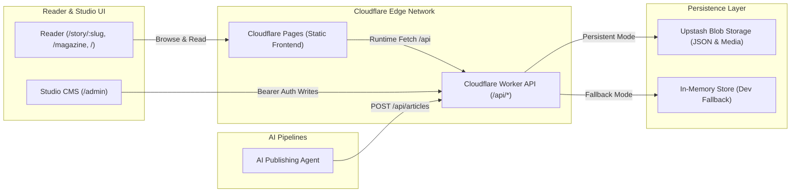

# Kalidass Journal — Systems Research Magazine

**Kalidass Journal** is a colorful research publication exploring the model layer: attention architectures, agent workflows, evals, and multimodal systems plumbing.

The application is structured as a **combined monorepo** consisting of a **Docusaurus 3.10** static frontend, a **Cloudflare Worker REST API**, and **Upstash Blob** object storage.

---

## 1. System Architecture & Data Flow



- **Static Frontend**: Pre-rendered Docusaurus 3.10 + React 19 SPA. Articles are loaded dynamically via runtime REST calls to the Cloudflare Worker.
- **Dynamic Worker API**: Cloudflare Worker handling CRUD operations (`/api/articles`), health checks (`/api/health`), media uploads (`/api/objects`), and signed Upstash browser uploads (`/api/upload`).
- **Persistence**: Production articles and media are stored as durable JSON objects and binary blobs in Upstash Blob. If no token is present, the Worker falls back to an in-memory store seeded with sample briefs.

---

## 2. Monorepo Directory Layout

```text
kalidass/
├── blog_frontend/             # Static frontend & reader application
│   ├── src/
│   │   ├── client-modules/    # window.KALIDASS_API_BASE client initialization
│   │   ├── components/        # ArticleCard, StoryBody, StoryPage, VideoEmbed
│   │   ├── css/               # Theming variables and color gradients
│   │   ├── lib/               # api.ts (CRUD/uploads), media.ts, types.ts
│   │   └── pages/             # /, /magazine, /admin, /story/[slug]
│   ├── static/                # Static assets, _redirects, .nojekyll
│   ├── docusaurus.config.ts   # Docusaurus config and Webpack dev proxy
│   ├── package.json           # Frontend dependencies and scripts
│   └── tsconfig.json          # TypeScript strict configuration (noEmit: true)
├── worker/                    # Cloudflare Worker REST API
│   ├── src/
│   │   ├── index.js           # Main fetch handler, router, CORS, auth
│   │   ├── memory.js          # In-memory storage adapter fallback
│   │   └── seed.js            # Sample articles for local preview
│   ├── package.json           # Worker dependencies
│   ├── wrangler.toml          # Cloudflare Worker configuration & bindings
│   └── .dev.vars.example      # Example environment variables template
├── docs/                      # Unified Docs7 documentation suite
│   ├── docs.json              # Docs7 config ($schema, filterSidebar, groups)
│   ├── custom.css             # Frame widening for responsive Mermaid
│   ├── *.mdx                  # Frontend & system architecture docs
│   └── worker/*.mdx           # Worker & storage architecture docs
├── AGENTS.md                  # Canonical AI agent operational invariants
├── AI_AGENT_PUBLISH.md        # Machine-to-machine API publishing specification
├── CLAUDE.md                  # Fast-reference agent instructions & commands
├── DEPLOY.md                  # Direct Cloudflare Pages/Worker deployment guide
├── README.md                  # Master project guide (this file)
├── start.sh                   # Concurrent local dev startup script
└── ZERO_TRUST_DEPLOY.md       # Cloudflare Zero Trust Access & proxy runbook
```

---

## 3. Core Features & Data Contracts

### Routes
- `/` — Homepage featuring the primary cover story, lead article grid, and issue index.
- `/magazine` — Issue archive with real-time text search and tag filtering.
- `/admin` — Studio CMS with four tab modes: **Compose**, **Drafts**, **Published**, and **Delete**. Deep linking supported via `?mode=` and `?edit=<slug>`.
- `/story/:slug` — Full-page article reader rendering polymorphic blocks with custom accent tints.

### Publication Flags
- `published`: When `false`, saved as a draft (requires Bearer authentication; unauthenticated queries return `404`).
- `private`: Defaults to `true` (unlisted). Accessible via direct `/story/:slug` URL, but excluded from public `/` and `/magazine` feeds.
- `aiGenerated`: When `true`, renders the `AI` badge across cards and reader headers.

### Content Blocks (`src/lib/types.ts`)
Articles support 5 block types: `paragraph`, `heading`, `quote` (with optional `cite`), `image` (with optional `caption`), and `video` (YouTube, Vimeo, or direct MP4).

---

## 4. How to Run Locally

### Prerequisites
- Node.js `>=20.0` (validated on Node.js 22).
- `npm` package manager.

### Option A: Concurrent Startup (Recommended)

From the repository root:

```bash
chmod +x start.sh
./start.sh
```

This launches both the Cloudflare Worker on `http://127.0.0.1:8787` and the Docusaurus frontend on `http://0.0.0.0:3000`.

---

### Option B: Manual Multi-Terminal Startup

#### 1. Start the Cloudflare Worker
In your first terminal:

```bash
cd worker
npm install

# (Optional) Configure Upstash Blob for persistent local testing:
# Copy .dev.vars.example to .dev.vars and add your UPSTASH_BLOB_TOKEN

npm run start
```

- Worker listens on `http://127.0.0.1:8787`.
- Without `UPSTASH_BLOB_TOKEN`, the worker runs on the in-memory store seeded with sample articles.

#### 2. Start the Frontend
In your second terminal:

```bash
cd blog_frontend
npm install
npm run start
```

- Frontend serves on `http://0.0.0.0:3000`.
- The Webpack dev server automatically proxies `/api/*` requests to `http://127.0.0.1:8787`.

---

### 5. Running & Validating Docs7 Documentation

The unified Docs7 documentation suite is hosted at the repository root in `docs/`:

```bash
# Preview documentation site on port 3333
npx docs7 dev docs --port 3333

# Validate docs integrity (zero errors / zero warnings)
node C:/Users/amrit/.gemini/config/skills/docs7/scripts/validate_docs7.mjs docs
```

---

## 6. How to Deploy

### Option 1: Standard Cloudflare Deployment (Pages + Worker)

#### Step 1: Upstash Blob Setup
1. Create a public bucket in [Upstash Console](https://console.upstash.com).
2. Copy the bucket token (`UPSTASH_BLOB_TOKEN`).

#### Step 2: Deploy the Cloudflare Worker
```bash
cd worker
npm install

# Configure secret tokens (do not commit secrets)
npx wrangler secret put UPSTASH_BLOB_TOKEN
npx wrangler secret put ADMIN_TOKEN  # Optional password for Studio writes

# Deploy worker to Cloudflare
npx wrangler deploy
```
*Note your deployed Worker URL (e.g. `https://kalidass-journal.<account>.workers.dev`).*

#### Step 3: Deploy the Frontend to Cloudflare Pages
1. Connect your Git repository in the Cloudflare Dashboard under **Workers & Pages** → **Create application** → **Pages**.
2. Set Build Settings:
   - **Framework preset**: None / Docusaurus
   - **Root directory**: `blog_frontend`
   - **Build command**: `npm run build`
   - **Build output directory**: `build`
   - **Environment variables**:
     - `KALIDASS_API_BASE`: Your deployed Worker URL (e.g., `https://kalidass-journal.<account>.workers.dev`).
     - `NODE_VERSION`: `20`
3. Deploy. `blog_frontend/static/_redirects` ensures dynamic `/story/*` client-side routes resolve properly.

#### Step 4: Lock Down CORS
In `worker/wrangler.toml`, set `CORS_ORIGIN` to your deployed Pages URL and redeploy:
```toml
[vars]
CORS_ORIGIN = "https://kalidass-journal.pages.dev"
```

---

### Option 2: Zero Trust Access Deployment (`journal.kalidass.fyi` + `api.kalidass.fyi`)

For high-security production deployments where the Worker API is completely private behind Cloudflare Zero Trust:

1. **Pages Function Proxy**: The frontend uses `blog_frontend/functions/api/[[route]].ts` to proxy all `/api/*` calls server-side, injecting `CF-Access-Client-Id` and `CF-Access-Client-Secret`.
2. **Worker Custom Domain**: The Worker runs on `api.kalidass.fyi` with `workers_dev = false`.
3. **Zero Trust Access Application**: Protects `api.kalidass.fyi` using a Service Token policy (`kalidass-journal-pages`).
4. **Custom Domain on Pages**: The frontend runs on `journal.kalidass.fyi` and calls same-origin `/api/*` without exposing tokens to the browser.

> Refer to [`ZERO_TRUST_DEPLOY.md`](./ZERO_TRUST_DEPLOY.md) for the complete step-by-step dashboard runbook.

---

## 7. Studio CMS & Authentication

1. Navigate to `/admin` to open the Studio CMS.
2. If `ADMIN_TOKEN` is configured on the Worker, enter your token in the Studio prompt or set it via browser console:
   ```javascript
   localStorage.setItem("kalidass-admin-token", "<your-admin-token>");
   ```
3. Use the tabs to:
   - **Compose**: Write text, add pull quotes, insert images, and embed videos.
   - **Drafts**: Edit and preview unlisted drafts.
   - **Published**: Manage live articles and toggles.
   - **Delete**: Soft/hard purge articles.

---

## 8. Machine-to-Machine Agent Publishing

Autonomous AI agents can publish articles directly via HTTP without using the browser UI:

```bash
curl -X POST https://api.kalidass.fyi/api/articles \
  -H "Authorization: Bearer $ADMIN_TOKEN" \
  -H "Content-Type: application/json" \
  -d '{
    "title": "Field notes from the eval trench",
    "subtitle": "What broke and what we measured",
    "excerpt": "A summary deck for search cards.",
    "author": {"name": "Agent", "role": "Correspondent", "avatar": ""},
    "tags": ["Evals", "Agents"],
    "accent": "#c4f542",
    "published": false,
    "private": true,
    "aiGenerated": true,
    "blocks": [{"type": "paragraph", "text": "Opening section content."}]
  }'
```

> Refer to [`AI_AGENT_PUBLISH.md`](./AI_AGENT_PUBLISH.md) for the complete JSON schema and publishing lifecycle.

---

## 9. Verification & Quality Gates

```bash
# Frontend static type check (mandatory before deployment)
cd blog_frontend && npm.cmd run typecheck

# Validate unified Docs7 documentation suite
node C:/Users/amrit/.gemini/config/skills/docs7/scripts/validate_docs7.mjs docs

# Clear build artifacts if cache is stale
cd blog_frontend && npm run clear
```
