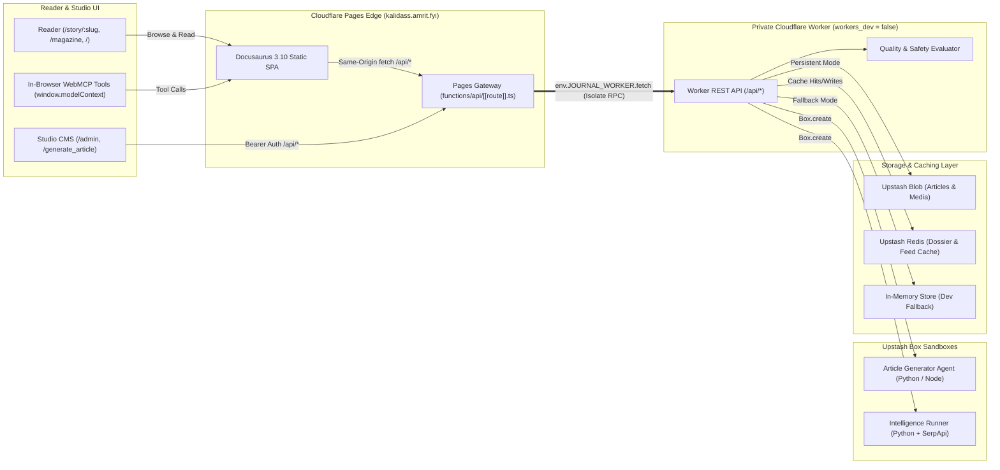

# Kalidass Journal — Systems Research Magazine

  One of Kalidasa's most celebrated verses on critical knowledge and intellectual discernment comes from the prologue of his play Mālavikāgnimitra (Act 1, Verse 2): 

  पुराणमित्येव न साधु सर्वं न चापि काव्यं नवमित्यवद्यम्।सन्तः परीक्ष्यान्यतरद्भजन्ते मूढः परप्रत्ययनेयबुद्धिः॥   

  Translation & Meaning:
  "Everything is not good simply because it is old, nor is a creation flawed merely because it is new. The wise examine with an open, discerning mind and accept what is genuinely worthy, while the foolish are blindly guided by the opinions of others."   
  
  Another notable observation by Kalidasa regarding education and pedagogy occurs in the Raghuvaṃśa (Canto 3, Verse 29): 
  "क्रिया हि वस्तुपहिता प्रसीदति" (Kriyā hi vastūpahitā prasīdati), 

  which translates to: 
  "Knowledge or instruction yields fruit only when imparted to a receptive and worthy mind."

---

**Kalidass Journal** is a high-signal mixed human-AI publication at the intersection of agentic cognition, serverless, AI-native and distributed edge architectures—inspired by Kalidasa's writings. It encourages the future of writing, i.e., human-AI mixed authorship.

The project is engineered as a unified monorepo bringing together a **Docusaurus 3.10 + React 19** static reader frontend, a private **Cloudflare Worker** REST API, **Upstash Blob & Redis** storage, **Upstash Box** isolated cloud container sandboxes, and **Grafana Faro** frontend observability.

> [!NOTE]
> **For AI Coding Agents**: If you are an autonomous coding assistant or LLM agent (Claude, Antigravity, etc.), please consult [`CLAUDE.md`](./CLAUDE.md) for non-negotiable operational invariants, machine-level execution toolchains, and data contracts. This README is curated specifically for human developers and systems engineers.

---

## What Kalidass Journal Offers

### 📖 For Readers
- **Immersive Research Reading**: Beautiful editorial layout with vibrant Neel theme styling, categorical pigment palettes (`Neel`, `Haldi`, `Sindoor`, `Gulabi`, `Mehendi`, `Aakash`), and rainbow accent gradients.
- **Lead Dispatch & Magazine Feeds**: Dedicated featured cover story hero on `/`, dynamic 3-column "In This Cycle" grid, and an issue archive (`/magazine`) with instant text search and tag filters.
- **Interactive Story Outline & Density**: Sticky table of contents tracking reading progress, section word counts, and element density metrics (paragraphs, quotes, images, videos, and code snippets).
- **First-Class Multi-Language Code Blocks**: Reusable `<ArticleCodeBlock />` with line numbers and Prism syntax highlighting across 13+ languages (Python, Bash, Go, Rust, Java, C#, SQL, JSON, YAML, Ruby, Kotlin, Swift, Docker).
- **Live Search Grounding (`AI Intel`)**: In-reader dossier powered by SerpApi and Upstash Box displaying Google AI Overviews, source citations, Knowledge Graphs, and "People Also Ask" questions.
- **Curated Books Suggestions**: A dedicated reader tab surfaces up to three AI-ranked Amazon book recommendations for each story, with cover art, ratings, prices, and direct buy links.

### ✍️ For Writers & Editorial Teams
- **Studio CMS (`/admin`)**: Clean web-based dashboard with 4 tab modes: **Compose**, **Drafts**, **Published**, and **Delete**.
- **Polymorphic Block Authoring**: Compose essays using 6 structured block types: `paragraph`, `heading`, `quote`, `image`, `video`, and `code`.
- **Pre-Submit Quality & Safety Audit**: Live evaluation measuring synthetic AI probability, technical rigor score ($1.0 - 5.0$), engagement, and content safety. Automatically blocks saving or publishing if safety risk exceeds 0.55.
- **Granular Privacy & Multi-Author Isolation**: Save private drafts (`published: false`), unlisted essays (`private: true`), or flag AI-assisted generation (`aiGenerated: true`). Regular authors manage only their own essays; admins have global permissions.

### 🤖 For AI Agents & Tooling
- **Autonomous Article Generation (`/generate_article`)**: Ephemeral containerized agents running in Upstash Box research topics on the web, synthesize 1,200+ word essays, and generate custom 16:9 infographic cover art.
- **In-Browser WebMCP Tools**: Full W3C Web Model Context Protocol implementation exposing 8 in-page tools (`window.modelContext`) for browser AI agents (Gemini, Claude, Chrome built-in AI) to search, read, inspect citations, fetch book suggestions, and stage inline edits.
- **Machine-to-Machine REST API**: Direct programmatic publishing via `POST /api/articles` with Bearer token authentication.

### ⚡ For Architects & Operators
- **Zero-Trust Private Worker Architecture**: The backend Cloudflare Worker runs with `workers_dev = false` and has no public internet exposure. It is reached strictly in-memory via Cloudflare Pages Function Service Binding RPC.
- **Frontend Observability & RUM (Grafana Faro)**: Live Real User Monitoring (RUM), Core Web Vitals tracking, unhandled React exception capture, OpenTelemetry HTTP request tracing, and automated production source map uploads to Grafana Cloud with zero client credentials checked into git.
- **Multi-Tier Edge Caching**: 3-hour feed cache and 24-hour story & intelligence caches on Upstash Redis with content-hash ETag revalidation for sub-millisecond edge responses.
- **Zero-Dependency Dev Mode**: Immediate offline local development using built-in in-memory storage — no cloud accounts or credentials required to get started.

---

## System Architecture



---

## Local Setup & Quickstart

You can run Kalidass Journal locally using your choice of package manager (`npm`, `pnpm`, `yarn`, or `bun`) on any operating system (Windows, macOS, or Linux).

### Prerequisites
- **Node.js**: `>=20.0.0` (validated on Node.js 20 and 22).
- Any standard package manager: `npm` (bundled with Node), `pnpm`, `yarn`, or `bun`.

---

### Running Services in Separate Terminals

Start the backend Worker API and frontend SPA in separate terminals:

#### Terminal 1 — Cloudflare Worker API (Port 8787)
Navigate to the `worker/` directory and install dependencies:

```bash
cd worker

# Install dependencies (choose your package manager):
npm install       # npm
pnpm install      # pnpm
yarn install      # yarn
bun install       # bun

# Start the worker dev server:
npm run start     # npm
pnpm start        # pnpm
yarn start        # yarn
bun run start     # bun
```

> **Zero-Config Dev Mode**: If no credentials are provided, the worker automatically runs on an in-memory storage engine. You can immediately create, read, and edit test articles in Studio without setting up any cloud databases.

#### Terminal 2 — Frontend Reader & Studio (Port 3000)
Navigate to the `blog_frontend/` directory and install dependencies:

```bash
cd blog_frontend

# Install dependencies:
npm install       # npm
pnpm install      # pnpm
yarn install      # yarn
bun install       # bun

# Start the Docusaurus dev server:
npm run start     # npm
pnpm start        # pnpm
yarn start        # yarn
bun run start     # bun
```

The frontend will open automatically at `http://localhost:3000`. Requests to `/api/*` are transparently proxied to the worker on `http://127.0.0.1:8787`.

---

### Option 3: Connecting Real Cloud Services (Optional)

To enable persistent cloud storage, Redis caching, or AI generation during local testing, create a `worker/.dev.vars` file (copied from `worker/.dev.vars.example`):

```ini
# worker/.dev.vars (DO NOT COMMIT)
UPSTASH_BLOB_TOKEN="your_upstash_blob_token"
UPSTASH_REDIS_REST_URL="https://your-redis.upstash.io"
UPSTASH_REDIS_REST_TOKEN="your_upstash_redis_token"
ADMIN_TOKEN="your_local_admin_password"
ADMIN_EMAILS="admin@example.com"

# Optional AI services
UPSTASH_BOX_TOKEN="your_upstash_box_token"
OPENAI_API_KEY="sk-..."
SERPAPI_API_KEY="..."
```

---

## Deployment Guide

Kalidass Journal is designed for seamless, zero-maintenance deployment to Cloudflare's global edge network.

### Deployment Method A: Cloudflare Dashboard (Recommended / No CLI Needed)

1. **Deploy the Worker**:
   - In Cloudflare Dashboard, go to **Workers & Pages** → **Create application** → **Create Worker**.
   - Name it `kalidass-journal-worker`.
   - Under **Settings** → **Variables and Secrets**, add your secrets:
     - `UPSTASH_BLOB_TOKEN`: Upstash Blob storage token.
     - `UPSTASH_REDIS_REST_URL` & `UPSTASH_REDIS_REST_TOKEN`: Upstash Redis credentials.
     - `ADMIN_TOKEN`: Secret key for Studio administrator access and agent publishing.
     - `ADMIN_EMAILS`: Comma-separated admin email list.

2. **Deploy the Frontend (Cloudflare Pages)**:
   - Go to **Workers & Pages** → **Create application** → **Pages** → **Connect to Git**.
   - Select your repository.
   - Configure Build Settings:
     - **Framework preset**: `Docusaurus` (or `None`)
     - **Root directory**: `blog_frontend`
     - **Build command**: `npm run build` (or `pnpm build` / `bun run build`)
     - **Build output directory**: `build`
     - **Environment variables**:
       - `NODE_VERSION`: `20`
       - `AUTH0_DOMAIN`: `your-tenant.us.auth0.com` (optional; leave blank for single-operator mode)
       - `AUTH0_CLIENT_ID`: `your-client-id`
       - `AUTH0_AUDIENCE`: `https://api.kalidass.amrit.fyi`
       - `PRIVATE_APP`: `false` (set to `true` for password-only single-operator mode)

3. **Link Service Binding**:
   - In your Pages project settings, navigate to **Settings** → **Functions** → **Service bindings**.
   - Click **Add binding**:
     - **Variable name**: `JOURNAL_WORKER`
     - **Service**: `kalidass-journal-worker`
     - **Environment**: `production`

All requests to `/api/*` will now execute directly inside the private worker across Cloudflare's in-memory isolate network!

---

### Deployment Method B: Wrangler CLI (Terminal Driven)

You can deploy directly using Wrangler with any package runner (`npx`, `pnpm dlx`, `yarn dlx`, or `bunx`):

#### 1. Deploy the Worker
```bash
cd worker

# Install dependencies if not already installed
npm install

# Set your production secrets securely:
npx wrangler secret put UPSTASH_BLOB_TOKEN
npx wrangler secret put UPSTASH_REDIS_REST_URL
npx wrangler secret put UPSTASH_REDIS_REST_TOKEN
npx wrangler secret put ADMIN_TOKEN
npx wrangler secret put ADMIN_EMAILS

# Deploy the private worker:
npx wrangler deploy
# Or with pnpm:  pnpm dlx wrangler deploy
# Or with bun:   bunx wrangler deploy
```

#### 2. Deploy the Frontend Pages Project
```bash
cd blog_frontend

# Install dependencies & build static site:
npm install
npm run build

# Deploy build directory to Cloudflare Pages:
npx wrangler pages deploy build --project-name=kalidass-journal
# Or with pnpm:  pnpm dlx wrangler pages deploy build --project-name=kalidass-journal
# Or with bun:   bunx wrangler pages deploy build --project-name=kalidass-journal
```

---

## Studio CMS & Publishing

1. **Accessing the Studio**: Open `/admin` in your browser.
2. **Logging In**:
   - **Auth0 Mode**: Sign in via your configured Auth0 identity provider.
   - **Admin Token Mode**: Set your admin token directly in the browser console:
     ```javascript
     localStorage.setItem("kalidass-admin-token", "your-admin-token");
     ```
3. **Tab Navigation**:
   - **Compose**: Write articles with title, subtitle, custom slug (`/story/<slug>`), pigment swatch, and 6 block types (`paragraph`, `heading`, `quote`, `image`, `video`, `code`).
   - **Drafts**: View and resume work on unpublished drafts (`published: false`).
   - **Published**: Browse live essays, toggle visibility, or update metadata.
   - **Delete**: Purge authorized entries with confirmation prompts.

---

## WebMCP (In-Browser AI Tools)

Kalidass Journal registers 8 structured WebMCP tools into `window.modelContext`, `document.modelContext`, and `navigator.modelContext`:

```javascript
// Test directly in your browser DevTools Console (F12):

// 1. Search publication articles
const results = await window.modelContext.tools.searchArticles.execute({ query: "evals" });
console.log("Search Results:", results);

// 2. Read article canonical metadata
const meta = await window.modelContext.tools.readArticle.execute({ slug: "attention-as-routing" });
console.log("Article Meta:", meta);

// 3. Inspect AI search grounding dossier (on /story/:slug)
const aiOverview = await window.modelContext.tools.getStoryAiOverview.execute({});
console.log("AI Overview:", aiOverview);

// 4. Extract citations and references
const citations = await window.modelContext.tools.getStoryCitations.execute({});
console.log("Citations:", citations);

// 5. Stage in-page content enhancements (authors & admins)
await window.modelContext.tools.enhanceStoryContent.execute({
  sectionHeading: "Introduction",
  enhancedText: "Refined introductory thesis with empirical benchmarks.",
  instruction: "Clarified introduction"
});

// 6. Fetch AI-ranked Amazon book recommendations (on /story/:slug)
const books = await window.modelContext.tools.getStoryBookSuggestions.execute({});
console.log("Book Suggestions:", books);
```

---

## Automated Verification & Testing

All test suites are hermetic with zero network or filesystem side-effects:

```bash
# Typecheck frontend (TypeScript strict)
cd blog_frontend
node ./node_modules/typescript/bin/tsc --noEmit
# Or: npm run typecheck / pnpm run typecheck / bun run typecheck

# Run frontend UI tests (Vitest + jsdom)
node ./node_modules/vitest/vitest.mjs run
# Or: npm test / pnpm test / bun test

# Run worker API tests (Vitest)
cd ../worker
node ./node_modules/vitest/vitest.mjs run
# Or: npm test / pnpm test / bun test

# Validate documentation site structure (from repo root)
cd ..
node scripts/validate_docs.mjs docs
```

---

## Documentation Site (Docs7)

Detailed architectural guides, data contracts, and operational runbooks are hosted in the `docs/` folder:

```bash
# Preview documentation locally on port 3333:
npx docs7 dev docs --port 3333

# Validate docs structure and Mermaid diagrams:
node scripts/validate_docs.mjs docs
```


---


## Digest from creator
I do believe future Jornal projects will welcome AI-HUMAN partership for reading and writing.
Havving said that , here is my take -

- **Dynamic Reading Over Static Text**: Kalidass is necessary because almost no technical sites offer dynamic reading—most provide only static text. To quench their thirst for deeper knowledge, readers are usually forced to leave for external search engines or AI chats.
- **Dual Perspective (Traditional + AI Intel)**: SerpApi fuels the concept of mixed authorship: every piece features a traditional longform research essay on one side, and live AI Intelligence grounding as the other side of the coin. Also Jev diagnose the Serapi output for relvent books on topic, is real winning strategy.
- **In-Browser WebMCP Tools**: Enables W3C Web Model Context Protocol tools (`window.modelContext`) so authors and browser agents can experience the full benefits of a dynamic reading platform, inspect citations, and stage in-page edits.
- **Mixed Human-AI Authorship**: Authors expand their creative craft as this publication boldly embraces the future: collaborative human-AI mixed authorship.
- **System 1 AI Quality Evals**: Embraces fast System 1 AI evaluations (Jev, Clef) and heuristic guardrails for instant technical rigor, synthetic likelihood, and safety scoring.
- **Sandboxed Agent Isolation**: Autonomous article generation and web research scripts execute inside isolated Upstash Box cloud containers, keeping untrusted LLM and Python code execution completely segregated from core edge worker isolates.
- **In-Studio Draft Generation**: Facilitates autonomous article draft generation directly from LLMs within the Studio UI (currently restricted to administrators).
- **100% Serverless Edge Stack**: Engineered with a modern, zero-maintenance serverless architecture: Cloudflare Workers, Upstash Redis caching, Upstash Blob storage, and Upstash Box containers.


---

## License & Credits

- **Author**: Amrit (@amrit)
- **License**: MIT
- **Theme**: Custom Neel palette with pigment spectrum tokens and Docusaurus 3.10.