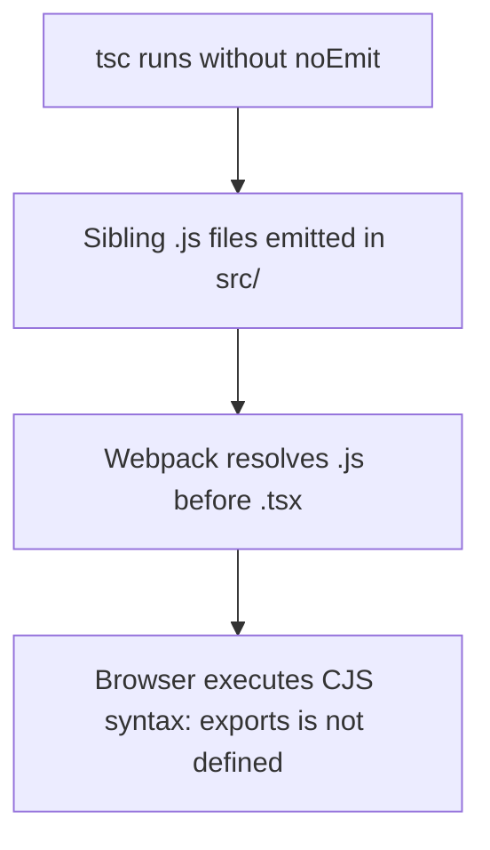

# Learnings

Technical discoveries and operational guard rails established during the development of Amrit Journal.

## Sibling `.js` Source Conflicts

When running a raw `tsc` compilation without the `noEmit` flag, TypeScript generates sibling CommonJS `.js` files next to every `.ts` and `.tsx` file across `src/` (e.g., `src/pages/index.js` adjacent to `index.tsx`).

Because Webpack prioritizes resolving `.js` extensions before `.tsx`, the development server attempts to execute the compiled CommonJS bundle in the browser environment, triggering a fatal runtime error: `exports is not defined`.

### Enforced Guard Rails

1. `tsconfig.json` explicitly sets `"noEmit": true`.
2. `.gitignore` explicitly ignores `src/**/*.js`, `docusaurus.config.js`, and `sidebars.js`.
3. If sibling `.js` files are ever generated, delete them immediately and execute `npm run clear`.

## Dynamic Route SSG Quirk on Windows

Docusaurus generates static HTML files during `npm run build` for all registered paths. Because `/story/:slug` is registered as a dynamic route via `amritPlugin.contentLoaded`, Docusaurus attempts to create directory paths containing `:slug`.

On Windows filesystems, colons (`:`) are prohibited characters, causing `fs-extra` to throw an `EINVAL` filesystem error. On Linux (Cloudflare Pages deploy environment), dynamic route filenames succeed without error.

**Operational Rule**: On Windows machines, verify frontend changes using `npm run typecheck` and `npm run start`. Production builds are validated on Linux CI/CD environments.

## Verification Protocol

1. Run `npm run typecheck` first (fast static type analysis with `noEmit`).
2. Run `node C:/Users/amrit/.gemini/config/skills/docs7/scripts/validate_docs7.mjs docs` to ensure 100% docs7 validity.
3. Validate runtime behavior by launching `npm run start` and ensuring the Cloudflare Worker is active on port `8787`.
