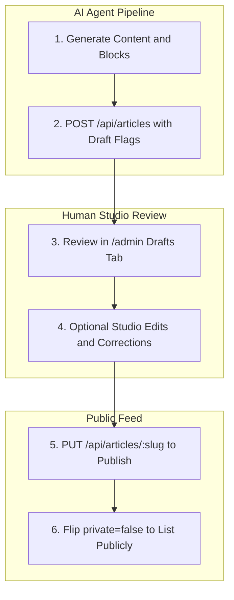

# AI Agent Publishing

How an automated script, background pipeline, or autonomous AI agent publishes an article directly to the Cloudflare Worker API as a **draft + private + AI-generated** brief without requiring a browser interface.

## Publishing Lifecycle



## Endpoint & Authentication

- **Local Dev Endpoint**: `http://127.0.0.1:8787` (the frontend dev server proxies `/api` to this address).
- **Deployed Endpoint**: The production Worker URL (configured via build-time `KALIDASS_API_BASE`).
- **Authorization**: `Authorization: Bearer <ADMIN_TOKEN>` on all write operations (`POST`, `PUT`, `DELETE`).
- **Content Type**: `application/json` (except media file uploads, which use `multipart/form-data`).

## Create Brief: `POST /api/articles`

Send a JSON `ArticleDraft` payload. For automated agent submissions, explicitly supply the three control flags:

```json
{
  "published": false,
  "private": true,
  "aiGenerated": true
}
```

- `published: false`: Creates a **draft**. The article is hidden from all public feeds; direct `GET /api/articles/:slug` requests return `404` unless the Bearer token is provided. `publishedAt` remains empty until the first publication.
- `private: true`: Marks the article as **unlisted** once published. It will not appear in the `/` home index or `/magazine` grid, and it can only be read by its author or an admin — anonymous requests to the direct `/story/:slug` URL return `404`.
- `aiGenerated: true`: Displays the badge `AI` on article cards and reader bylines.

### Full Payload Schema

```json
{
  "title": "Field Notes from the Model Layer",
  "subtitle": "Measuring attention mechanisms in synthetic benchmarks",
  "excerpt": "A concise summary for cards, RSS, and client search indexing.",
  "coverImage": "https://cdn.example.com/cover.webp",
  "videoUrl": "https://youtube.com/watch?v=dQw4w9WgXcQ",
  "author": {
    "name": "Research Agent",
    "role": "Systems Correspondent",
    "avatar": ""
  },
  "tags": ["Attention", "Evals", "Multimodal"],
  "accent": "#6366f1",
  "featured": false,
  "published": false,
  "private": true,
  "aiGenerated": true,
  "slug": "field-notes-model-layer",
  "blocks": [
    {
      "type": "paragraph",
      "text": "Introductory section establishing the technical framing."
    },
    {
      "type": "heading",
      "text": "Empirical Observations"
    },
    {
      "type": "quote",
      "text": "Linear attention scales quadratically in cache efficiency under tight latency budgets.",
      "cite": "Benchmark Log 42"
    },
    {
      "type": "image",
      "url": "https://cdn.example.com/latency-chart.webp",
      "caption": "Figure 1: Latency distribution across context lengths"
    },
    {
      "type": "video",
      "url": "https://youtube.com/watch?v=dQw4w9WgXcQ",
      "caption": "Live benchmark execution recording"
    }
  ]
}
```

### Server Rules & Schema Invariants

| Field | Invariant / Behavior |
| --- | --- |
| `slug` | Optional. If omitted, automatically slugified from `title` (max 72 chars) with deduplication suffixes (`-2`, `-3`). |
| `id`, `createdAt`, `updatedAt`, `readTime`, `publishedAt` | **Server-owned fields**. Never include these in the draft payload. `readTime` is calculated server-side from block word counts. |
| `blocks[].type` | Must match one of `paragraph`, `heading`, `quote`, `image`, `video`, `code`. |
| `tags` | Array of strings; empty values are filtered out automatically. |
| Field Defaults | Default values if omitted are `published: true`, `private: true`, and `aiGenerated: false`. AI agents should always pass all three explicitly. |

### Example Request (`curl`)

```bash
curl -X POST http://127.0.0.1:8787/api/articles \
  -H "Authorization: Bearer $ADMIN_TOKEN" \
  -H "Content-Type: application/json" \
  -d '{
    "title": "Field notes from the eval trench",
    "subtitle": "What broke and what we measured",
    "excerpt": "An operational breakdown of latency characteristics.",
    "author": {"name": "Agent", "role": "Correspondent", "avatar": ""},
    "tags": ["Evals"],
    "accent": "#c4f542",
    "published": false,
    "private": true,
    "aiGenerated": true,
    "blocks": [{"type": "paragraph", "text": "Opening paragraph detailing test suite outcomes."}]
  }'
```

## Post-Creation Lifecycle

| Operation | HTTP Call | Description |
| --- | --- | --- |
| Read Back | `GET /api/articles/:idOrSlug` | Fetch article data (requires Bearer token if `published: false`). |
| Update | `PUT /api/articles/:idOrSlug` | Update fields. Omitted fields preserve existing server values. |
| Publish | `PUT /api/articles/:idOrSlug` with `{"published": true}` | Transitions draft to live; sets `publishedAt` timestamp. |
| Make Public | `PUT /api/articles/:idOrSlug` with `{"private": false}` | Lists article on the home feed and `/magazine` page. |
| List Drafts | `GET /api/articles?status=draft` | Returns all drafts (requires Bearer token). |
| Delete | `DELETE /api/articles/:idOrSlug` | Permanently deletes article object (requires Bearer token). |

## Media File Uploads

For uploading images or direct video files:
1. Make a `POST /api/objects` request with `multipart/form-data`.
2. Attach the binary file in the `file` form field and provide the Bearer token.
3. Server returns `{ "url": "https://...", "name": "..." }`.
4. Use the returned `url` in `coverImage`, `videoUrl`, or block URLs.
