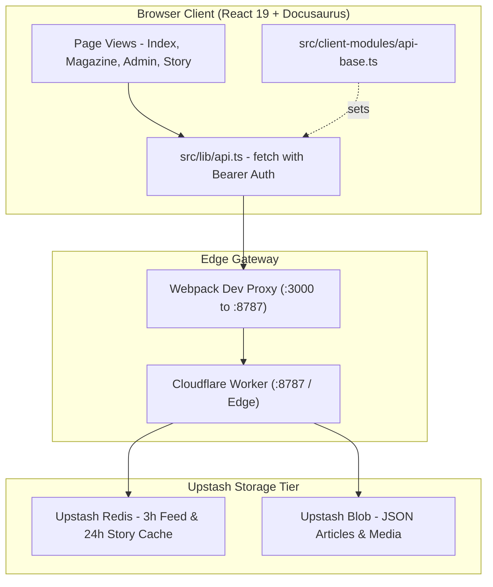

# Architecture

Kalidass Journal is built on Docusaurus 3.10 and React 19. It configures `preset-classic` with `docs: false, blog: false` so that Markdown processing is disabled for standard content; all articles are fetched at runtime via client-side fetch requests to the Cloudflare Worker API.

## System Topology

## Route Map

| Route | Component Source | Functionality |
| --- | --- | --- |
| `/` | `src/pages/index.tsx` | Cover story, dedicated featured dispatch, and index grid |
| `/magazine` | `src/pages/magazine.tsx` | Searchable article archive with tag filtering |
| `/admin` | `src/pages/admin.tsx` | Studio CMS: Compose, Drafts, Published, and Delete tabs |
| `/story/:slug*` | Dynamic Route → `src/components/StoryPage.tsx` | Dynamic story reader registered in `kalidassPlugin.contentLoaded` via `actions.addRoute` |

## Source Tree Layout

<Tree>
  <Tree.Folder name="src" defaultOpen>
    <Tree.Folder name="client-modules" defaultOpen>
      <Tree.File name="api-base.ts" highlight />
    </Tree.Folder>
    <Tree.Folder name="components" defaultOpen>
      <Tree.File name="ArticleCard.tsx" highlight />
      <Tree.File name="ArticleCard.module.css" />
      <Tree.File name="StoryBody.tsx" highlight />
      <Tree.File name="StoryBody.module.css" />
      <Tree.File name="StoryPage.tsx" highlight />
      <Tree.File name="StoryPage.module.css" />
      <Tree.File name="VideoEmbed.tsx" />
      <Tree.File name="VideoEmbed.module.css" />
    </Tree.Folder>
    <Tree.Folder name="css" defaultOpen>
      <Tree.File name="custom.css" />
    </Tree.Folder>
    <Tree.Folder name="lib" defaultOpen>
      <Tree.File name="api.ts" highlight />
      <Tree.File name="config.ts" />
      <Tree.File name="media.ts" />
      <Tree.File name="types.ts" highlight />
    </Tree.Folder>
    <Tree.Folder name="pages" defaultOpen>
      <Tree.File name="admin.tsx" highlight />
      <Tree.File name="admin.module.css" />
      <Tree.File name="index.tsx" highlight />
      <Tree.File name="index.module.css" />
      <Tree.File name="magazine.tsx" highlight />
      <Tree.File name="magazine.module.css" />
    </Tree.Folder>
  </Tree.Folder>
</Tree>

## API Base Resolution & Proxy

1. **Build Time**: `customFields.apiBase` is hardcoded to `""` in `docusaurus.config.ts`, ensuring all requests default to relative paths.
2. **Client Initialization**: `src/client-modules/api-base.ts` initializes `window.KALIDASS_API_BASE` as `""`.
3. **Runtime Requests**: `src/lib/config.ts` exports `apiUrl(path)`, generating relative URLs (`/api/...`) routed through same-origin Pages Functions.
4. **Dev Server Proxy**: During development, `devServer.proxy` automatically forwards `/api` requests to `http://127.0.0.1:8787`.
5. **Production Edge Proxy**: In production on Cloudflare Pages, `functions/api/[[route]].ts` forwards all `/api/*` traffic directly to `kalidass-journal-worker` via the `JOURNAL_WORKER` Service Binding.
