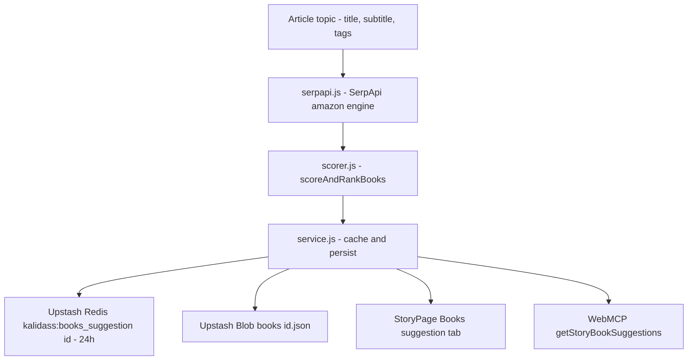

# Books Suggestions

Every story can carry a **Books Suggestions** dossier: up to three curated Amazon book
recommendations for the article's topic, fetched live from SerpApi and ranked by the same
System One evaluation models used for quality scoring. Readers see the result as a read-only
tab in the story reader; authors and admins generate or refresh it on demand.

---

## 1. Compilation Pipeline



1. **`worker/src/books/serpapi.js`** — issues a single SerpApi request against the `amazon`
   engine (`amazon_domain=amazon.in`) with the query `Books on: <topic>` and returns normalized
   `BookSuggestionItem` candidates.
2. **`worker/src/books/scorer.js`** — `scoreAndRankBooks` caps to the first **10** candidates,
   scores them with the active provider, filters on `score >= 0.40` **and** `isBookConfidence >= 0.40`,
   sorts by score → rating → review count, and keeps the **top 3**. When a model runs and returns
   zero qualifying books, that verdict is preserved (no heuristic resurrection).
3. **`worker/src/books/service.js`** — persists the payload to Blob and Redis and deduplicates
   concurrent generations with a module-level in-flight lock (`_booksInflightLocks`).

### Scorer provider cascade

The scorer reuses the quality-evaluation provider selection (`EVAL_PROVIDER`), degrading gracefully:

| Order | Provider | `scoredBy` value | Requirement |
| --- | --- | --- | --- |
| 1 | TypeSafe Jev (`jev-latest`) | `"jev"` | `TYPESAFE_API_KEY` |
| 2 | Cloudflare Clef | `"clef"` | `CLEF_API_KEY` or the `env.AI` binding |
| 3 | Deterministic heuristic | `"heuristic"` | none (always available) |

If no model credential is configured, the deterministic `isBookDeterministic` filter
(positive/negative term lists) ranks search-ordered candidates instead. See
[Quality & Safety Evaluation](/worker/quality-eval) for the provider details.

---

## 2. HTTP Endpoints

| Method | Path | Auth Required | Description |
| --- | --- | --- | --- |
| `GET` | `/api/articles/:idOrSlug/books` | Conditional | Read-only peek (Redis → Blob). Never generates. `404` when none is compiled, or when the article is a draft/private and the caller is not its author or an admin. |
| `POST` | `/api/articles/:idOrSlug/books` | **Yes** | Generates or refreshes the dossier. Author (owner) or admin only. Purges only the article cache and returns `201` with the payload. |
| `GET` | `/api/articles/:idOrSlug?books=true[&refresh=true]` | **Yes** | Inline variant returning the article with an embedded `books_suggestions` payload. `refresh=true` forces a fresh generation. |

The `:idOrSlug` segment accepts either the article ID or its slug. Normal article reads also
expose a lightweight `has_books: boolean` flag so the reader can render the tab badge without
downloading the payload.

---

## 3. Payload Contract

`GET`/`POST` `/books` return a `BooksSuggestionData` object (also embedded as
`books_suggestions` on the authenticated article variant):

```typescript
export interface BooksSuggestionData {
  query: string;                 // "Books on: <topic>"
  topic: string;                 // Cleaned topic (truncated to 150 chars)
  amazon_domain: string;         // e.g. "amazon.in"
  fetchedAt: string;             // ISO timestamp
  scoredBy: "jev" | "clef" | "heuristic" | string;
  books: BookSuggestionItem[];   // At most 3 items
}

export interface BookSuggestionItem {
  title: string;
  link: string;
  thumbnail?: string;
  price?: string;
  rating?: number;
  reviews_count?: number;
  authors?: string[];
  asin?: string;
  badge?: string;                // "Best Seller" | "Amazon's Choice" | ""
  score?: number;                // Provider score (0.0 - 1.0)
  isBookConfidence?: number;     // Confidence the result is a real book
  topicSimilarity?: number;      // Relevance to the article topic
}
```

---

## 4. Caching & Invalidation

| Tier | Key / Path | TTL |
| --- | --- | --- |
| Upstash Redis | `kalidass:books_suggestion:<id>` | 24 hours (86,400s) |
| Upstash Blob | `<rootBucket>/books/<id>.json` | durable |

- `peekArticleBooks` reads Redis first, then Blob, re-populating Redis on a Blob hit — it never
  triggers generation.
- `invalidateArticleCaches(redis, { id })` deletes `kalidass:books_suggestion:<id>` alongside the
  article and intelligence keys on create, update, delete, and generate. `POST /books` uses the
  narrower `invalidateOnlyArticleCache` so the home feed is not flushed.

---

## 5. Configuration

| Variable | Required | Purpose |
| --- | --- | --- |
| `SERPAPI_API_KEY` (or `SERP_API_KEY`) | For generation | SerpApi authentication for the `amazon` engine. |
| `ROOT_BUCKET` (or `ROOT_FOLDER`) | Optional | Blob prefix for the `<root>/books/<id>.json` object (default `kalidass`). |
| `EVAL_PROVIDER` | Optional | `jev` (default), `clef`, or `heuristic` — selects the ranking model. |
| `TYPESAFE_API_KEY` | For Jev scoring | TypeSafe AI key for the Jev batch scorer. |
| `CLEF_API_KEY` / `CLOUDFLARE_ACCOUNT_ID` / `CLEF_MODEL` | For Clef scoring | Cloudflare Workers AI credentials and model selector. |

See [Environment Variables](/worker/environment) for the full reference.

---

## 6. Frontend Integration

- **Story reader tab**: `StoryPage.tsx` renders the **Books suggestion** ARIA tab
  (`story-tab-books` / `story-panel-books`) alongside **Article**, **AI Intel**, and **Research**.
  The panel is mounted **read-only** (`<BooksPanel readOnly />`), so generation happens through
  authenticated flows rather than the public reader.
- **Lazy fetch**: the tab fetches `getArticleBooks(slug)` once, on first activation, via
  `src/lib/api.ts`; the badge is driven by `booksData` or `article.has_books`.
- **API client helpers**: `getArticleBooks(idOrSlug)` (public peek) and
  `triggerArticleBooks(idOrSlug)` (authenticated refresh).
- **Component**: `src/components/BooksPanel/BooksPanel.tsx` renders the ranked cards with
  thumbnail, authors, star rating, review count, price, and a "View on Amazon.in ↗" link, plus a
  `Ranked by <scoredBy>` badge.

---

## 7. WebMCP Tool

The story-scoped `getStoryBookSuggestions` tool exposes the dossier to in-browser agents:

- **Parameters**: `slug?` *(string, optional)* — defaults to the active `/story/:slug` route.
- **Returns**: `{ available: true, query, topic, total, scoredBy?, books: [{ title, authors?, price?, rating?, reviews_count?, link, thumbnail? }] }`,
  or `{ available: false, reason }` when no dossier exists. See [WebMCP](/webmcp).

---

## See Also

- [Reading Experience](/reading-experience) — the story reader tabs.
- [Data Model](/data-model) — `BooksSuggestionData` and `BookSuggestionItem` contracts.
- [API Reference](/api) — full endpoint table.
- [Storage Abstraction](/worker/storage) — Redis cache and Blob path conventions.
