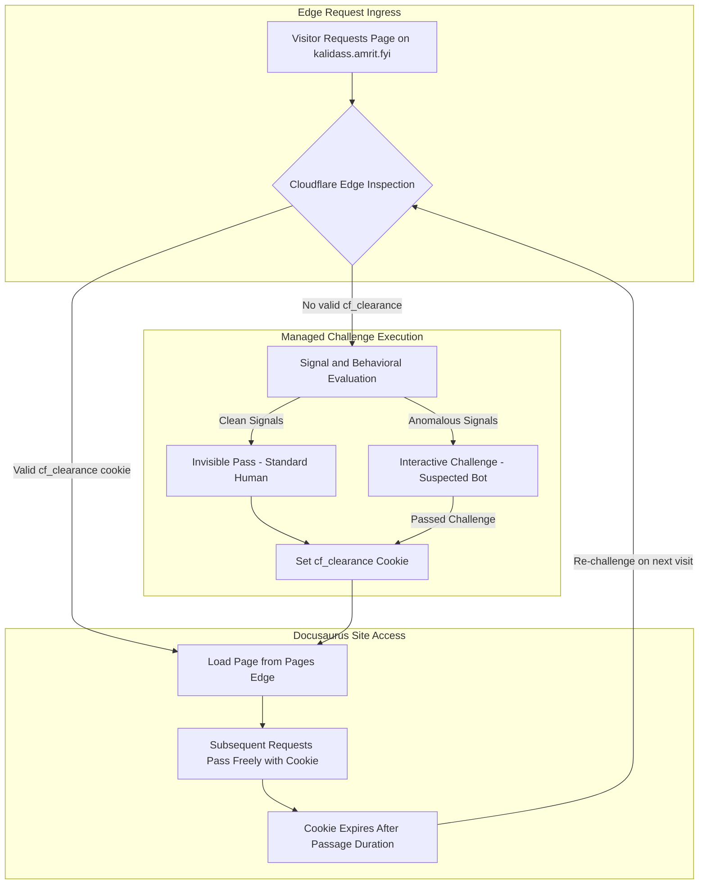

# Bot Protection

for each page of kalidass.amrit.fyi:

Visitor requests any page — Cloudflare intercepts the request at the edge before it reaches your Docusaurus site.
Managed Challenge runs — Cloudflare checks the visitor's signals; most humans pass invisibly, bots get an interactive challenge.
cf_clearance cookie is set — once passed, the visitor gets a clearance cookie stored in their browser.
All subsequent pages load freely — the cookie lets them browse every page on kalidass.amrit.fyi without being re-challenged.
Cookie expires after the Challenge Passage duration — once it expires, the visitor is challenged again on their next visit.

---

## Cloudflare WAF Custom Rule Configuration

| Order | Name | Description / Expression | Action | CSR | Events | Status |
| :--- | :--- | :--- | :--- | :--- | :--- | :--- |
| **1** | `kalidass` | `Hostname contains kalidass.amrit.fyi` | **Managed Challenge** *(stops evaluating later rules)* | 0% | 0 | **Active** |

---

## Challenge Lifecycle & Edge Flow

