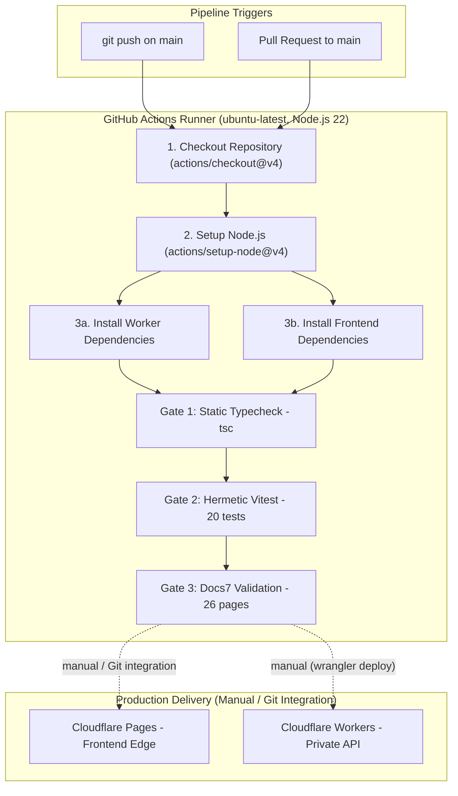

# Continuous Integration & Deployment (CI/CD)

Kalidass Journal enforces automated quality verification using **GitHub Actions CI** on every push and pull request to the `main` branch. The pipeline guarantees that regressions in TypeScript types, edge runtime contracts, safety heuristics, or documentation syntax are caught before deployment.

---

## 1. CI Pipeline Architecture



---

## 2. Automated Quality Gates

Every CI execution runs through three automated quality gates:

### Gate 1: Frontend Static Typecheck
- **Command**: `npm --prefix blog_frontend run typecheck`
- **Engine**: TypeScript compiler (`tsc` with `noEmit: true`).
- **Scope**: Validates all React 19 pages, polymorphic block renderers (`StoryBody`, `ArticleCard`), client modules (`api-base`, `webmcp`), and API client bindings.
- **Invariant**: Catches missing properties, invalid block unions, or improper DOM API usages at compile time.

### Gate 2: Hermetic Worker Vitest Suite
- **Command**: `npm --prefix worker test`
- **Engine**: Vitest in isolated Node.js environment.
- **Scope**: 68 hermetic test cases across 9 test suites:
  - Safety heuristics & word-boundary Scunthorpe defense (`test/eval_heuristic.test.js`).
  - In-memory storage adapter mechanics (`test/memory_store.test.js`).
  - Draft normalization and schema sanitization (`test/schemas.test.js`).
  - Worker REST API endpoint contracts & auth guards (`test/worker_api.test.js`).
  - Concurrency & race conditions — async index mutex (`test/concurrency.test.js`).
  - SerpApi search intelligence pipeline & cascade (`test/intelligence.test.js`).
  - WebMCP route isolation & slug resolution (`test/webmcp.test.js`).
  - Box generator prompt construction & grounding (`test/prompts.test.js`).
  - Upstash Redis multi-user feed delivery, 3h ETag revalidation & story cache (`test/redis_cache.test.js`).
- **Invariant**: 100% mocked and hermetic with zero external network calls and sub-second execution (~750ms).

### Gate 3: Portable Docs7 Documentation Validator
- **Command**: `node scripts/validate_docs.mjs docs`
- **Engine**: Self-contained Node.js validator (`scripts/validate_docs.mjs`).
- **Scope**: Validates `docs/docs.json`, frontmatter completeness (`title` and `description`), navigation consistency (0 orphans, 0 dangling slugs), strict-mode Mermaid syntax, and `<Tree>` component compliance.
- **Invariant**: Prevents documentation drift and ensures live docs render reliably without browser crashes or hanging diagrams.

---

## 3. Workflow Specification

The workflow is declared in `.github/workflows/ci.yml`:

```yaml
name: CI

on:
  push:
    branches: [main]
  pull_request:
    branches: [main]

jobs:
  test:
    name: Verify & Test
    runs-on: ubuntu-latest

    steps:
      - name: Checkout Repository
        uses: actions/checkout@v4

      - name: Setup Node.js 22
        uses: actions/setup-node@v4
        with:
          node-version: 22

      - name: Install Worker Dependencies
        run: npm --prefix worker install

      - name: Install Frontend Dependencies
        run: npm --prefix blog_frontend install

      - name: Frontend Static Typecheck
        run: npm --prefix blog_frontend run typecheck

      - name: Worker Hermetic Vitest Test Suite
        run: npm --prefix worker test

      - name: Docs7 Documentation Validation
        run: node scripts/validate_docs.mjs docs
```

---

## 4. Zero-Secret Invariants & PR Security

The CI pipeline is architected to operate with **zero repository secrets**:
- **Hermetic Tests**: Tests run entirely against in-memory mocks (`memoryBucket`, local heuristics, mock `env`). No access to production Upstash, Auth0, or Cloudflare API tokens is needed.
- **Safe Fork PRs**: Pull requests from community forks or external contributors run without leaking credentials or failing due to missing secrets.
- **No System Environment Inspection**: CI scripts never dump environment variables or inspect host filesystems.

---

## 5. Deployment Pipelines

Production delivery occurs through decoupled Cloudflare workflows:

<Tree>
  <Tree.Folder name=".github" defaultOpen>
    <Tree.Folder name="workflows" defaultOpen>
      <Tree.File name="ci.yml" highlight />
    </Tree.Folder>
  </Tree.Folder>
  <Tree.Folder name="scripts" defaultOpen>
    <Tree.File name="validate_docs.mjs" highlight />
  </Tree.Folder>
</Tree>

- **Frontend (Cloudflare Pages)**: Built via Git integration or direct deployment (`npm run build` on Linux CI). Serves pre-rendered HTML and client assets on `https://kalidass.amrit.fyi`.
- **Backend API (Cloudflare Worker)**: Deployed via Wrangler (`npx wrangler deploy`). Executes privately behind Service Binding RPC with `workers_dev = false`.
