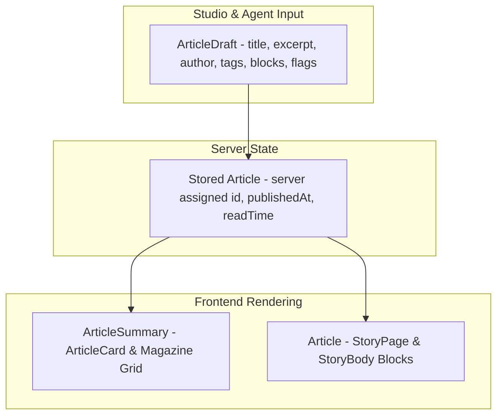

# Data Model

The single source of truth for frontend data contracts resides in `src/lib/types.ts`. The schema consists of three progressive models: `ArticleSummary`, `Article`, and `ArticleDraft`.

## Data Model Flow



## Author Schema

```typescript
export interface Author {
  name: string;
  role: string;
  avatar?: string;
}
```

- **Cards (`ArticleCard.tsx`)**: Renders the avatar image when provided, or the first uppercase initial of `name` (falling back to `"C"`).
- **Reader Byline (`StoryPage.tsx`)**: Displays the author's name, role, publication date, and calculated read time.

## Block Union

The body of each essay is composed of an ordered list of polymorphic blocks:

```typescript
export type Block =
  | { type: "paragraph"; text: string; _id?: string }
  | { type: "heading"; text: string; _id?: string }
  | { type: "quote"; text: string; cite?: string; _id?: string }
  | { type: "image"; url: string; caption?: string; _id?: string }
  | { type: "video"; url: string; caption?: string; _id?: string }
  | {
      type: "code";
      text: string;
      language?: string;
      title?: string;
      showLineNumbers?: boolean;
      wrapLines?: boolean;
      highlightLines?: string;
      _id?: string;
    };
```

| Type | Fields | Rendering Component |
| --- | --- | --- |
| `paragraph` | `text` | Native `<p>` element with typography styling |
| `heading` | `text` | Section heading `<h2>` |
| `quote` | `text`, `cite?` | Pull quote `<blockquote>` with optional `<cite>` tag |
| `image` | `url`, `caption?` | Responsive `<figure>` with `` and `<figcaption>` |
| `video` | `url`, `caption?` | `VideoEmbed` component (YouTube, Vimeo, or direct MP4) |
| `code` | `text`, `language?`, `title?`, `showLineNumbers?`, `wrapLines?`, `highlightLines?` | `ArticleCodeBlock` with Prism syntax highlighting, optional line numbers, line wrapping, and highlighted line ranges |

## Article Models

### `ArticleSummary`

Used in index feeds, search results, and Studio summary listings:

- `id: string` — Server-generated unique identifier.
- `slug: string` — URL segment slug.
- `title: string` — Article headline.
- `subtitle?: string` — Secondary header deck.
- `excerpt?: string` — Summary description used on cards and meta tags.
- `coverImage?: string` — URL to hero image asset.
- `videoUrl?: string` — URL to lead video player asset.
- `author: Author` — Author metadata.
- `authorEmail: string` — Non-editable creator email stamped by backend from login credentials.
- `tags: string[]` — List of topic tags.
- `accent: string` — Hex color string applied to CSS custom properties.
- `publishedAt: string` — ISO publication timestamp (empty for drafts).
- `readTime: string` — Formatted read time estimated from content word count.
- `featured?: boolean` — Flags article as the lead cover story.
- `published?: boolean` — `false` for drafts, `true` for live articles.
- `private?: boolean` — `true` for unlisted articles (readable only by the author or an admin).
- `aiGenerated?: boolean` — Displays the `AI` badge across cards and headers.
- `userId?: string` — Auth0 subject identifier or system user ID.
- `updatedAt?: string` — ISO timestamp of last modification.
- `has_intelligence?: boolean` — Lightweight flag indicating a compiled AI intelligence dossier exists.
- `has_books?: boolean` — Lightweight flag indicating compiled book suggestions exist.
- `has_research?: boolean` — Lightweight flag indicating compiled arXiv research suggestions exist.

### `Article`

The complete article payload returned by `getArticle()` and consumed by `StoryPage.tsx`:
- All properties of `ArticleSummary`.
- `blocks: Block[]` — Array of body content blocks.
- `createdAt?: string` — ISO record creation timestamp.
- `books_suggestions?: BooksSuggestionData | null` — Embedded book dossier (authenticated `?books=true` variant only).
- `research_suggestions?: ResearchSuggestionData | null` — Embedded arXiv research dossier when stored on the article (the reader otherwise lazy-fetches `/api/articles/:slug/research`).

### `ArticleDraft`

The payload sent during article creation (`POST /api/articles`) and editing (`PUT /api/articles/:slug`):
- Contains all content fields: `title`, `subtitle`, `excerpt`, `coverImage`, `videoUrl`, `author`, `tags`, `accent`, `featured`, `blocks`, `published`, `private`, `aiGenerated`, and optional `slug`.
- **Excludes server-managed fields**: `id`, `authorEmail`, `publishedAt`, `readTime`, `createdAt`, `updatedAt` (the server stamps `authorEmail` automatically from credentials).
- The helper `fromArticle()` in `admin.tsx` converts an existing `Article` into an `ArticleDraft` by stripping server-owned fields.

### `AuthUser`

The user identity contract resolved by `getAuthUser()` and `/api/auth/me`:

```typescript
export type AuthUser = {
  sub: string;
  email: string;
  name?: string;
  avatar?: string;
  role: "admin" | "author";
};
```

## Core Operational Flags

- **`published`**: When `false`, the article is saved as a draft. It is excluded from public API responses and direct GET queries return `404` unless authenticated with the Bearer token.
- **`private`**: Defaults to `true` (unlisted). When `true`, the article is excluded from public feeds (`/` and `/magazine`) and is readable only by its author or an admin; anonymous requests to the direct `/story/:slug` URL return `404`. Set to `false` in Studio to feature publicly.
- **`aiGenerated`**: Defaults to `false`. When enabled, renders an `AI` tag chip on cards and story headers.

## Article Intelligence Schema (`AiIntelligence`)

Search grounding context returned by `/api/articles/:slug/intel`:

```typescript
export interface AiIntelligence {
  query: string;
  ai_overview?: {
    text?: string;
    snippet?: string;
    expanded?: {
      text_blocks?: Array<{
        type?: string;
        text?: string;
        snippet?: string;
        reference_indexes?: number[];
      }>;
      references?: AiIntelligenceReference[];
    };
    references?: AiIntelligenceReference[];
  } | null;
  knowledge_graph?: {
    title?: string;
    type?: string;
    description?: string;
    website?: string;
    attributes?: Record<string, string | number | boolean>;
  } | null;
  people_also_ask?: Array<{
    question: string;
    snippet?: string;
    link?: string;
  }>;
  inline_videos?: Array<{
    title?: string;
    link?: string;
    channel?: string;
    duration?: string;
  }>;
  organic_results?: Array<{
    title: string;
    link: string;
    snippet: string;
  }>;
  answer_box?: {
    title?: string;
    snippet?: string;
    link?: string;
  } | null;
  news?: Array<{ title: string; source: string; date: string; link: string }>;
  books_shopping?: Array<{ title: string; price: string; source: string; link: string }>;
  jobs_results?: Array<{ title: string; company_name: string; location: string; via: string }>;
  discussions_and_forums?: Array<{ title: string; link: string; forum: string }>;
  fetchedAt?: string;
}
```

## Quality & Safety Evaluation Schema (`QualityEvalResult`)

Payload returned by `POST /api/eval/quality`:

```typescript
export interface QualityEvalResult {
  ok: boolean;
  source: "typesafe-jev" | "cloudflare-clef" | "local-heuristic";
  safety: {
    violence: number;
    sexual: number;
    antisocial: number;
    verdict: "safe" | "rejected";
    violations: string[];
  };
  metrics: {
    isAiWritten: { probability: number; label: string };
    accuracy: { score: number; level: string; confidence: number };
    engagement: { score: number; level: string; confidence: number };
    editorialReadiness: { choice: string; confidence: number };
  };
  summary: string;
}
```

## Books Suggestion Schema (`BooksSuggestionData`)

Amazon book recommendations compiled per article (see [Books Suggestions](/books-suggestions)):

```typescript
export interface BooksSuggestionData {
  query: string;
  topic: string;
  amazon_domain: string;
  fetchedAt: string;
  scoredBy: "jev" | "clef" | "heuristic" | string;
  books: BookSuggestionItem[];
}

export interface BookSuggestionItem {
  title: string;
  link: string;
  thumbnail?: string;
  price?: string;
  rating?: number;
  reviews_count?: number;
  authors?: string[];
  asin?: string;
  badge?: string;
  score?: number;
  isBookConfidence?: number;
  topicSimilarity?: number;
}
```

## Research Suggestion Schema (`ResearchSuggestionData`)

arXiv preprint recommendations compiled per article (see [Research Suggestions](/research-suggestions)):

```typescript
export interface ResearchSuggestionData {
  query: string;
  topic: string;
  fetchedAt: string;
  scoredBy: "jev" | "clef" | "heuristic" | string;
  papers: ResearchPaperItem[];
}

export interface ResearchPaperItem {
  id: string;
  title: string;
  summary: string;
  authors: Array<{ name: string; affiliation?: string }>;
  links: { abstract: string; pdf?: string; doi?: string };
  published?: string;
  updated?: string;
  categories?: string[];
  primaryCategory?: string | null;
  score?: number;
  isPaperConfidence?: number;
  topicSimilarity?: number;
  recencyTimestamp?: number;
}
```

