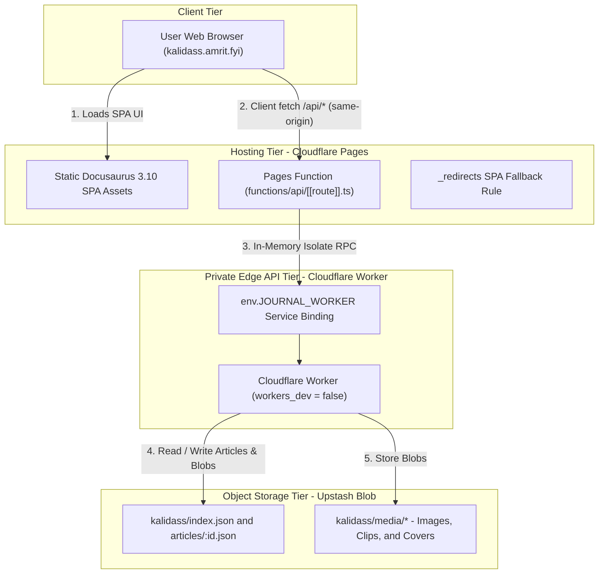
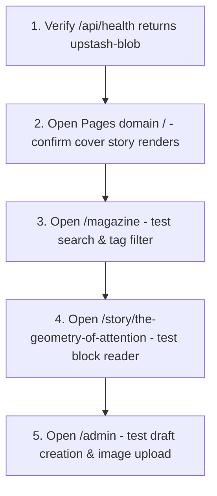

# Deployment

Kalidass Journal uses a serverless 3-tier production architecture combining a static Docusaurus frontend hosted on Cloudflare Pages, an edge API running on Cloudflare Workers, and object persistence in Upstash Blob.

## Deployment Topology



## Prerequisites Checklist

Before initiating deployment, gather and configure the following credentials:

| Requirement | Service | Purpose |
| --- | --- | --- |
| **Public Blob Bucket** | Upstash | Stores article JSON schemas and uploaded media objects |
| **`UPSTASH_BLOB_TOKEN`** | Upstash Console | Authenticates Worker and browser client uploads |
| **`AUTH0_DOMAIN`** | Auth0 Tenant | Signs and verifies user JWTs (e.g. `dev-xxx.us.auth0.com`) |
| **`AUTH0_AUDIENCE`** | Auth0 API | API audience identifier (`https://api.kalidass.amrit.fyi`) |
| **`AUTH0_CLIENT_ID`** | Auth0 SPA App | Client ID for Docusaurus frontend authentication |
| **`ADMIN_EMAILS`** | Cloudflare Secret | *(Optional)* Comma-separated list of Super-Admin emails |
| **`ADMIN_TOKEN`** | Cloudflare Secret | *(Optional)* Protects Studio CMS write and delete endpoints |
| **`JOURNAL_WORKER`** | Cloudflare Pages Binding | Direct edge RPC binding to `kalidass-journal-worker` |
| **`NODE_VERSION`** | Cloudflare Pages Env | Specifies Node.js `20` or `22` for build runtime |
| **`PRIVATE_APP`** | Cloudflare Pages Env | *(Optional)* Set to `true` to disable Auth0 and require admin token |

---

## 1. Upstash Blob Bucket Setup

Kalidass Journal requires a **Public** Upstash Blob bucket so that article cover images, video assets, and article JSON files are accessible via public HTTPS URLs.

1. Navigate to the [Upstash Console](https://console.upstash.com/blob).
2. Click **Create Bucket**.
3. Set the bucket name (e.g., `kalidass-journal`) and select your preferred region.
4. Set the bucket access type to **Public**.
5. Copy the generated **Read-Write Token**.

> [!IMPORTANT]
> Keep `UPSTASH_BLOB_TOKEN` exclusively on the Cloudflare Worker as a secret. Never expose this token in client-side bundles or repository files.

---

## 2. Auth0 API & Application Setup

Auth0 manages user authentication and scopes access tokens for the Cloudflare Worker API.

### Step 2.1: Register the Auth0 API (Resource Server)

1. Navigate to [Auth0 Dashboard](https://manage.auth0.com/) -> **Applications** -> **APIs**.
2. Click **+ Create API**:
   - **Name**: `Kalidass Worker API`
   - **Identifier**: `https://api.kalidass.amrit.fyi` *(Must match `AUTH0_AUDIENCE`)*
   - **Signing Algorithm**: `RS256`
3. Click **Create**.
4. In API **Settings**:
   - **Token Expiration (Seconds)**: `86400`
   - **Allow Skipping User Consent**: **ON**
   - Click **Save**.

### Step 2.2: Register the SPA Application

1. Navigate to **Applications** -> **Applications** -> **+ Create Application**:
   - **Name**: `Kalidass Journal UI`
   - **Application Type**: **Single Page Web Applications**
2. In **Settings**, configure the Application URIs:
   - **Allowed Callback URLs**: `https://kalidass.amrit.fyi/, http://localhost:3000/, https://kalidass.amrit.fyi/admin, http://localhost:3000/admin`
   - **Allowed Logout URLs**: `https://kalidass.amrit.fyi/, http://localhost:3000/, https://kalidass.amrit.fyi/admin, http://localhost:3000/admin`
   - **Allowed Web Origins**: `https://kalidass.amrit.fyi, http://localhost:3000`
   - **Allow Cross-Origin Authentication**: Checked
3. Copy **Domain** (`AUTH0_DOMAIN`) and **Client ID** (`AUTH0_CLIENT_ID`). Click **Save Changes**.

### Step 2.3: Add Custom Claim Action (Recommended)

1. Navigate to **Actions** -> **Library** -> **Build Custom**:
   - **Name**: `Add Email and Roles to Access Token`
   - **Trigger**: `Login / Post Login`
2. In the Action editor:
```javascript
exports.onExecutePostLogin = async (event, api) => {
  const namespace = 'https://kalidass.amrit.fyi';
  if (event.user.email) {
    api.accessToken.setCustomClaim(`${namespace}/email`, event.user.email);
    api.idToken.setCustomClaim(`${namespace}/email`, event.user.email);
  }
  if (event.authorization && event.authorization.roles) {
    api.accessToken.setCustomClaim(`${namespace}/roles`, event.authorization.roles);
  }
};
```
3. Click **Deploy**, then go to **Actions** -> **Flows** -> **Login**, drag the Action into the flow, and click **Apply**.

---

## 3. Cloudflare Worker Deployment

The Cloudflare Worker serves as the edge REST gateway. It handles article querying, slug deduplication, CORS negotiation, and signed upload delegations.

### Step 3.1: Install Dependencies & Secrets

Navigate to the `worker/` directory:

```bash
cd worker
npm install
```

Set the Upstash Blob secret in Cloudflare:

```bash
npx wrangler secret put UPSTASH_BLOB_TOKEN
# Paste your Upstash Blob token when prompted
```

Set Auth0 and Super-Admin secrets:

```bash
# Set Auth0 Domain (without https://)
npx wrangler secret put AUTH0_DOMAIN
# Enter: dev-amrit.us.auth0.com

# (Optional) Comma-separated list of Super-Admin emails eligible for step-up elevation
npx wrangler secret put ADMIN_EMAILS
# Enter: your-email@example.com,editor@example.com

# (Optional) Fallback Administrative Token for offline/token bypass
npx wrangler secret put ADMIN_TOKEN
# Enter a secure passphrase or secret
```

### Step 3.2: Deploy Private Worker to Cloudflare

Run the Wrangler deployment command:

```bash
npx wrangler deploy
```

*Note: In `worker/wrangler.toml`, `workers_dev = false` ensures the worker has no public `*.workers.dev` routing and remains strictly private.*

### Step 3.3: Verify Live Gateway Health via Pages

Once the Cloudflare Pages Service Binding (`JOURNAL_WORKER`) is attached, test the health endpoint through the Pages domain:

```bash
curl https://kalidass.amrit.fyi/api/health
```

Expected response:

```json
{"ok":true}
```

---

## 4. Cloudflare Pages Deployment

The frontend is a static Docusaurus site that hydrates dynamically in the client.

### Step 4.1: Build Configuration in Cloudflare Dashboard

1. In the [Cloudflare Dashboard](https://dash.cloudflare.com/), go to **Workers & Pages** -> **Create application** -> **Pages** -> **Connect to Git**.
2. Select your repository and configure the build settings:

| Setting | Value |
| --- | --- |
| **Framework preset** | `None` |
| **Root directory** | `blog_frontend` |
| **Build command** | `npm install && npm run build` |
| **Build output directory** | `build` |

### Step 4.2: Configure Service Binding & Environment

1. Under **Settings** -> **Bindings** (or **Functions** -> **Service bindings**), add:
   - **Type**: `Service binding`
   - **Name**: `JOURNAL_WORKER`
   - **Value**: `kalidass-journal-worker`
2. Under **Environment variables (Advanced)**, add:
   - `AUTH0_DOMAIN`: `dev-amrit.us.auth0.com`
   - `AUTH0_CLIENT_ID`: `<your-spa-client-id>`
   - `AUTH0_AUDIENCE`: `https://api.kalidass.amrit.fyi`
   - `NODE_VERSION`: `20`
   - `PRIVATE_APP`: `false` *(or `true` if operating in solo token mode)*

Click **Save and Deploy**.

### Step 4.3: Direct CLI Deployment (Alternative)

To deploy without connecting to a Git provider, use Wrangler Pages:

```bash
cd blog_frontend
npm run build
npx wrangler pages deploy build --project-name=kalidass
```

---

## 5. SPA Route Handling & Security Headers

### SPA Route Handling (`_redirects`)

Because article URLs (`/story/:slug`) are dynamic client routes, direct browser reloads must resolve to `index.html`. The file `static/_redirects` is copied to the build root:

```text
/story/* /index.html 200
```

### Security & Trust Headers (`_headers`)

Cloudflare Pages enforces enterprise-grade Trust & Safety headers via `static/_headers`:

- **`Content-Security-Policy`**: Restricts scripts, styles, media, and frame ancestors.
- **`Strict-Transport-Security`**: `max-age=31536000; includeSubDomains; preload`
- **`Cross-Origin-Opener-Policy`**: `same-origin-allow-popups`
- **`X-Frame-Options`**: `SAMEORIGIN`
- **`Permissions-Policy`**: Disables `browsing-topics` and ad tracking APIs.
- **`X-Content-Type-Options`**: `nosniff`

---

## 6. Worker CORS Lockdown

Once your Pages deployment URL is live (e.g., `https://kalidass-journal.pages.dev`):

1. Update `worker/wrangler.toml`:

```toml
name = "kalidass-journal-worker"
main = "src/index.js"
compatibility_date = "2026-09-01"
compatibility_flags = ["nodejs_compat"]

[vars]
CORS_ORIGIN = "https://kalidass-journal.pages.dev"
```

2. Redeploy the Worker:

```bash
cd worker
npx wrangler deploy
```

---

## 7. Post-Deployment Verification

Verify the end-to-end pipeline across the live site:



1. **Cover & Issue Index**: Open the Pages domain and verify the featured story and recent index render without errors.
2. **Dynamic Story Reader**: Click on an article card and verify the `/story/:slug` route loads smoothly. Refresh the browser page to ensure `_redirects` works.
3. **Studio CMS**: Navigate to `/admin`. If `ADMIN_TOKEN` was set, provide the token in browser storage:
   ```javascript
   localStorage.setItem('kalidass-admin-token', '<your-admin-token>');
   ```
4. **Blob Upload**: Upload a cover image and create a draft brief to confirm write operations to Upstash Blob.
