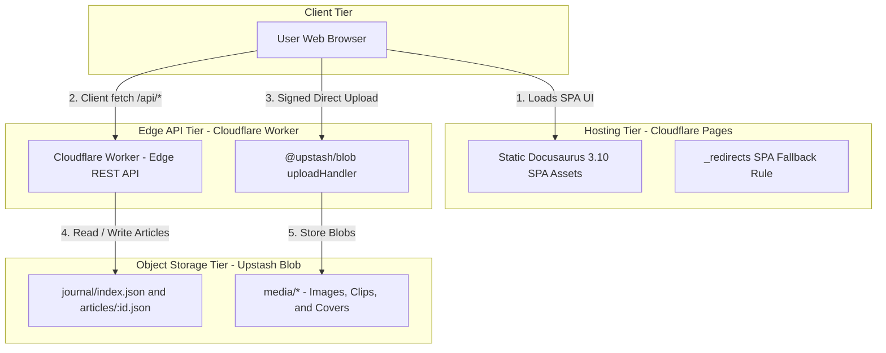
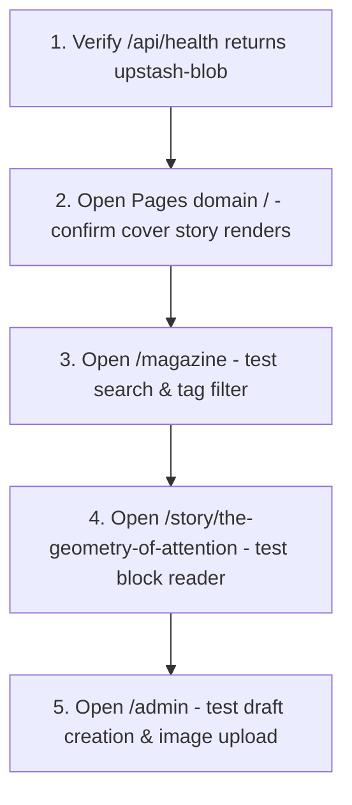

# Deployment

Kalidass Journal uses a serverless 3-tier production architecture combining a static Docusaurus frontend hosted on Cloudflare Pages, an edge API running on Cloudflare Workers, and object persistence in Upstash Blob.

## Deployment Topology



## Prerequisites Checklist

Before initiating deployment, gather and configure the following credentials:

| Requirement | Service | Purpose |
| --- | --- | --- |
| **Public Blob Bucket** | Upstash | Stores article JSON schemas and uploaded media objects |
| **`UPSTASH_BLOB_TOKEN`** | Upstash Console | Authenticates Worker and browser client uploads |
| **`ADMIN_TOKEN`** | Cloudflare Secret | *(Optional)* Protects Studio CMS write and delete endpoints |
| **`JOURNAL_WORKER`** | Cloudflare Pages Binding | Direct edge RPC binding to `kalidass-journal-worker` |
| **`NODE_VERSION`** | Cloudflare Pages Env | Specifies Node.js `20` or `22` for build runtime |

---

## 1. Upstash Blob Bucket Setup

Kalidass Journal requires a **Public** Upstash Blob bucket so that article cover images, video assets, and article JSON files are accessible via public HTTPS URLs.

1. Navigate to the [Upstash Console](https://console.upstash.com/blob).
2. Click **Create Bucket**.
3. Set the bucket name (e.g., `kalidass-journal`) and select your preferred region.
4. Set the bucket access type to **Public**.
5. Copy the generated **Read-Write Token**.

> [!IMPORTANT]
> Keep `UPSTASH_BLOB_TOKEN` exclusively on the Cloudflare Worker as a secret. Never expose this token in client-side bundles or repository files.

---

## 2. Cloudflare Worker Deployment

The Cloudflare Worker serves as the edge REST gateway. It handles article querying, slug deduplication, CORS negotiation, and signed upload delegations.

### Step 2.1: Install Dependencies & Secrets

Navigate to the `worker/` directory:

```bash
cd worker
npm install
```

Set the Upstash Blob secret in Cloudflare:

```bash
npx wrangler secret put UPSTASH_BLOB_TOKEN
# Paste your Upstash Blob token when prompted
```

*(Optional)* Set an administrative token to protect `/admin` operations:

```bash
npx wrangler secret put ADMIN_TOKEN
# Enter a secure passphrase or secret
```

### Step 2.2: Deploy Worker to Cloudflare

Run the Wrangler deployment command:

```bash
npx wrangler deploy
```

Take note of the resulting Worker URL (e.g., `https://kalidass-journal.<subdomain>.workers.dev`).

### Step 2.3: Verify Worker Health

Test that the worker is connected to Upstash Blob:

```bash
curl https://kalidass-journal.<subdomain>.workers.dev/api/health
```

Expected response:

```json
{"ok":true}
```

---

## 3. Cloudflare Pages Deployment

The frontend is a static Docusaurus site that hydrates dynamically in the client.

### Step 3.1: Build Configuration in Cloudflare Dashboard

1. In the [Cloudflare Dashboard](https://dash.cloudflare.com/), go to **Workers & Pages** -> **Create application** -> **Pages** -> **Connect to Git**.
2. Select your repository and configure the build settings:

| Setting | Value |
| --- | --- |
| **Framework preset** | `None` |
| **Root directory** | `blog_frontend` |
| **Build command** | `npm install && npm run build` |
| **Build output directory** | `build` |

### Step 3.2: Configure Service Binding & Environment

1. Under **Settings** -> **Bindings** (or **Functions** -> **Service bindings**), add:
   - **Type**: `Service binding`
   - **Name**: `JOURNAL_WORKER`
   - **Value**: `kalidass-journal-worker`
2. Under **Environment variables (Advanced)**, add:
   - `NODE_VERSION`: `20`

Click **Save and Deploy**.

### Step 3.3: Direct CLI Deployment (Alternative)

To deploy without connecting to a Git provider, use Wrangler Pages:

```bash
cd blog_frontend
npm run build
npx wrangler pages deploy build --project-name=kalidass
```

---

## 4. SPA Route Handling (`_redirects`)

Because article URLs (`/story/:slug`) are dynamic client routes, direct browser reloads must resolve to `index.html`.

The file `static/_redirects` is automatically included in the build root:

```text
/story/* /index.html 200
```

Cloudflare Pages detects `_redirects` and serves `index.html` with a `200` status code, allowing the React router in `StoryPage.tsx` to mount and fetch the article payload.

---

## 5. Worker CORS Lockdown

Once your Pages deployment URL is live (e.g., `https://kalidass-journal.pages.dev`):

1. Update `worker/wrangler.toml`:

```toml
name = "kalidass-journal-worker"
main = "src/index.js"
compatibility_date = "2026-09-01"
compatibility_flags = ["nodejs_compat"]

[vars]
CORS_ORIGIN = "https://kalidass-journal.pages.dev"
```

2. Redeploy the Worker:

```bash
cd worker
npx wrangler deploy
```

---

## 6. Post-Deployment Verification

Verify the end-to-end pipeline across the live site:



1. **Cover & Issue Index**: Open the Pages domain and verify the featured story and recent index render without errors.
2. **Dynamic Story Reader**: Click on an article card and verify the `/story/:slug` route loads smoothly. Refresh the browser page to ensure `_redirects` works.
3. **Studio CMS**: Navigate to `/admin`. If `ADMIN_TOKEN` was set, provide the token in browser storage:
   ```javascript
   localStorage.setItem('kalidass-admin-token', '<your-admin-token>');
   ```
4. **Blob Upload**: Upload a cover image and create a draft brief to confirm write operations to Upstash Blob.
