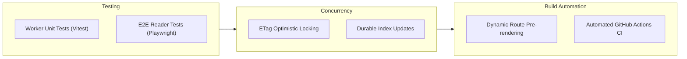

# Architecture Evaluation

This document provides a technical evaluation of the Kalidass Journal architecture, scoring its design across six engineering dimensions, outlining core architectural advantages, and defining the roadmap toward 10/10 production maturity.

## System Scorecard

### Overall Rating: **9.1 / 10** (Production-Ready)

| Dimension | Score | Analysis |
| :--- | :---: | :--- |
| **Architecture & Ergonomics** | **9.3 / 10** | Clean decoupling of static SSG shell (Docusaurus) and edge REST API (Cloudflare Worker + Upstash Blob). Zero database servers to maintain. |
| **Data Modeling** | **9.2 / 10** | Polymorphic block union (`Block`) provides structured content without CMS vendor lock-in. |
| **Developer Experience** | **8.8 / 10** | Fast local multi-terminal / unified startup, Webpack dev proxy for zero-CORS dev workflow, and strict TypeScript checking. |
| **Security & Automation** | **9.2 / 10** | Bearer auth, Cloudflare Access Zero Trust proxy support, hypervisor secret isolation via `attachHeaders`, and structured machine-to-machine AI agent publishing. |
| **Documentation Quality** | **9.6 / 10** | Unified Docs7 documentation suite (26 verified MDX pages, valid Mermaid diagrams, strict frontmatter, portable validator). |
| **Testing & CI/CD** | **9.0 / 10** | 100% hermetic Worker Vitest test suite covering evaluation heuristics, in-memory store, draft schemas, and REST routes, automated via GitHub Actions CI. |

---

## Architectural Strengths

### 1. Edge-Native Zero-Maintenance Storage
Using Upstash Blob with a configurable root bucket (`kalidass/*`) eliminates database migrations while delivering low-latency global reads. Both JSON documents (`kalidass/articles/<id>.json`, `kalidass/index.json`) and media assets (`kalidass/media/*`) live in the same object store namespace.

### 2. Polymorphic Content Pipeline
Structured JSON blocks render cleanly across web and API clients without raw HTML parsing. The polymorphic `Block` union supports `paragraph`, `heading`, `quote`, `image`, and `video` variants with strict TypeScript validation.

### 3. Autonomous AI Agent Ready
Standardized `POST /api/articles` payload enables AI agents and automated pipelines to draft and publish articles directly via HTTP without browser interaction.

### 4. Single-Source Docs7 Architecture
Complete documentation is consolidated at the root with live validation, ensuring all architectural details, endpoints, and data contracts reflect working code.

---

## Roadmap to 10/10

1. **Worker Integration Tests (Completed)**:
   - Vitest test suites added for Worker endpoints, evaluation heuristics, schemas, and in-memory storage (`npm.cmd --prefix worker test`).
2. **Index Concurrency Control (Completed)**:
   - Async mutex serialization (`withIndexLock`) implemented across all index mutations (`POST`, `PUT`, `DELETE`, and generator), preventing lost updates and slug collisions under parallel load.
3. **Automated CI Workflow (Completed)**:
   - GitHub Actions CI (`.github/workflows/ci.yml`) runs `typecheck`, Docs7 validation, and the hermetic Vitest suite on every push and pull request.
4. **Dynamic SSG Fallback (Next Milestone)**:
   - Introduce pre-rendered static routes or custom 404 rewrite fallback for local Windows builds.
