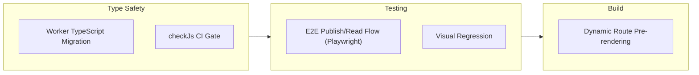

# Architecture Evaluation

This document provides a technical assessment of the Kalidass Journal architecture: what the design does well, where its known limitations lie, and the roadmap for hardening it. It deliberately avoids self-assigned scores — see the limitations below for the areas that would actually benefit from investment.

## Architectural Strengths

### 1. Edge-Native Zero-Maintenance Storage
Using Upstash Blob with a configurable root bucket (`kalidass/*`) eliminates database migrations while delivering low-latency global reads. Both JSON documents (`kalidass/articles/<id>.json`, `kalidass/index.json`) and media assets (`kalidass/media/*`) live in the same object store namespace.

### 2. Polymorphic Content Pipeline
Structured JSON blocks render cleanly across web and API clients without raw HTML parsing. The polymorphic `Block` union supports `paragraph`, `heading`, `quote`, `image`, and `video` variants with strict TypeScript validation.

### 3. Autonomous AI Agent Ready
Standardized `POST /api/articles` payload enables AI agents and automated pipelines to draft and publish articles directly via HTTP without browser interaction.

### 4. Single-Source Docs7 Architecture
Complete documentation is consolidated at the root with live validation, ensuring all architectural details, endpoints, and data contracts reflect working code.

---

## Known Limitations

1. **Worker is untyped JavaScript**: The frontend is strict TypeScript, but the Worker — the security-critical surface — relies on JSDoc annotations only; type errors surface at runtime, not compile time.
2. **Whole-index read-modify-write**: Article listing loads and rewrites the full JSON index per mutation. The `withIndexLock` async mutex prevents lost updates and slug collisions, but the pattern itself caps write throughput and is a ceiling at high traffic.
3. **No end-to-end tests**: Coverage is component-level (frontend jsdom suite) and unit-level (Worker Vitest suite); there is no browser E2E publish/read flow or visual regression testing.
4. **Windows build limitation**: `npm run build` fails locally because the dynamic `/story/:slug*` route contains `:`, which is illegal in Windows filenames; production builds run on Linux CI.
5. **Single-region Worker**: No multi-region replication or response caching layer for the API.

---

## Hardening Roadmap

Already shipped: hermetic Worker Vitest suites (`worker/test/`), index concurrency control via `withIndexLock` across all mutations, GitHub Actions CI (typecheck, frontend UI tests, Worker tests, Docs7 validation), and the component-level frontend jsdom suite (`blog_frontend/src/**/*.test.{ts,tsx}`).

1. **Worker Type Safety (Next Milestone)**:
   - Migrate `worker/src` to TypeScript, or enable `checkJs` with JSDoc typechecking as a CI gate.
2. **E2E Smoke Tests (Next Milestone)**:
   - Browser-level publish/read flow (Playwright) against the in-memory store.
3. **Dynamic SSG Fallback (Next Milestone)**:
   - Pre-rendered static routes or a custom 404 rewrite fallback for local Windows builds.
