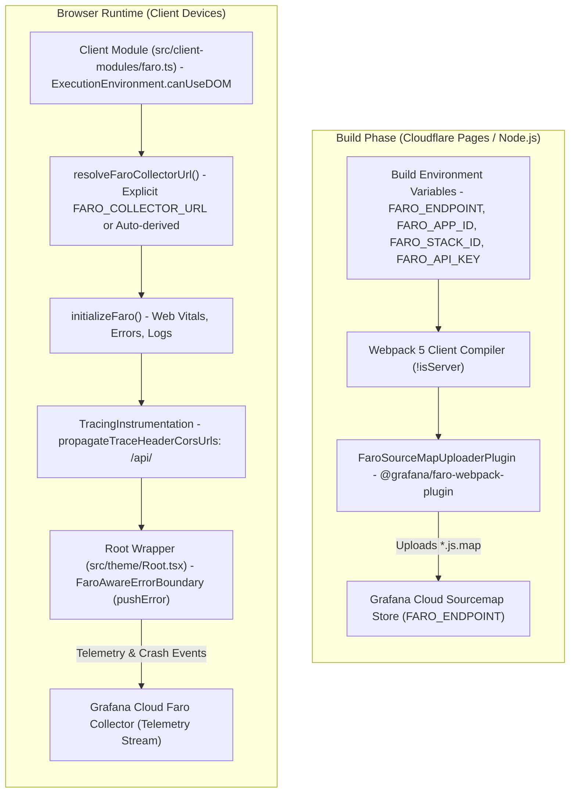

# Grafana Faro Frontend Observability

Kalidass Journal integrates **Grafana Faro Frontend Observability** to capture Real User Monitoring (RUM) telemetry, Core Web Vitals metrics, console logs, unhandled exceptions, and distributed HTTP traces from readers' browsers, paired with automated build-time source map uploads for de-obfuscated production stack traces.

---

## 1. Architectural Model

The integration divides telemetry into two independent pipelines:

---

## 2. Environment Variables & Secret Hygiene

To enforce strict security and prevent credentials leakage, **no endpoints, stack IDs, app IDs, or API keys are hardcoded in source control**. All telemetry configuration is driven by environment variables injected at build-time:

| Variable | Scope | Description |
| :--- | :--- | :--- |
| `FARO_COLLECTOR_URL` | Client (Public) | Ingestion URL where user browsers send live RUM telemetry and traces. |
| `FARO_ENDPOINT` | Build-only (Private) | Grafana Cloud Source Map API endpoint for uploading build artifacts. |
| `FARO_APP_ID` | Build + Client (Public by design) | Unique Grafana Application identifier. Browsers post telemetry with no auth header, so this ID is embedded in the client-visible collector URL when auto-derived. Never confuse with `FARO_API_KEY`. |
| `FARO_STACK_ID` | Build-only (Private) | Grafana Cloud Stack identifier. |
| `FARO_API_KEY` | Build-only (Private) | Secret API token with `sourcemaps:write` permission. |
| `FARO_APP_NAME` | Optional | Application identifier in Grafana (defaults to `kalidass`). |

---

## 3. Automatic Collector URL Derivation

To simplify deployment configuration, `docusaurus.config.ts` and `src/client-modules/faro.ts` provide automatic derivation for `faroCollectorUrl`:

1. **Explicit Override**: If `FARO_COLLECTOR_URL` is set, it is used directly.
2. **Auto-Derived Fallback**: If `FARO_COLLECTOR_URL` is omitted but `FARO_ENDPOINT` and `FARO_APP_ID` are present:
   - Replaces the API subdomain prefix (`faro-api-*`) with the collector subdomain prefix (`faro-collector-*`).
   - Appends `/collect/${FARO_APP_ID}`.
3. **Safe No-Op**: If neither configuration is provided, the client module stays cleanly inactive without generating console errors or breaking page loads.

### Content Security Policy

Browser telemetry POSTs from `faro.ts` are gated by the site CSP in `blog_frontend/static/_headers`. `connect-src` includes the vendor wildcard `https://*.grafana.net` — the same pattern used for Auth0 and Upstash — so any stack region or app ID works without committing stack-specific origins to git.

---

## 4. Docusaurus 3 & Webpack 5 Integration

Docusaurus 3 uses Webpack 5 for bundling and performs two compilation passes: a server-side static site generation pass (`isServer = true`) and a client bundle pass (`isServer = false`).

### Webpack Plugin Configuration
In `docusaurus.config.ts`, `@grafana/faro-webpack-plugin` is registered inside the custom plugin's `configureWebpack` hook:

- **Client Only**: Gated behind `!isServer` so the uploader only runs during the browser bundle compilation.
- **Credential Presence**: Only activated when all required build variables (`FARO_API_KEY`, `FARO_ENDPOINT`, `FARO_APP_ID`, `FARO_STACK_ID`) are present.
- **Safe Fallback**: If any build variable is missing (such as during local development or pull request previews), the uploader is skipped gracefully.

---

## 5. Client Module & SSR Lifecycle

Docusaurus pre-renders React components in Node.js where `window`, `document`, and `navigator` do not exist. To prevent SSR crashes:

1. **DOM Execution Guard**: Telemetry initialization in `src/client-modules/faro.ts` is guarded with `ExecutionEnvironment.canUseDOM`.
2. **Client Module Registration**: Registered in `clientModules` in `docusaurus.config.ts` to ensure execution immediately upon browser hydration.
3. **HTTP Trace Header CORS Isolation**: `TracingInstrumentation` limits W3C trace header propagation to same-origin `/api/` routes and the primary journal domain. External requests (such as Auth0 authentication endpoints and media CDN links) do not receive custom trace headers, preventing browser CORS preflight failures.

---

## 6. Root Error Boundary

In `src/theme/Root.tsx`, the custom `<FaroAwareErrorBoundary>` (`src/components/ErrorBoundary.tsx`) wraps the top-level application component tree:

- Intercepts unhandled React rendering crashes.
- Transmits error details to Grafana Cloud via the core SDK's `api.pushError`.
- Displays an accessible, brand-aligned fallback screen allowing readers to reload without breaking navigation.

`@grafana/faro-react` is intentionally NOT used: its `react-router ^7 || ^8` peer dependency conflicts with Docusaurus's `react-router@5` and breaks `npm clean-install` on Cloudflare Pages. SPA route changes are tracked through the `onRouteDidUpdate` client-module lifecycle hook (`api.setView`) instead.
