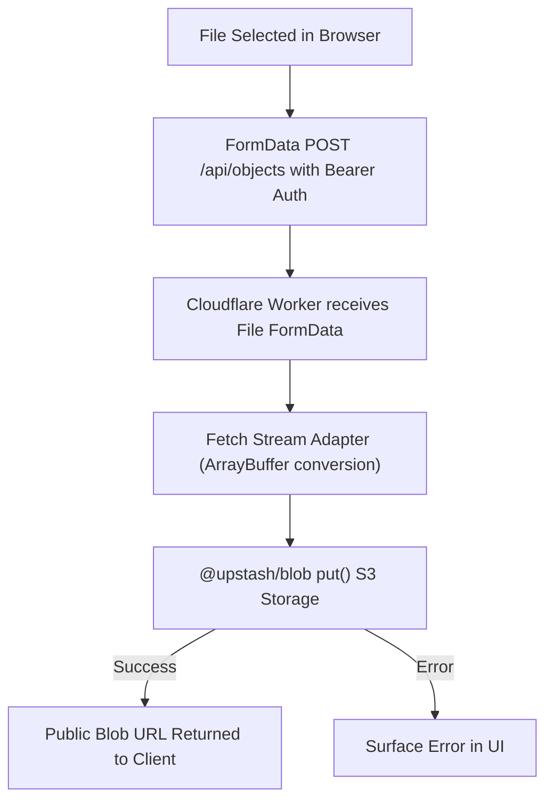

# Media and Uploads

Kalidass Journal supports rich media integration across articles, including cover image uploads, lead video players, and inline image/video body blocks.

## Video URL Parsing (`src/lib/media.ts`)

The `parseVideo(url)` helper analyzes video input strings and categorizes them:

1. **YouTube**: Matches patterns such as `youtube.com/watch?v=`, `youtube.com/embed/`, `youtube.com/shorts/`, and `youtu.be/`, capturing an alphanumeric ID of 6+ characters.
2. **Vimeo**: Matches `vimeo.com/<digits>` and `vimeo.com/video/<digits>`.
3. **Direct File**: Any other non-empty URL string is treated as a direct media stream URL (e.g., MP4, WebM).

Empty or invalid strings return `null`, which causes the video component to safely render nothing.

## VideoEmbed Component (`src/components/VideoEmbed.tsx`)

The `VideoEmbed` component renders the appropriate player:

| Provider | Rendered Element | Attributes & Permissions |
| --- | --- | --- |
| `youtube` | `<iframe>` | `src="https://www.youtube.com/embed/<id>"` with fullscreen, autoplay, and encrypted media permissions |
| `vimeo` | `<iframe>` | `src="https://player.vimeo.com/video/<id>"` with picture-in-picture and autoplay capabilities |
| `file` | `<video>` | Native HTML5 video player with `controls`, `playsInline`, and responsive sizing |

When a `caption` property is provided, it is rendered within an enclosing `<figcaption>` tag.

## Upload Pipeline (`src/lib/api.ts`)

File uploads are processed by the `uploadObject(file)` function:

1. **Client Upload (`uploadObject`)**: Bundles the selected file into a `FormData` payload and issues a `POST` request to `/api/objects` with Bearer authentication headers.
2. **Worker Streaming & Buffering**: The Cloudflare Worker reads the file stream into an in-memory `Uint8Array` buffer. This guarantees an explicit `Content-Length` header on the outgoing Upstash S3 request, preventing signature mismatch errors.
3. **Upstash Blob Persistence**: Calls `@upstash/blob` `put(name, buffer, { access: "public", contentType })` to persist the asset.
4. **Public URL Propagation**: Returns `{ url, name }` to the client, populating the draft form and updating live image/video previews.
