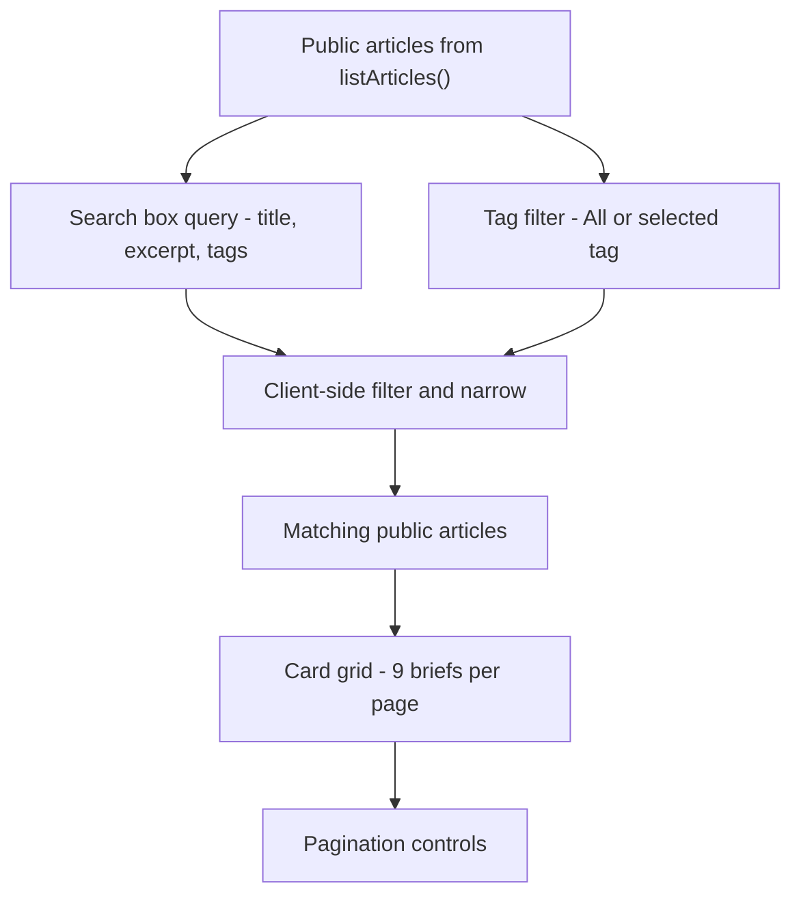

# Reading Experience

Kalidass Journal renders reading views purely client-side within the Docusaurus `Layout` component. On component mount, the client calls `listArticles()` or `getArticle()` to fetch content directly from the Worker API.

## Home Page (`src/pages/index.tsx`, `/`)

- **Hero & Publication Header**: Displays the publication tagline *"Field notes from the neural heart."*, live system indicators, and primary navigation actions.
- **Dedicated Featured Story (`Lead Dispatch`)**: A visually distinct featured section with generous top spacing (`margin-top: 4.5rem;`) and a section divider. Renders the lead story (`articles.find(a => a.featured) || articles[0]`) using the featured card variant. Deterministic lead selection (`ensureFeaturedDecided`) guarantees exactly one story is stamped `featured: true` so the hero never flickers.
- **3-Hour Edge Delivery & ETag Revalidation**: Home page article feeds are served from Upstash Redis (`kalidass:feed:public`) under a 3-hour TTL (10,800s). Full-feed content-hash ETag folding enables returning clients to revalidate via `If-None-Match`, receiving instantaneous `304 Not Modified` responses with zero Blob reads.
- **In This Cycle**: The next 3 articles are arranged in a 3-column responsive grid with tag chips, author avatars, and read times.
- **Index List**: All remaining articles are presented as streamlined row entries linking to `/story/:slug` with their primary tag.
- **Error Handling**: Network and API errors are caught and surfaced in a dedicated notification banner with troubleshooting hints.

## Color Tokens & Branding System

- **Primary Accent (`Neel` - Royal Indigo)**: Configured as `#6366f1` / `#4f46e5` for branding, buttons, active tabs, and link hover states.
- **Pigment Spectrum**: Six CSS theme tokens (`--pigment-neel`, `--pigment-haldi`, `--pigment-sindoor`, `--pigment-gulabi`, `--pigment-mehendi`, `--pigment-aakash`) provide categorical color coding.
- **Dual Gradients**: Warm and cool rainbow gradients (`--rainbow-gradient-warm`, `--rainbow-gradient-cool`) style dividers, hero accents, and card borders.
- **Top Navigation**: Navigation bar places `Issue` (Magazine archive) and `Studio` (CMS) side-by-side with distinct icon accents.

## Magazine Archive (`src/pages/magazine.tsx`, `/magazine`)

- **Live Search**: Client-side substring search filtering across `title`, `excerpt`, and `tags` simultaneously.
- **Dynamic Tag Filter**: Generates a tag filter bar from the union of all article tags, prefixed with `All`.
- **Card Grid**: Renders all matching public articles as cards, updating instantly as search queries change.

Changing the query string or the active tag resets pagination to page 1; the controls are hidden when the result set fits on a single page.

## ArticleCard Component (`src/components/ArticleCard.tsx`)

- **Interactive Card**: The entire card functions as a clickable navigation link tinted by the `--card-accent` CSS variable.
- **Media Header**: Displays the article's `coverImage` asset. If absent, renders a patterned CSS fallback background.
- **Meta Chips**: Displays primary tag chips and, if `aiGenerated: true`, an AI-content warning (`"Ai generated content, verify before applying in real life"`) on cards, plus a full-width notice banner in the reader.
- **Author Row**: Displays the author's avatar image or first initial, alongside publication date and estimated read time.

## Story Reader (`src/components/StoryPage.tsx`, `/story/:slug*`)

- **Dynamic Route**: The dynamic path `/story/:slug*` is registered via `kalidassPlugin.contentLoaded` using `actions.addRoute` in `docusaurus.config.ts`.
- **Slug Resolution**: The article slug is extracted from `location.pathname` and fetched via `getArticle(slug)`. Public articles resolve from the 24-hour Upstash Redis story cache (`kalidass:article:<id>` / `kalidass:slug:<slug>`) for near-zero latency edge delivery.
- **Hero Header**: Full-width veil overlay with cover image, topic kicker tag, headline, subtitle, and author byline.
- **Reader View Tabs**: The left reading column provides a three-tab ARIA `tablist` (keyboard-navigable via arrow keys, roving tabindex):
  - **Article (default)**: Standard full-text essay reading experience rendered by `StoryBody`. Supports paragraphs, headings, blockquotes, images, video embeds, and `<ArticleCodeBlock />` with line numbers and multi-language Prism syntax highlighting (Python, Bash, Go, Rust, Java, C#, SQL, JSON, YAML, Ruby, Kotlin, Swift, Docker).
  - **AI Intel**: Live web search grounding dossier rendered by `IntelligencePanel`. Displays Google AI Overviews, Knowledge Graph entities, People Also Ask questions, organic citations, and videos. The dossier is lazy-fetched from `/api/articles/:slug/intel` on first tab activation (the tab badge is driven by the article's `has_intelligence` flag), with an authorized Fetch/Force Refresh action for authors/admins.
  - **Books suggestion**: Read-only dossier rendered by `BooksPanel`, showing up to three AI-ranked Amazon book recommendations (title, authors, rating, price, buy link). Lazy-fetched from `/api/articles/:slug/books` on first activation; the tab badge is driven by the article's `has_books` flag. See [Books Suggestions](/books-suggestions).
- **Article Heuristics Sidebar**: Right-sidebar audit inspecting AI generation probability, technical rigor score, content safety flags, and **Element Density** (paragraphs, quotes, images, videos, and code block counts). Authenticated callers can trigger live re-evaluations.
- **Navigation Footer**: Direct link back to the main index (`← All briefs`).
- **Authorization Gated Editorial Link (`Edit in studio →`)**:
  - The `Edit in studio →` link is strictly gated via `canEdit = isAuthenticated && (isAdmin || (authorEmail && userEmail === authorEmail))`.
  - Hidden for anonymous readers and non-owner authors.
  - Rendered only for the story's original author and active Super Admins.
  - Automatically vanishes when dropping superuser privileges.

## IntelligencePanel Component (`src/components/IntelligencePanel/`)

The `IntelligencePanel` component renders deep search context compiled by SerpApi:
- **AI Overview**: Summarized search thesis with citation links and expanded reference cards (favicons load lazily).
- **Knowledge Graph**: Entity metadata, attributes, official sites, and authoritative descriptions.
- **People Also Ask**: Expandable accordion questions reflecting searcher inquiries.
- **Inline Videos & Organic Sources**: Direct links and snippets to related technical literature and video tutorials.
- **News, Books, Jobs & Forums**: Additional SERP sections rendered as accordion grids when present in the dossier.
- **Lazy Sections**: Only the AI Overview accordion defaults open; every other section renders its content on expand.
- **Cache & Compilation Status**: Surfaced status chips indicate whether data was served from Redis cache, Blob persistence, or freshly compiled.

