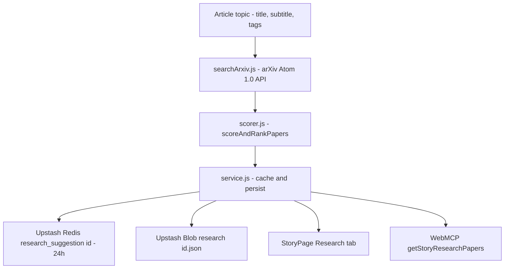

# Research Suggestions

Every story can carry a **Research Suggestions** dossier: up to five curated academic
preprints and papers for the article's topic, fetched live from the official arXiv Atom 1.0 API
(`export.arxiv.org/api/query`) and ranked by System One evaluation models. Readers view paper
cards with direct links, formatted author bylines, and 25-word summary excerpts in the story reader;
authors and admins generate or refresh the dossier on demand.

---

## 1. Compilation Pipeline



1. **`worker/src/research/searchArxiv.js`** — sanitizes the topic (`[^\w\s-]` collapses to spaces, truncated to 150 chars), builds an up-to-8-token `all:<t1> AND all:<t2> ...` query (falling back to `all:technology`), and queries `export.arxiv.org/api/query?search_query=...&start=0&max_results=10&sortBy=relevance&sortOrder=descending` with a compliant `User-Agent`. A standalone `parseAtom` XML parser extracts Atom feeds without external DOM dependencies.
2. **`worker/src/research/scorer.js`** — `scoreAndRankPapers` caps to the first **10** candidates, passes them to the active evaluation provider (TypeSafe Jev &rarr; Cloudflare Clef &rarr; deterministic heuristic), filters on `score >= 0.40` **and** `isPaperConfidence >= 0.40`, and sorts by **relevancy first, and recency second** (`published`/`updated` tiebreak when scores differ by ≤ 0.05), retaining the **top 5**. Unparsable model verdicts fail closed to score `0` (they cannot clear the admission gates), and a model's zero-match verdict is preserved rather than resurrected by the heuristic fallback.
3. **`worker/src/research/service.js`** — `getOrGenerateArticleResearch` resolves Redis &rarr; Blob &rarr; arXiv, validates the payload (`isValidResearchPayload` requires a non-empty `papers` array), persists to Blob and Redis, and deduplicates concurrent generations with a module-level in-flight lock (`_researchInflightLocks`).

### Scorer Provider Cascade

The scorer follows the same model hierarchy as the quality eval system:

| Order | Provider | `scoredBy` value | Requirement |
| --- | --- | --- | --- |
| 1 | TypeSafe Jev (`jev-latest`) | `"jev"` | `TYPESAFE_API_KEY` |
| 2 | Cloudflare Clef | `"clef"` | `CLEF_API_KEY` or `env.AI` binding |
| 3 | Heuristic fallback | `"heuristic"` | none (always available) |

An invalid or empty Clef ranking array throws and falls through to the heuristic rather than
silently admitting zero-scored candidates.

---

## 2. HTTP Endpoints

| Method | Path | Auth Required | Description |
| --- | --- | --- | --- |
| `GET` | `/api/articles/:idOrSlug/research` | Conditional | Read-only peek (Redis → Blob). Never generates. `404` when none is compiled, or when the article is a draft/private and the caller is not its author or an admin. |
| `POST` | `/api/articles/:idOrSlug/research` | **Yes** | Harvests and ranks arXiv papers, persists the dossier, purges the article cache, and returns `201` with the payload. Author (owner) or admin only. |

The `:idOrSlug` segment accepts either the article ID or its slug. Normal article reads expose a
lightweight `has_research: boolean` flag so the reader can render the tab badge without
downloading the payload.

---

## 3. Card Representation & Sorting

Each research card renders:
- **Title**: direct link to the arXiv abstract or PDF.
- **Author byline**: formatted via `authors.map((a) => a.name).filter(Boolean).join(", ")`.
- **Summary**: truncated to the first 25 words (`summary.trim().split(/\s+/).slice(0, 25).join(" ") + "..."`).
- **Direct links**: link to the abstract page (`arXiv ↗`) and direct PDF link (`PDF ↗`).
- **Badges**: primary subject category (e.g. `cs.CL`, `cs.AI`, `cs.LG`), publication date, and relevancy score.

Sorting criteria strictly enforce:
1. **Relevancy score descending** (rounded to 2 decimal places to bucket comparable semantic relevance).
2. **Recency descending** (most recent `published`/`updated` timestamp) when the scores are within 0.05.

---

## 4. Payload Contract

`GET`/`POST` `/research` return a `ResearchSuggestionData` object (also embedded as
`research_suggestions` on the article when stored):

```typescript
export interface ResearchSuggestionData {
  query: string;                 // Sanitized arXiv "all:... AND all:..." query
  topic: string;                 // Cleaned topic (truncated to 150 chars)
  fetchedAt: string;             // ISO timestamp
  scoredBy: "jev" | "clef" | "heuristic" | string;
  papers: ResearchPaperItem[];   // At most 5 items
}

export interface ResearchPaperItem {
  id: string;                    // arXiv id (e.g. "2401.01234")
  title: string;
  summary: string;               // Abstract
  authors: Array<{ name: string; affiliation?: string }>;
  links: { abstract: string; pdf?: string; doi?: string };
  published?: string;
  updated?: string;
  categories?: string[];
  primaryCategory?: string | null;
  score?: number;                // Provider relevance score (0.0 - 1.0)
  isPaperConfidence?: number;    // Confidence the result is a real paper
  topicSimilarity?: number;      // Raw normalized model verdict
  recencyTimestamp?: number;
}
```

---

## 5. Caching, Configuration & Invalidation

| Tier | Key / Path | TTL |
| --- | --- | --- |
| Upstash Redis | `kalidass:research_suggestion:<id>` | 24 hours (86,400s) |
| Upstash Blob | `<rootBucket>/research/<id>.json` | durable |

- `peekArticleResearch` reads Redis first, then Blob (re-populating Redis on a Blob hit) — it never
  triggers generation.
- `invalidateArticleCaches(redis, { id })` deletes `kalidass:research_suggestion:<id>` alongside the
  article, intelligence, and books keys. `POST /research` uses the narrower
  `invalidateOnlyArticleCache` so the home feed is not flushed.

| Variable | Required | Purpose |
| --- | --- | --- |
| `EVAL_PROVIDER` | Optional | `jev` (default), `clef`, or `heuristic` — selects the ranking model. |
| `TYPESAFE_API_KEY` | For Jev scoring | TypeSafe AI key for the Jev batch scorer. |
| `CLEF_API_KEY` / `CLOUDFLARE_ACCOUNT_ID` / `CLEF_MODEL` | For Clef scoring | Cloudflare Workers AI credentials and model selector. |
| `ROOT_BUCKET` (or `ROOT_FOLDER`) | Optional | Blob prefix for the `<root>/research/<id>.json` object (default `kalidass`). |

No API key is required to query the arXiv API.

---

## 6. Frontend Integration

- **Story reader tab**: `StoryPage.tsx` renders the **Research** ARIA tab (`story-tab-research` /
  `story-panel-research`) alongside **Article**, **AI Intel**, and **Books suggestion**. The panel
  mounts read-only for public readers, exposing a Fetch/Refresh action only to authors/admins
  (`canEdit`).
- **Lazy fetch**: the tab calls `getArticleResearch(slug)` once, on first activation, via
  `src/lib/api.ts`; the badge is driven by `researchData` or `article.has_research`.
- **API client helpers**: `getArticleResearch(idOrSlug)` (public peek) and
  `triggerArticleResearch(idOrSlug)` (authenticated refresh).
- **Component**: `src/components/ResearchPanel/ResearchPanel.tsx` renders ranked paper cards with
  the title (abstract/PDF links), author byline, 25-word summary, category and date badges, and the
  relevancy score.

---

## 7. WebMCP Tool

The story-scoped `getStoryResearchPapers` tool exposes the dossier to in-browser agents:

- **Parameters**: `slug?` *(string, optional)* — defaults to the active `/story/:slug` route.
- **Returns**: `{ available: true, query, topic, total, scoredBy?, papers: [{ id, title, authors, summary, links: { abstract, pdf }, published, primaryCategory, score }] }`,
  or `{ available: false, reason }` when no dossier exists. See [WebMCP](/webmcp).

---

## See Also

- [Reading Experience](/reading-experience) — the story reader tabs.
- [Data Model](/data-model) — `ResearchSuggestionData` and `ResearchPaperItem` contracts.
- [API Reference](/api) — full endpoint table.
- [Books Suggestions](/books-suggestions) — the sibling ranking pipeline.
- [Storage Abstraction](/worker/storage) — Redis cache and Blob path conventions.
