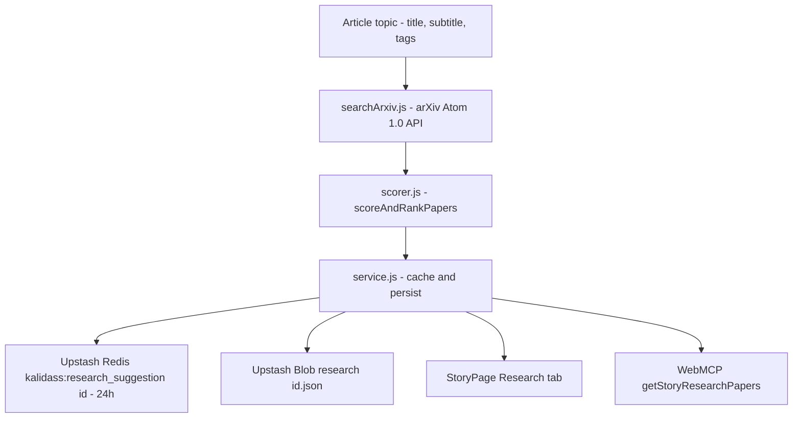

# Research Suggestions

Every story can carry a **Research Suggestions** dossier: up to five curated academic
preprints and papers for the article's topic, fetched live from the official arXiv Atom 1.0 API
(`export.arxiv.org/api/query`) and ranked by System One evaluation models. Readers view paper
cards with direct links, formatted author bylines, and 25-word summary excerpts in the story reader;
authors and admins generate or refresh the dossier on demand.

---

## 1. Compilation Pipeline



1. **`worker/src/research/searchArxiv.js`** — issues query requests to `export.arxiv.org/api/query?search_query=all:<query>&start=0&max_results=10&sortBy=relevance&sortOrder=descending` with compliant `User-Agent` headers. A standalone XML parser extracts Atom feeds without external DOM dependencies.
2. **`worker/src/research/scorer.js`** — `scoreAndRankPapers` passes candidates to the active evaluation provider (TypeSafe Jev &rarr; Cloudflare Clef &rarr; deterministic heuristic), filters by confidence, and sorts by **relevancy first, and recency second** (`published` descending), retaining the **top 5**.
3. **`worker/src/research/service.js`** — persists the payload to Upstash Blob and Upstash Redis, deduplicating concurrent generations with a module-level in-flight lock (`_researchInflightLocks`).

### Scorer Provider Cascade

The scorer follows the same model hierarchy as the quality eval system:

| Order | Provider | `scoredBy` value | Requirement |
| --- | --- | --- | --- |
| 1 | TypeSafe Jev (`jev-latest`) | `"jev"` | `TYPESAFE_API_KEY` |
| 2 | Cloudflare Clef | `"clef"` | `CLEF_API_KEY` or `env.AI` binding |
| 3 | Heuristic fallback | `"heuristic"` | none (always available) |

---

## 2. Card Representation & Sorting

Each research card renders:
- **Title**: direct link to the arXiv abstract or PDF.
- **Author byline**: formatted via `authors.map((a) => a.name).filter(Boolean).join(", ")`.
- **Summary**: truncated to the first 25 words (`summary.trim().split(/\s+/).slice(0, 25).join(" ") + "..."`).
- **Direct links**: link to the abstract page (`arXiv ↗`) and direct PDF link (`PDF ↗`).
- **Badges**: primary subject category (e.g. `cs.CL`, `cs.AI`, `cs.LG`), publication date, and relevancy score.

Sorting criteria strictly enforce:
1. **Relevancy score descending** (rounded to 2 decimal places to bucket comparable semantic relevance).
2. **Recency descending** (most recent `published` timestamp).

---

## 3. WebMCP Tool Integration

The reader exports a story-scoped WebMCP tool `getStoryResearchPapers` registered on `window.modelContext`:

```json
{
  "name": "getStoryResearchPapers",
  "description": "Returns relevant arXiv academic papers and preprint suggestions for the current story page (/story/:slug).",
  "parameters": {
    "type": "object",
    "properties": {
      "slug": {
        "type": "string",
        "description": "Optional bare slug; automatically resolves to active story if omitted."
      }
    }
  }
}
```
