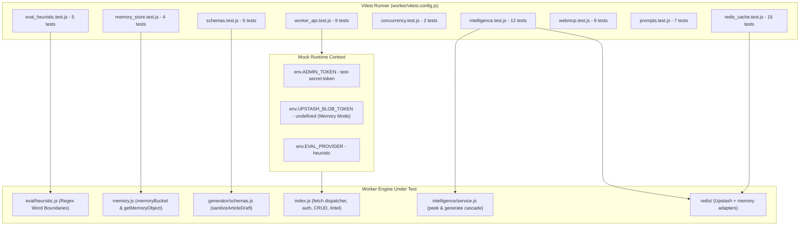

# Automated Test Cases & Hermetic Testing

Kalidass Journal incorporates a **100% hermetic automated test suite** powered by **Vitest**. The test suite runs in isolated Node.js environments with zero external network dependencies, zero real cloud secrets, and zero persistent disk mutations, delivering deterministic pass/fail results in under 300 milliseconds.

---

## 1. Hermetic Testing Architecture



---

## 2. Test Suite Taxonomy

The test files reside inside `worker/test/` and are organized by functional domain:

<Tree>
  <Tree.Folder name="worker" defaultOpen>
    <Tree.Folder name="test" defaultOpen>
      <Tree.File name="eval_heuristic.test.js" highlight />
      <Tree.File name="memory_store.test.js" highlight />
      <Tree.File name="schemas.test.js" highlight />
      <Tree.File name="worker_api.test.js" highlight />
      <Tree.File name="concurrency.test.js" highlight />
      <Tree.File name="intelligence.test.js" highlight />
      <Tree.File name="webmcp.test.js" highlight />
      <Tree.File name="prompts.test.js" highlight />
      <Tree.File name="redis_cache.test.js" highlight />
    </Tree.Folder>
    <Tree.File name="vitest.config.js" highlight />
    <Tree.File name="package.json" />
  </Tree.Folder>
</Tree>

---

## 3. Detailed Test Case Inventory

### Suite 1: Safety Heuristics & Scunthorpe Defense (`eval_heuristic.test.js`)

Verifies the rule-based safety evaluator and quality metric computation in `worker/src/eval/heuristic.js`:

| Test Case | Description | Expected Outcome |
| :--- | :--- | :--- |
| **Baseline Safe Content** | Evaluates technical text on systems architecture, CUDA kernels, and V8 isolates. | `ok: true`, `verdict: "safe"`, `violations: []`, all risk scores $< 0.55$. |
| **Scunthorpe Defense: Sexual** | Evaluates text containing `"field analysis"`, `"statistical analytics"`, and `"network analyzer"`. | `sexual: 0.01`, `violations: []`, `verdict: "safe"`. Strict regex `\b` prevents partial match on `"anal"`. |
| **Scunthorpe Defense: Violence** | Evaluates text containing `"engineering skills"` and `"system stability"`. | `violence: 0.02`, `violations: []`, `verdict: "safe"`. Prevents partial match on `"kill"` or `"stab"`. |
| **Prohibited Explicit Content** | Evaluates input with explicit terms (`"anal sex"`, `"pornography"`). | `sexual >= 0.85`, `verdict: "rejected"`, `violations` contains `"Sexually explicit or NSFW content detected"`. |
| **Quality Metric Computation** | Verifies accuracy ($1.0 - 5.0$), engagement ($1.0 - 5.0$), and AI probability calculation. | Technical scores $\ge 3.0$, engagement scores $\ge 2.5$, summary string populated. |

---

### Suite 2: In-Memory Storage Adapter (`memory_store.test.js`)

Verifies the in-memory fallback store (`worker/src/memory.js`) used during local development and testing:

| Test Case | Description | Expected Outcome |
| :--- | :--- | :--- |
| **Put & Get Text Objects** | Stores a text file and retrieves it via `bucket.get(path)`. | Correct `contentType: "text/plain"`, stream reader decodes matching payload. |
| **JSON Serialization via `getMemoryObject`** | Puts an article JSON object and reads raw buffer via `getMemoryObject(path)`. | Returns decoded JSON with matching `id` and `title`. |
| **Object Deletion & Error Handling** | Puts a temporary object, calls `bucket.del(path)`, and verifies subsequent access. | `getMemoryObject` returns `null`; `bucket.get` rejects with `not_found` error code. |

---

### Suite 3: Schema Normalization & Defense (`schemas.test.js`)

Verifies `sanitizeArticleDraft()` in `worker/src/generator/schemas.js`:

| Test Case | Description | Expected Outcome |
| :--- | :--- | :--- |
| **Standard Draft Validation** | Sanitizes a complete object with `title`, `subtitle`, `excerpt`, `tags`, and typed `blocks`. | Validated draft with `published: false, private: true, aiGenerated: true`. |
| **Bare Block Array Normalization** | Passes a raw array `[ { type: "heading", ... }, { type: "paragraph", ... } ]`. | Automatically wrapped into `{ title, subtitle, blocks: [...] }` without throwing `AttributeError`. |
| **Single-Element Wrapper Unwrapping** | Passes a wrapped array `[ { title: "...", blocks: [...] } ]`. | Unwraps first element and validates against `GeneratedArticleSchema`. |
| **Fallback Defaults for Empty Inputs** | Passes an empty object with only `title`. | Injects default paragraph block, default tags, and `#6366f1` accent tint. |

---

### Suite 4: Worker REST API Integration (`worker_api.test.js`)

Executes requests directly against the Cloudflare Worker `fetch(request, env)` handler:

| Test Case | Method & Endpoint | Auth State | Expected Outcome |
| :--- | :--- | :--- | :--- |
| **Health Check** | `GET /api/health` | None | HTTP `200` with `{ ok: true }`. |
| **Article Collection Query** | `GET /api/articles` | None (Public) | HTTP `200` with array of published items. |
| **Quality Evaluation API** | `POST /api/eval/quality` | Bearer (required) | HTTP `401 Unauthorized` without a token; HTTP `200` returning `local-heuristic` verdict with `Bearer test-secret-token`. |
| **Unauthenticated Mutation Block** | `POST /api/articles` | None | HTTP `401 Unauthorized`. |
| **Authenticated Article Creation** | `POST /api/articles` | `Bearer test-secret-token` | HTTP `201 Created` with persisted article; subsequent authorized `GET /api/articles/:slug` returns HTTP `200`. |
| **Unknown Path Resolution** | `GET /api/unknown-route` | None | HTTP `404 Not Found`. |

---

### Suite 5: Concurrency & Race Conditions (`concurrency.test.js`)

Verifies atomic read-modify-write synchronization and async mutex serialization:

| Test Case | Description | Expected Outcome |
| :--- | :--- | :--- |
| **10 Parallel Creations** | Fires 10 concurrent `POST /api/articles` requests simultaneously with identical base titles. | All 10 return HTTP `201`; all 10 are preserved in `index.json` (zero lost updates); all 10 receive unique slugs without collisions (`dispatch`, `dispatch-2`, ..., `dispatch-10`). |
| **Parallel Update & Create** | Concurrently updates an existing article while creating a new sibling article in parallel. | Both operations succeed (HTTP `200` & `201`) without race condition errors or index state corruption. |

---

### Suite 6: SerpApi Intelligence Pipeline (`intelligence.test.js`)

Verifies the Redis package contract and the intelligence service cascade against the Worker:

| Test Case | Description | Expected Outcome |
| :--- | :--- | :--- |
| **Redis Key Prefix Contract** | `formatRedisKey` enforces the idempotent `kalidass:` root prefix; the memory adapter round-trips values and honors TTL expiry. | Keys always resolve to `kalidass:ai_intel:<id>`; expired entries return `null`. |
| **Service Orchestration** | Double cache miss invokes the Box runner and populates both Redis and Blob; subsequent calls hit caches; `refresh=true` bypasses both. | Generated dossier cached in both tiers; husks never persisted. |
| **Husk Rejection** | Runner returns `{error, organic_results: []}`. | `getOrGenerateArticleIntelligence` rejects; nothing cached in Blob or Redis. |
| **Lazy `/intel` Contract** | Valid dossier in Blob (Redis empty): anonymous `GET /api/articles/:slug` returns `has_intelligence: true` without the payload; `GET /:slug/intel` serves the dossier and re-populates Redis. | Flag-only article GET; `/intel` returns payload; `kalidass:ai_intel:<id>` re-cached. |
| **Husk on `/intel`** | Invalid husk stored in Blob. | `/intel` returns `404`; article GET reports `has_intelligence: false`; husk never enters Redis. |
| **Private Article Gating** | Private article with stored dossier. | Anonymous `/intel` → `404`; admin `/intel` → `200` with dossier. |
| **Auth Gates** | `?intelligence=true` without token (`401`) and non-owner authenticated author (`403`, minted RS256 Auth0-style JWT with mocked JWKS). | Compilation pass restricted to owner/admin. |

---

### Suite 7: WebMCP Path & Route Gating (`webmcp.test.js`)

Verifies WebMCP slug extraction and route-context isolation:

| Test Case | Description | Expected Outcome |
| :--- | :--- | :--- |
| **Slug Extraction** | Parses `/story/:slug` paths; rejects non-story paths (issues page, home, admin, history). | Slug returned or `null`. |
| **searchArticles Gating** | On `/story/:slug` returns only the active article; on `/magazine` searches globally (max 5) — including queries containing `story/`. | 1-item isolated array vs. bounded global results. |
| **readArticle Gating** | Off-route without `slug` throws `"Argument 'slug' is required"`; explicit slug returns metadata; on `/story/:slug` empty args auto-resolve and explicit different slugs win. | Route-aware slug resolution with as-is off-route behavior. |

---

### Suite 8: Generator Prompts (`prompts.test.js`)

Verifies Upstash Box generator prompt construction for `/api/generate`:

| Test Case | Description | Expected Outcome |
| :--- | :--- | :--- |
| **Query Building** | `getCurrentYear` and `buildSearchQuery` combine verbatim topic and angle. | Clean current-year-aware query strings. |
| **System & User Prompts** | `buildSystemPrompt` / `buildUserPrompt` embed IEEE/Elsevier grounding, developer pragmatism, and the non-negotiable thesis angle. | Structural directives present in both prompts. |
| **Agent Scripts** | `buildPythonAgentScript` / `buildNodeAgentScript` embed Tavily `time_range: year`, SerpApi as-of grounding, and infographic styling directives. | Grounding tokens present in both scripts. |

---

### Suite 9: Upstash Redis Multi-User Feed & Story Delivery (`redis_cache.test.js`)

Verifies the Redis feed and story delivery tier, 3-hour caching, RFC 7232 ETag validation, and deterministic lead assignment (`worker/src/redis/cache.js`):

| Test Case | Description | Expected Outcome |
| :--- | :--- | :--- |
| **3-Hour Feed Cache** | Caches the public article feed under `kalidass:feed:public` with a 3-hour TTL (10,800s). | Subsequent reads hit Redis; returns HTTP `200` with `ETag` and `X-Cache: HIT`. |
| **Full-Feed ETag Hashing** | Hashes count, lead ID, lead timestamp, and every article ID + updated timestamp. | Non-lead edits re-derive a new ETag hash, preventing stale `304` responses. |
| **RFC 7232 If-None-Match** | Compares incoming `If-None-Match` header using `matchesEtag`. | Returns HTTP `304 Not Modified` with empty body on weak (`W/"..."`) or comma-separated matches. |
| **Deterministic Featured Decision** | Ensures exactly one lead story is marked `featured: true` via `ensureFeaturedDecided`. | Explicitly flagged story or top story becomes featured; falls back locally if Redis write fails. |
| **24-Hour Public Story Cache** | Caches full article JSON under `kalidass:article:<id>` and slug pointers under `kalidass:slug:<slug>`. | Fast-path GET resolves directly from Redis cache without Blob lookups. |
| **Draft & Private Cache Exclusion** | Owner and admin views of unpublished drafts bypass Redis caching. | Unpublished articles are never written to shared Redis storage. |
| **Dynamic Intel Invalidation** | When `?intelligence=true` finishes compiling search intelligence, purges `kalidass:article:<id>`. | Unfreezes `has_intelligence: true` badge on subsequent article reads. |
| **Mutation Invalidation Protocol** | Article creation, update, and deletion calls `invalidateAllArticleCaches` and `invalidateArticleCache`. | Purges feed keys (`kalidass:feed:*`) and article/slug keys across mutations. |

---

## 4. Frontend jsdom Suite (`blog_frontend`)

The Docusaurus UI ships its own hermetic Vitest/jsdom suite (`npm.cmd test` in `blog_frontend/`, 4 files / 29 tests):

| Test File | Covers |
| :--- | :--- |
| `src/components/__tests__/StoryBody.test.tsx` | Block rendering across the 5-variant `Block` union. |
| `src/components/__tests__/ArticleCard.test.tsx` | Card interactivity, AI banner, author row. |
| `src/client-modules/__tests__/webmcp.registry.test.ts` | Registry auto-registration of all 6 tools, story-route isolation, `StoryWebMcp` tools (lazy dossier fetch, degradation reasons, explicit slug, lookup-failure discrimination). |
| `src/components/__tests__/IntelligencePanel.test.tsx` | Accordion laziness (content renders on expand), section rendering, Force Refresh wiring. |

---

## 5. Running Tests Locally

```bash
# Execute full worker test suite once
npm.cmd --prefix worker test

# Run tests in interactive watch mode during development
npm.cmd --prefix worker run test:watch

# Execute the frontend jsdom suite
npm.cmd --prefix blog_frontend test
```

Execution output (worker):
```text
 Test Files  9 passed (9)
      Tests  68 passed (68)
   Duration  ~750ms
```

---

## 6. Guidelines for Authoring New Tests

1. **Strictly Hermetic**: Never make unmocked outbound HTTP calls. Use mock `env` bindings or local adapters.
2. **In-Memory Storage Mode**: Always leave `env.UPSTASH_BLOB_TOKEN` unset in unit tests to activate `memoryBucket`.
3. **Admin Token Matching**: Match `env.ADMIN_TOKEN` against test `Authorization: Bearer <TOKEN>` headers.
4. **Fast Execution**: Keep each test under 50ms to ensure the entire suite executes in under 1 second.
