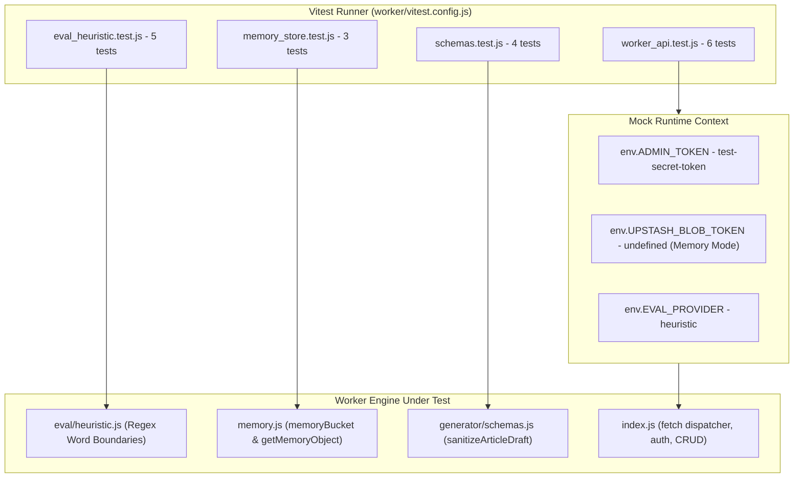

# Automated Test Cases & Hermetic Testing

Kalidass Journal incorporates a **100% hermetic automated test suite** powered by **Vitest**. The test suite runs in isolated Node.js environments with zero external network dependencies, zero real cloud secrets, and zero persistent disk mutations, delivering deterministic pass/fail results in under 300 milliseconds.

---

## 1. Hermetic Testing Architecture



---

## 2. Test Suite Taxonomy

The test files reside inside `worker/test/` and are organized by functional domain:

<Tree>
  <Tree.Folder name="worker" defaultOpen>
    <Tree.Folder name="test" defaultOpen>
      <Tree.File name="eval_heuristic.test.js" highlight />
      <Tree.File name="memory_store.test.js" highlight />
      <Tree.File name="schemas.test.js" highlight />
      <Tree.File name="worker_api.test.js" highlight />
      <Tree.File name="concurrency.test.js" highlight />
    </Tree.Folder>
    <Tree.File name="vitest.config.js" highlight />
    <Tree.File name="package.json" />
  </Tree.Folder>
</Tree>

---

## 3. Detailed Test Case Inventory

### Suite 1: Safety Heuristics & Scunthorpe Defense (`eval_heuristic.test.js`)

Verifies the rule-based safety evaluator and quality metric computation in `worker/src/eval/heuristic.js`:

| Test Case | Description | Expected Outcome |
| :--- | :--- | :--- |
| **Baseline Safe Content** | Evaluates technical text on systems architecture, CUDA kernels, and V8 isolates. | `ok: true`, `verdict: "safe"`, `violations: []`, all risk scores $< 0.55$. |
| **Scunthorpe Defense: Sexual** | Evaluates text containing `"field analysis"`, `"statistical analytics"`, and `"network analyzer"`. | `sexual: 0.01`, `violations: []`, `verdict: "safe"`. Strict regex `\b` prevents partial match on `"anal"`. |
| **Scunthorpe Defense: Violence** | Evaluates text containing `"engineering skills"` and `"system stability"`. | `violence: 0.02`, `violations: []`, `verdict: "safe"`. Prevents partial match on `"kill"` or `"stab"`. |
| **Prohibited Explicit Content** | Evaluates input with explicit terms (`"anal sex"`, `"pornography"`). | `sexual >= 0.85`, `verdict: "rejected"`, `violations` contains `"Sexually explicit or NSFW content detected"`. |
| **Quality Metric Computation** | Verifies accuracy ($1.0 - 5.0$), engagement ($1.0 - 5.0$), and AI probability calculation. | Technical scores $\ge 3.0$, engagement scores $\ge 2.5$, summary string populated. |

---

### Suite 2: In-Memory Storage Adapter (`memory_store.test.js`)

Verifies the in-memory fallback store (`worker/src/memory.js`) used during local development and testing:

| Test Case | Description | Expected Outcome |
| :--- | :--- | :--- |
| **Put & Get Text Objects** | Stores a text file and retrieves it via `bucket.get(path)`. | Correct `contentType: "text/plain"`, stream reader decodes matching payload. |
| **JSON Serialization via `getMemoryObject`** | Puts an article JSON object and reads raw buffer via `getMemoryObject(path)`. | Returns decoded JSON with matching `id` and `title`. |
| **Object Deletion & Error Handling** | Puts a temporary object, calls `bucket.del(path)`, and verifies subsequent access. | `getMemoryObject` returns `null`; `bucket.get` rejects with `not_found` error code. |

---

### Suite 3: Schema Normalization & Defense (`schemas.test.js`)

Verifies `sanitizeArticleDraft()` in `worker/src/generator/schemas.js`:

| Test Case | Description | Expected Outcome |
| :--- | :--- | :--- |
| **Standard Draft Validation** | Sanitizes a complete object with `title`, `subtitle`, `excerpt`, `tags`, and typed `blocks`. | Validated draft with `published: false, private: true, aiGenerated: true`. |
| **Bare Block Array Normalization** | Passes a raw array `[ { type: "heading", ... }, { type: "paragraph", ... } ]`. | Automatically wrapped into `{ title, subtitle, blocks: [...] }` without throwing `AttributeError`. |
| **Single-Element Wrapper Unwrapping** | Passes a wrapped array `[ { title: "...", blocks: [...] } ]`. | Unwraps first element and validates against `GeneratedArticleSchema`. |
| **Fallback Defaults for Empty Inputs** | Passes an empty object with only `title`. | Injects default paragraph block, default tags, and `#6366f1` accent tint. |

---

### Suite 4: Worker REST API Integration (`worker_api.test.js`)

Executes requests directly against the Cloudflare Worker `fetch(request, env)` handler:

| Test Case | Method & Endpoint | Auth State | Expected Outcome |
| :--- | :--- | :--- | :--- |
| **Health Check** | `GET /api/health` | None | HTTP `200` with `{ ok: true }`. |
| **Article Collection Query** | `GET /api/articles` | None (Public) | HTTP `200` with array of published items. |
| **Quality Evaluation API** | `POST /api/eval/quality` | None | HTTP `200` returning `local-heuristic` verdict. |
| **Unauthenticated Mutation Block** | `POST /api/articles` | None | HTTP `401 Unauthorized`. |
| **Authenticated Article Creation** | `POST /api/articles` | `Bearer test-secret-token` | HTTP `201 Created` with persisted article; subsequent authorized `GET /api/articles/:slug` returns HTTP `200`. |
| **Unknown Path Resolution** | `GET /api/unknown-route` | None | HTTP `404 Not Found`. |

---

### Suite 5: Concurrency & Race Conditions (`concurrency.test.js`)

Verifies atomic read-modify-write synchronization and async mutex serialization:

| Test Case | Description | Expected Outcome |
| :--- | :--- | :--- |
| **10 Parallel Creations** | Fires 10 concurrent `POST /api/articles` requests simultaneously with identical base titles. | All 10 return HTTP `201`; all 10 are preserved in `index.json` (zero lost updates); all 10 receive unique slugs without collisions (`dispatch`, `dispatch-2`, ..., `dispatch-10`). |
| **Parallel Update & Create** | Concurrently updates an existing article while creating a new sibling article in parallel. | Both operations succeed (HTTP `200` & `201`) without race condition errors or index state corruption. |

---

## 4. Running Tests Locally

```bash
# Execute full test suite once
npm.cmd --prefix worker test

# Run tests in interactive watch mode during development
npm.cmd --prefix worker run test:watch
```

Execution output:
```text
 ✓ test/memory_store.test.js (3 tests) 6ms
 ✓ test/schemas.test.js (4 tests) 8ms
 ✓ test/eval_heuristic.test.js (5 tests) 7ms
 ✓ test/worker_api.test.js (6 tests) 27ms
 ✓ test/concurrency.test.js (2 tests) 32ms

 Test Files  5 passed (5)
      Tests  20 passed (20)
   Duration  303ms
```

---

## 5. Guidelines for Authoring New Tests

1. **Strictly Hermetic**: Never make unmocked outbound HTTP calls. Use mock `env` bindings or local adapters.
2. **In-Memory Storage Mode**: Always leave `env.UPSTASH_BLOB_TOKEN` unset in unit tests to activate `memoryBucket`.
3. **Admin Token Matching**: Match `env.ADMIN_TOKEN` against test `Authorization: Bearer <TOKEN>` headers.
4. **Fast Execution**: Keep each test under 50ms to ensure the entire suite executes in under 1 second.
