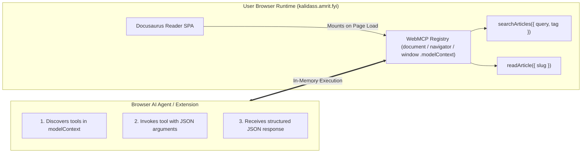

# WebMCP (In-Browser AI Tools)

**WebMCP (Web Model Context Protocol)** is an emerging W3C Web ML Community Group proposal (draft) that allows web applications to expose structured, typed JavaScript functions as callable tools directly within the browser runtime.

Kalidass Journal integrates WebMCP across all pages via a dedicated client module (`document.modelContext` / `navigator.modelContext` / `window.modelContext`), allowing browser AI agents (Chrome built-in AI, Gemini Nano, OpenAI Operator, and Chrome extensions like **WebMCP - Model Context Tool Inspector**) to query and read publication content without fragile visual DOM scraping.

---

## 1. How WebMCP Works



When a user or AI agent visits any page on Kalidass Journal, the frontend automatically registers the available tools into `document.modelContext`, `navigator.modelContext`, and `window.modelContext`.

---

## 2. Available WebMCP Tools

### `searchArticles`
Searches publication articles and research briefs by text keyword or category tag.
* **On `/magazine` (Issues Page) & Non-Story Pages**: Strictly bounded to a maximum of 5 items matching query/tag.
* **On `/story/:slug` Pages**: Automatically detects the active story path and returns **only that article** (1-item array).

* **Description**: `"Search Kalidass Journal research articles by text query or tag (returns up to 5 articles, or only the current story on /story/:slug)."`
* **Input Schema / Parameters**:
  * `query` *(string, optional)*: Keyword to match in title, subtitle, excerpt, or tags.
  * `tag` *(string, optional)*: Category filter (e.g. `'Agents'`, `'Evals'`, `'Systems'`).
* **Returns**: Array of matching article summaries (or single isolated story on `/story/:slug`):
  ```json
  [
    {
      "id": "uuid",
      "slug": "field-notes-evals",
      "title": "Field notes from the eval trench",
      "subtitle": "What broke and what we measured",
      "excerpt": "A short summary deck.",
      "tags": ["Evals", "Agents"],
      "readTimeMinutes": 5,
      "publishedAt": "2026-10-04T12:00:00.000Z",
      "authorName": "Research Team",
      "url": "https://kalidass.amrit.fyi/story/field-notes-evals",
      "path": "/story/field-notes-evals"
    }
  ]
  ```

---

### `readArticle`
Gets the direct canonical reading URL, path, and summary metadata for a specific article.
* **On `/magazine` & Non-Story Pages**: Requires an explicit `slug` argument.
* **On `/story/:slug` Pages**: Automatically resolves the slug from `window.location.pathname` if omitted in arguments.

* **Description**: `"Get the direct reading URL and summary metadata for a specific article by slug (or automatically for the current story on /story/:slug)."`
* **Input Schema / Parameters**:
  * `slug` *(string, optional)*: The bare URL slug of the article (e.g. `'attention-as-routing'` — not a path or URL; optional if currently viewing `/story/:slug`).
* **Returns**: Canonical navigation and metadata object:
  ```json
  {
    "slug": "attention-as-routing",
    "title": "Attention as Routing",
    "subtitle": "Sparse Mixture-of-Experts plumbing",
    "excerpt": "Architectural breakdown.",
    "url": "https://kalidass.amrit.fyi/story/attention-as-routing",
    "path": "/story/attention-as-routing",
    "publishedAt": "2026-10-01T15:00:00.000Z",
    "readTimeMinutes": 4,
    "tags": ["Architectures", "Systems"],
    "authorName": "Kalidass Author",
    "authorRole": "Systems Engineer"
  }
  ```

---

## 3. Testing with WebMCP Inspector Extension

Kalidass Journal is validated with the **WebMCP – Model Context Tool Inspector** extension (by Google Chrome Labs / W3C Web ML CG):

1. **Enable Browser Flags** (Chrome Dev / Canary):
   - Set `chrome://flags/#enable-webmcp-testing` (or `#enable-experimental-web-platform-features`) to **Enabled**.
2. **Open Extension Panel**:
   - Open the **WebMCP Inspector** side panel.
3. **Hard-Refresh Page**:
   - Press `Ctrl + Shift + R` (or `F5`) on `https://kalidass.amrit.fyi` or `http://localhost:3000`.
   - The inspector will automatically list `searchArticles` and `readArticle` along with their interactive schema forms.
4. **Execute & Test with Gemini**:
   - Test manual JSON inputs directly in the inspector or attach a Gemini API key to run autonomous multi-step agent queries.

---

## 4. Testing in Browser DevTools Console

Open DevTools Console (`F12` or `Ctrl + Shift + I`):

```javascript
// 1. Inspect registered tools (or call listTools / getTools)
console.log(window.modelContext.tools);
console.log(await window.modelContext.listTools());

// 2. Search articles (returns up to 5 items)
const results = await window.modelContext.tools.searchArticles.execute({ query: "evals" });
console.log("Search Results:", results);

// 3. Read an article (returns canonical URL and summary metadata)
const article = await window.modelContext.tools.readArticle.execute({ slug: "attention-as-routing" });
console.log("Article Metadata & URL:", article);
```

---

## 5. Implementation Details

- **Source Code**: `blog_frontend/src/client-modules/webmcp.ts`
- **Registration**: Registered in `blog_frontend/docusaurus.config.ts` via `clientModules: ["./src/client-modules/api-base.ts", "./src/client-modules/webmcp.ts"]`.
- **Triple Global Sync**: Exposes tools via `document.modelContext`, `navigator.modelContext`, and `window.modelContext`.
- **Dual Schema Specification**: Provides standard `inputSchema` (JSON Schema) and `parameters` for universal parser compatibility.
- **SSR Safety**: All browser global access is guarded with `ExecutionEnvironment.canUseDOM` to ensure hermetic static site pre-rendering.
