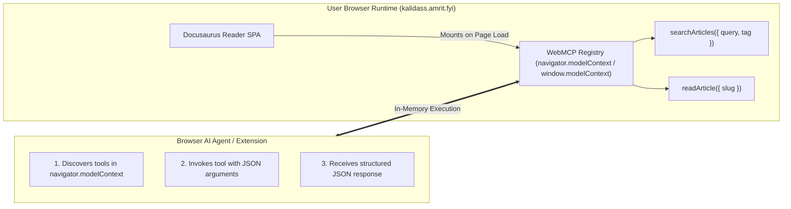

# WebMCP (In-Browser AI Tools)

**WebMCP (Web Model Context Protocol)** is an emerging W3C Web ML Community Group proposal (draft) that allows web applications to expose structured, typed JavaScript functions as callable tools directly within the browser runtime.

Kalidass Journal integrates WebMCP across all pages via a dedicated client module (`navigator.modelContext` / `window.modelContext` polyfill pattern), allowing browser AI agents (Chrome built-in AI, Gemini, OpenAI Operator, browser extensions, and web crawlers) to query and read publication content without fragile visual DOM scraping.

---

## 1. How WebMCP Works



When a user or AI agent visits any page on Kalidass Journal, the frontend automatically registers the available tools into `navigator.modelContext` (with a universal fallback to `window.modelContext`).

---

## 2. Available WebMCP Tools

### `searchArticles`
Searches publication articles and research briefs by text keyword or category tag, strictly bounded to a maximum of 5 items.

* **Description**: `"Search Kalidass Journal research articles by text query or tag (returns up to 5 articles)."`
* **Parameters**:
  * `query` *(string, optional)*: Keyword to match in title, subtitle, excerpt, or tags.
  * `tag` *(string, optional)*: Category filter (e.g. `'Agents'`, `'Evals'`, `'Systems'`).
* **Returns**: Array of at most 5 article summaries:
  ```json
  [
    {
      "id": "uuid",
      "slug": "field-notes-evals",
      "title": "Field notes from the eval trench",
      "subtitle": "What broke and what we measured",
      "excerpt": "A short summary deck.",
      "tags": ["Evals", "Agents"],
      "readTimeMinutes": 5,
      "publishedAt": "2026-10-04T12:00:00.000Z",
      "authorName": "Research Team",
      "url": "https://kalidass.amrit.fyi/story/field-notes-evals",
      "path": "/story/field-notes-evals"
    }
  ]
  ```

---

### `readArticle`
Gets the direct canonical reading URL, path, and summary metadata for a specific article.

* **Description**: `"Get the direct reading URL and summary metadata for a specific article by slug."`
* **Parameters**:
  * `slug` *(string, required)*: The URL slug of the article (e.g. `'attention-as-routing'`).
* **Returns**: Lightweight navigation and metadata object:
  ```json
  {
    "slug": "attention-as-routing",
    "title": "Attention as Routing",
    "subtitle": "Sparse Mixture-of-Experts plumbing",
    "excerpt": "Architectural breakdown.",
    "url": "https://kalidass.amrit.fyi/story/attention-as-routing",
    "path": "/story/attention-as-routing",
    "publishedAt": "2026-10-01T15:00:00.000Z",
    "readTimeMinutes": 4,
    "tags": ["Architectures", "Systems"],
    "authorName": "Kalidass Author",
    "authorRole": "Systems Engineer"
  }
  ```

---

## 3. Testing in Browser DevTools Console

Open DevTools Console (`F12` or `Ctrl + Shift + I`) on `https://kalidass.amrit.fyi` or `http://localhost:3000`:

```javascript
// 1. Inspect registered tools
console.log(window.modelContext.tools);

// 2. Search articles
const results = await window.modelContext.tools.searchArticles.execute({ query: "evals" });
console.log("Search Results:", results);

// 3. Read an article (returns canonical URL and summary metadata)
const article = await window.modelContext.tools.readArticle.execute({ slug: "attention-as-routing" });
console.log("Article Metadata & URL:", article);
```

---

## 4. Implementation Details

- **Source Code**: `blog_frontend/src/client-modules/webmcp.ts`
- **Registration**: Registered in `blog_frontend/docusaurus.config.ts` via `clientModules: ["./src/client-modules/api-base.ts", "./src/client-modules/webmcp.ts"]`.
- **SSR Safety**: All browser global access is wrapped with `ExecutionEnvironment.canUseDOM` to ensure hermetic static site pre-rendering.
