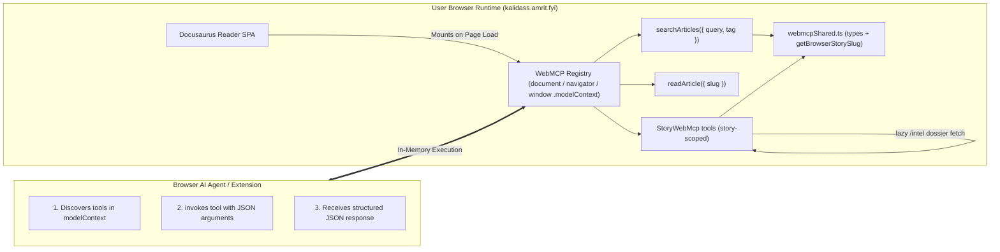

# WebMCP (In-Browser AI Tools)

**WebMCP (Web Model Context Protocol)** is an emerging W3C Web ML Community Group proposal (draft) that allows web applications to expose structured, typed JavaScript functions as callable tools directly within the browser runtime.

Kalidass Journal integrates WebMCP across all pages via a dedicated client module (`document.modelContext` / `navigator.modelContext` / `window.modelContext`), allowing browser AI agents (Chrome built-in AI, Gemini Nano, OpenAI Operator, and Chrome extensions like **WebMCP - Model Context Tool Inspector**) to query and read publication content without fragile visual DOM scraping.

---

## 1. How WebMCP Works



When a user or AI agent visits any page on Kalidass Journal, the frontend automatically registers the available tools into `document.modelContext`, `navigator.modelContext`, and `window.modelContext`.

---

## 2. Available WebMCP Tools

### `searchArticles`
Searches publication articles and research briefs by text keyword or category tag.
* **On `/magazine` (Issues Page) & Non-Story Pages**: Strictly bounded to a maximum of 5 items matching query/tag.
* **On `/story/:slug` Pages**: Automatically detects the active story path and returns **only that article** (1-item array).

* **Description**: `"Search Kalidass Journal research articles by text query or tag (returns up to 5 articles, or only the current story on /story/:slug)."`
* **Input Schema / Parameters**:
  * `query` *(string, optional)*: Keyword to match in title, subtitle, excerpt, or tags.
  * `tag` *(string, optional)*: Category filter (e.g. `'Agents'`, `'Evals'`, `'Systems'`).
* **Returns**: Array of matching article summaries (or single isolated story on `/story/:slug`):
  ```json
  [
    {
      "id": "uuid",
      "slug": "field-notes-evals",
      "title": "Field notes from the eval trench",
      "subtitle": "What broke and what we measured",
      "excerpt": "A short summary deck.",
      "tags": ["Evals", "Agents"],
      "readTimeMinutes": 5,
      "publishedAt": "2026-10-04T12:00:00.000Z",
      "authorName": "Research Team",
      "url": "https://kalidass.amrit.fyi/story/field-notes-evals",
      "path": "/story/field-notes-evals"
    }
  ]
  ```

---

### `readArticle`
Gets the direct canonical reading URL, path, and summary metadata for a specific article.
* **On `/magazine` & Non-Story Pages**: Requires an explicit `slug` argument.
* **On `/story/:slug` Pages**: Automatically resolves the slug from `window.location.pathname` if omitted in arguments.

* **Description**: `"Get the direct reading URL and summary metadata for a specific article by slug (or automatically for the current story on /story/:slug)."`
* **Input Schema / Parameters**:
  * `slug` *(string, optional)*: The bare URL slug of the article (e.g. `'attention-as-routing'` — not a path or URL; optional if currently viewing `/story/:slug`).
* **Returns**: Canonical navigation and metadata object:
  ```json
  {
    "slug": "attention-as-routing",
    "title": "Attention as Routing",
    "subtitle": "Sparse Mixture-of-Experts plumbing",
    "excerpt": "Architectural breakdown.",
    "url": "https://kalidass.amrit.fyi/story/attention-as-routing",
    "path": "/story/attention-as-routing",
    "publishedAt": "2026-10-01T15:00:00.000Z",
    "readTimeMinutes": 4,
    "tags": ["Architectures", "Systems"],
    "authorName": "Kalidass Author",
    "authorRole": "Systems Engineer"
  }
  ```

---

## 3. Story-Scoped Tools (`storyWebMcp.ts`)

Six additional tools are registered by the `StoryWebMcp` class (`blog_frontend/src/client-modules/storyWebMcp.ts`). They resolve the active story from an explicit `slug` argument or, by default, from the current `/story/:slug` route (`getBrowserStorySlug`). Every story tool accepts an optional `slug`; the intelligence dossier is lazy-fetched from `/api/articles/:slug/intel` only when the article carries the `has_intelligence` flag, and the book dossier is lazy-fetched from `/api/articles/:slug/books` when the article carries `has_books`.

All six return a **discriminated availability union**: `{ available: true, ...data }` on success, or `{ available: false, error | reason }` — `error` distinguishes *no story context* (`"Tool only available on a story page (/story/:slug)."`) from *lookup failures* (`"Story lookup failed for '<slug>'"`), while `reason` reports section-level absences (e.g. `"No video embeds or links in this story."`).

### `getStoryAiOverview`
Returns the Google AI Overview text and cited research sources for the current story.
* **Input Schema / Parameters**: `slug` *(string, optional)* — defaults to the active story on `/story/:slug`.
* **Returns**: `{ available, query, text, snippet, references: [{ title, link, snippet, source }] }`. Expanded text blocks are flattened (per-block `snippet || text`) and references prefer `expanded.references` over the top-level list — mirroring `IntelligencePanel`.

### `getStoryCitations`
Extracts empirical references and attribution quotes from the article body.
* **Detection**: `quote` blocks carrying a `cite`, plus any quotes appearing under headings matching `/reference|attribution|sources/i`.
* **Returns**: `{ available, count, citations: [{ index, text, cite }] }`.

### `getStoryVideoLinks`
Returns the hero (`article.videoUrl`) and inline body video blocks.
* **Returns**: `{ available, count, videos: [{ url, title?, caption?, source: "hero" | "body" }] }`.

### `getPeopleAlsoAsk`
Returns "People Also Ask" questions and answer snippets from the intelligence dossier.
* **Returns**: `{ available, count, questions: [{ question, snippet, link }] }`.

### `getStoryBookSuggestions`
Returns curated Amazon book recommendations and relevant literature for the current story, compiled by the [Books Suggestions](/books-suggestions) pipeline.
* **Input Schema / Parameters**: `slug` *(string, optional)* — defaults to the active story on `/story/:slug`.
* **Returns**: `{ available, query, topic, total, scoredBy?, books: [{ title, authors?, price?, rating?, reviews_count?, link, thumbnail? }] }`, or `{ available: false, reason: "No book suggestions available for this story." }` when none has been compiled.

### `getStoryResearchPapers`
Returns curated arXiv academic papers and preprint suggestions for the current story, compiled by the [Research Suggestions](/research-suggestions) pipeline.
* **Input Schema / Parameters**: `slug` *(string, optional)* — defaults to the active story on `/story/:slug`.
* **Returns**: `{ available, query, topic, total, scoredBy?, papers: [{ id, title, authors, summary, links: { abstract, pdf }, published, primaryCategory, score }] }`.

### `getStoryBlocks`
Returns the indexed list of blocks (with 0-based indices, types, metadata, previews, and staged dirty indicators) for the active story page (`/story/:slug`).
* **Target Resolution**: Purely internal via `window.location.pathname` (no manual `slug` argument needed). Rejects on non-story pages.
* **Authorization**: Gated to the story author (`authorEmail`) or elevated administrator (`kalidass-admin-token`).
* **Returns**: `{ available: true, ok: true, slug, title, totalBlocks, staged, dirtyIndices, blocks: [{ index, type, text?, preview, isDirty }] }`.
* **Behavior**: Reflects any pending staged edits in memory (`isDirty: true`, `staged: true`), allowing agents to inspect exact block indices before in-place modifications.

### `enhanceStoryContent`
Stages in-browser content enhancements, section refinements, or code block additions to the currently viewed story.
* **Target Resolution**: Purely internal via `window.location.pathname` (no manual `slug` argument needed). Rejects on non-story pages.
* **Authorization**: Gated to the story author (`authorEmail`) or elevated administrator (`kalidass-admin-token`).
* **Input Schema / Parameters**:
  * `enhancedText` *(string, optional)*: Replacement or appended prose/markdown text.
  * `sectionHeading` *(string, optional)*: Specific heading to target and update. Rejects actionably if the heading is not found.
  * `blockIndex` *(number, optional)*: Exact block index to replace.
  * `enhancedBlocks` *(Block[], optional)*: Direct replacement block array supporting `paragraph`, `heading`, `quote`, `image`, `video`, and `code` (with `language` and `title`).
  * `instruction` *(string, optional)*: Summary message explaining the editorial modification.
* **Returns**: `{ available: true, ok: true, staged: true, slug, dirtyIndices, updatedIndices, articleTitle, message }`.
* **Behavior**: Composes consecutive edits incrementally on top of pending staged blocks. Dispatches `kalidass:stage-enhancement` custom event for live in-page diff preview in `StoryPage.tsx`.

---

## 4. Testing with WebMCP Inspector Extension

Kalidass Journal is validated with the **WebMCP – Model Context Tool Inspector** extension (by Google Chrome Labs / W3C Web ML CG):

1. **Enable Browser Flags** (Chrome Dev / Canary):
   - Set `chrome://flags/#enable-webmcp-testing` (or `#enable-experimental-web-platform-features`) to **Enabled**.
2. **Open Extension Panel**:
   - Open the **WebMCP Inspector** side panel.
3. **Hard-Refresh Page**:
   - Press `Ctrl + Shift + R` (or `F5`) on `https://kalidass.amrit.fyi` or `http://localhost:3000`.
   - The inspector will automatically list all 10 tools — `searchArticles`, `readArticle`, `getStoryAiOverview`, `getStoryCitations`, `getStoryVideoLinks`, `getPeopleAlsoAsk`, `getStoryBookSuggestions`, `getStoryResearchPapers`, `getStoryBlocks`, and `enhanceStoryContent` — along with their interactive schema forms.
4. **Execute & Test with Gemini**:
   - Test manual JSON inputs directly in the inspector or attach a Gemini API key to run autonomous multi-step agent queries.

---

## 5. Testing in Browser DevTools Console

Open DevTools Console (`F12` or `Ctrl + Shift + I`):

```javascript
// 1. Inspect registered tools (or call listTools / getTools)
console.log(window.modelContext.tools);
console.log(await window.modelContext.listTools());

// 2. Search articles (returns up to 5 items)
const results = await window.modelContext.tools.searchArticles.execute({ query: "evals" });
console.log("Search Results:", results);

// 3. Read an article (returns canonical URL and summary metadata)
const article = await window.modelContext.tools.readArticle.execute({ slug: "attention-as-routing" });
console.log("Article Metadata & URL:", article);

// 4. Story-scoped tool (on /story/:slug; lazy-fetches the intel dossier)
const overview = await window.modelContext.tools.getStoryAiOverview.execute({});
console.log("AI Overview:", overview);

// 5. Story-scoped book recommendations (on /story/:slug; lazy-fetches the books dossier)
const books = await window.modelContext.tools.getStoryBookSuggestions.execute({});
console.log("Book Suggestions:", books);
```

---

## 6. Implementation Details

- **Source Code**: `blog_frontend/src/client-modules/webmcp.ts` (registry + core tools), `storyWebMcp.ts` (story-scoped tools), `webmcpShared.ts` (shared `WebMcpTool`/`ModelContextRegistry` types, global declarations, and `getBrowserStorySlug`).
- **Acyclic Module Graph**: both `webmcp.ts` and `storyWebMcp.ts` import shared pieces from `webmcpShared.ts`, keeping the dependency direction strictly `webmcp → storyWebMcp` (no cycles).
- **Registration**: Registered in `blog_frontend/docusaurus.config.ts` via `clientModules: ["./src/client-modules/api-base.ts", "./src/client-modules/webmcp.ts"]`; `StoryWebMcp` tools are registered by `initWebMcp()` on load.
- **Triple Global Sync**: Exposes tools via `document.modelContext`, `navigator.modelContext`, and `window.modelContext`.
- **Dual Schema Specification**: Provides standard `inputSchema` (JSON Schema) and `parameters` for universal parser compatibility.
- **Lazy Dossier Resolution**: story tools only hit `/api/articles/:slug/intel` when `has_intelligence` is set and no dossier is already embedded; intel-fetch failures degrade to `available: false` section reasons.
- **SSR Safety**: All browser global access is guarded with `ExecutionEnvironment.canUseDOM` to ensure hermetic static site pre-rendering.
