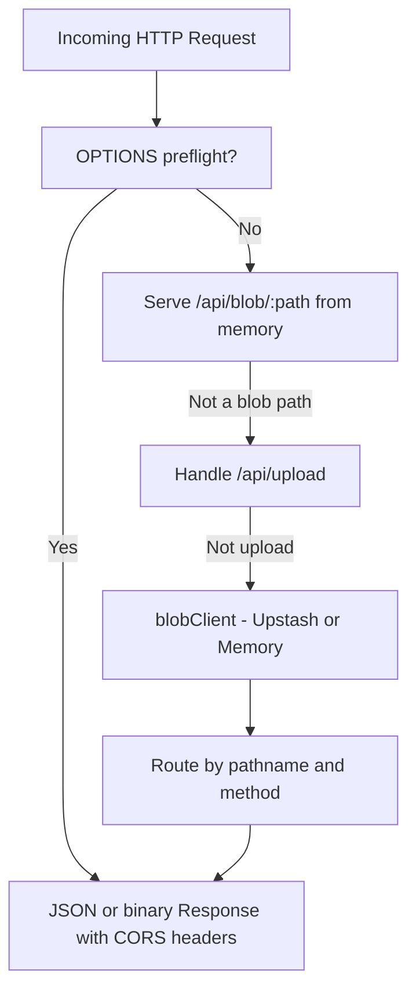

# Worker Overview

The Kalidass Journal Worker is a lightweight Cloudflare Worker that serves as the edge REST API for all article CRUD operations, media uploads, and health reporting. It is backed by Upstash Blob for persistent JSON and object storage, with an in-memory fallback for local development.

## Responsibilities

- **Article API**: Create, read, update, and delete article objects stored as JSON in Upstash Blob.
- **Upload Signing**: Delegate direct browser-to-Upstash uploads via the `@upstash/blob` `uploadHandler`.
- **Fallback Upload**: Accept `FormData` file uploads when the direct upload route is unavailable.
- **CORS Negotiation**: Respond to `OPTIONS` preflight requests and add access-control headers to all responses.
- **Health Reporting**: Expose `/api/health` to report server availability with HTTP `200 { "ok": true }`.
- **Cold-Start Seeding**: Populate an empty store with four seed articles on first request.

## Tech Stack

| Component | Package / Runtime |
| --- | --- |
| **Runtime** | Cloudflare Workers (ES Module format) |
| **Storage** | `@upstash/blob@0.0.6-canary.20260914173111` |
| **Dev Server** | `wrangler ^4.37.0` |
| **Compatibility** | `nodejs_compat` flag, `compatibility_date = 2026-09-01` |

## Source Layout

<Tree>
  <Tree.Folder name="worker" defaultOpen>
    <Tree.Folder name="src" defaultOpen>
      <Tree.File name="index.js" highlight />
      <Tree.File name="memory.js" highlight />
      <Tree.File name="seed.js" highlight />
    </Tree.Folder>
    <Tree.File name=".dev.vars.example" />
    <Tree.File name=".wranglerignore" highlight />
    <Tree.File name="wrangler.toml" highlight />
    <Tree.File name="package.json" />
  </Tree.Folder>
</Tree>

## Request Lifecycle

