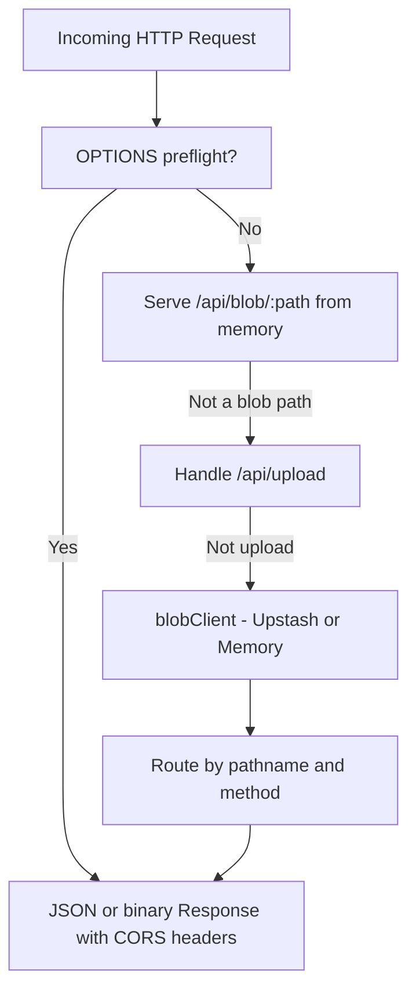

# Worker Overview

The Kalidass Journal Worker is a lightweight Cloudflare Worker that serves as the edge REST API for all article CRUD operations, media uploads, and health reporting. It is backed by Upstash Blob for persistent JSON and object storage, with an in-memory fallback for local development.

## Responsibilities

- **Article API**: Create, read, update, and delete article objects stored as JSON in Upstash Blob.
- **Multi-User Edge Caching**: Serve public feeds (3h TTL, full-feed ETag 304 revalidation) and public stories (24h TTL) from Upstash Redis.
- **Upload Signing**: Delegate direct browser-to-Upstash uploads via the `@upstash/blob` `uploadHandler`.
- **Fallback Upload**: Accept `FormData` file uploads when the direct upload route is unavailable.
- **CORS Negotiation**: Respond to `OPTIONS` preflight requests and add access-control headers to all responses.
- **Health Reporting**: Expose `/api/health` to report server availability with HTTP `200 { "ok": true }`.
- **Cold-Start Seeding**: Bootstrap an empty index on first request (the seed list is currently empty).
- **Quality & Safety Evaluation**: `POST /api/eval/quality` runs the provider cascade (jev → clef → heuristic) and gates writes on the safety verdict. See [Quality & Safety Evaluation](/worker/quality-eval).
- **Book Suggestions**: Compiles per-article Amazon recommendations via SerpApi, ranked by the same eval scorer. See [Books Suggestions](/books-suggestions).

## Tech Stack

| Component | Package / Runtime |
| --- | --- |
| **Runtime** | Cloudflare Workers (ES Module format) |
| **Storage** | `@upstash/blob@0.0.6-canary.20260914173111` |
| **Caching** | `@upstash/redis` (with in-memory fallback) |
| **Dev Server** | `wrangler ^4.37.0` |
| **Compatibility** | `nodejs_compat` flag, `compatibility_date = 2026-09-01` |

## Source Layout

<Tree>
  <Tree.Folder name="worker" defaultOpen>
    <Tree.Folder name="src" defaultOpen>
      <Tree.File name="index.js" highlight />
      <Tree.Folder name="helper" defaultOpen>
        <Tree.File name="auth.js" highlight />
        <Tree.File name="response.js" highlight />
        <Tree.File name="storage.js" highlight />
      </Tree.Folder>
      <Tree.Folder name="books">
        <Tree.File name="service.js" />
        <Tree.File name="serpapi.js" />
        <Tree.File name="scorer.js" />
      </Tree.Folder>
      <Tree.Folder name="eval">
        <Tree.File name="index.js" />
        <Tree.File name="heuristic.js" />
        <Tree.File name="jev.js" />
        <Tree.File name="clef.js" />
        <Tree.File name="types.js" />
      </Tree.Folder>
      <Tree.Folder name="generator">
        <Tree.File name="box_based_generator.js" />
        <Tree.File name="agent_python.js" />
        <Tree.File name="agent_node.js" />
        <Tree.File name="index.js" />
        <Tree.File name="schemas.js" />
        <Tree.File name="prompts.js" />
        <Tree.File name="types.js" />
      </Tree.Folder>
      <Tree.Folder name="intelligence">
        <Tree.File name="service.js" />
        <Tree.File name="box_runner.js" />
        <Tree.File name="python_script.js" />
      </Tree.Folder>
      <Tree.Folder name="redis" defaultOpen>
        <Tree.File name="cache.js" highlight />
        <Tree.File name="index.js" />
        <Tree.File name="upstash_adapter.js" />
        <Tree.File name="memory_adapter.js" />
        <Tree.File name="types.js" />
      </Tree.Folder>
      <Tree.File name="memory.js" highlight />
      <Tree.File name="seed.js" highlight />
    </Tree.Folder>
    <Tree.File name=".dev.vars.example" />
    <Tree.File name=".wranglerignore" highlight />
    <Tree.File name="wrangler.toml" highlight />
    <Tree.File name="package.json" />
  </Tree.Folder>
</Tree>

## Request Lifecycle

