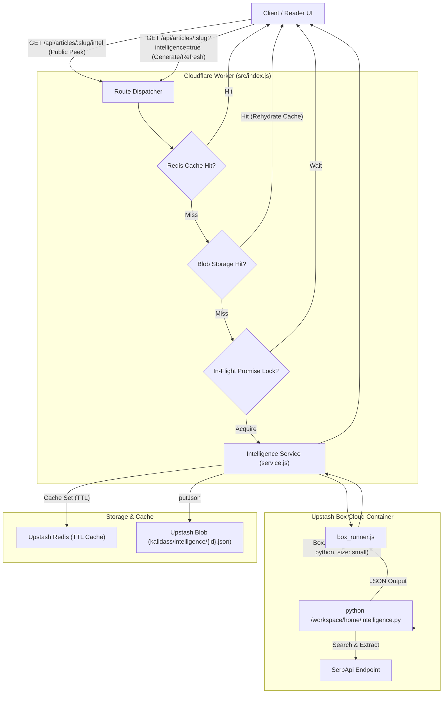

# Article Intelligence Engine

The **Article Intelligence Engine** (`worker/src/intelligence/`) compiles empirical search grounding for research articles in Kalidass Journal. It executes a dedicated Python research runner inside an ephemeral **Upstash Box** cloud container, fetches Google Search intelligence and AI Overviews via **SerpApi**, and serves cached dossiers through a multi-tier storage architecture.

---

## 1. System Architecture & Lifecycle

---

## 2. Component Layout

The intelligence module is structured into isolated, testable modules within the worker:

<Tree>
  <Tree.Folder name="worker" defaultOpen>
    <Tree.Folder name="src" defaultOpen>
      <Tree.Folder name="intelligence" defaultOpen>
        <Tree.File name="box_runner.js" highlight />
        <Tree.File name="python_script.js" highlight />
        <Tree.File name="service.js" highlight />
      </Tree.Folder>
      <Tree.Folder name="redis" defaultOpen>
        <Tree.File name="index.js" highlight />
        <Tree.File name="upstash_adapter.js" highlight />
        <Tree.File name="memory_adapter.js" highlight />
        <Tree.File name="types.js" />
      </Tree.Folder>
      <Tree.File name="index.js" />
    </Tree.Folder>
  </Tree.Folder>
</Tree>

### Key Responsibilities

1. **`box_runner.js`**: Spawns an ephemeral Upstash Box (`runtime: "python"`, `size: "small"`, `timeout: 120_000`) with hypervisor-injected `attachHeaders` for `serpapi.com`. Writes the synthesized Python script and executes it with a 90-second timeout. Always terminates the container on completion or failure.
2. **`python_script.js`**: Builds the self-contained Python extraction script (`buildIntelligenceScript`). Queries Google Search via SerpApi to extract AI Overviews, Knowledge Graph, People Also Ask (PAA), inline videos, and organic search results. Strips re-query metadata (`serpapi_link`, `page_token`) from persisted blocks so account credentials embedded in mirrored SerpApi links can never reach public readers.
3. **`service.js`**: Orchestrates storage, deduplication, and verification:
   - In-flight promise locks (`_intelInflightLocks`) prevent concurrent client requests from spawning duplicate Box containers for the same article.
   - Validation via `isValidIntelligencePayload` ensures empty or corrupt payloads are rejected before persistence.
   - Dual-tier resolution: checks Upstash Redis first, falls back to Upstash Blob (`kalidass/intelligence/{id}.json`), and populates the cache on blob hits.
   - `peekArticleIntelligence()` provides the read-only Redis → Blob → re-cache cascade (24h TTL, key `kalidass:ai_intel:<id>`) behind the public `/intel` route — it never spawns a Box or joins in-flight generation locks.
4. **`redis/`**: Uniform Redis interface abstraction providing `@upstash/redis` connectivity in production and an in-memory Map adapter for local development.
5. **SerpApi Quota Isolation**: SerpApi is reserved for reader-facing dossiers — the Article Intelligence Engine and the [Books Suggestions](/books-suggestions) pipeline. Article authoring in the generator relies on Firecrawl and Tavily (70/30 ratio), so generation never consumes SerpApi quota.

---

## 3. Data Structure (`AiIntelligence`)

The compiled intelligence dossier conforms to the `AiIntelligence` interface defined in `blog_frontend/src/lib/types.ts`:

| Property | Type | Description |
| --- | --- | --- |
| `query` | `string` | Search query synthesized from the article title, subtitle, and primary tags. |
| `ai_overview` | `object \| null` | Google AI Overview text, source snippets, and expanded citation blocks. |
| `knowledge_graph` | `object \| null` | Entity knowledge graph title, type, description, website, and attributes. |
| `answer_box` | `object \| null` | Featured snippet or direct answer box when surfaced by Google. |
| `people_also_ask` | `Array<{ question, snippet, link }>` | Related questions and accordion answers from searchers. |
| `inline_videos` | `Array<{ title, link, channel, duration }>` | Video clips and presentations relevant to the thesis topic. |
| `organic_results` | `Array<{ title, link, snippet }>` | Top organic web citations and research publications. |
| `news` | `Array<{ title, source, date, link }>` | Top news stories and dispatches (capped at 5). |
| `books_shopping` | `Array<{ title, price, source, link }>` | Curated books and literature results (capped at 8). |
| `jobs_results` | `Array<{ title, company_name, location, via }>` | Industry opportunity listings (capped at 6). |
| `discussions_and_forums` | `Array<{ title, link, forum }>` | Community discussions and forum threads. |
| `fetchedAt` | `string` | ISO timestamp of the extraction run. |

---

## 4. Endpoints & Access Control

### Public Reader Peek (`GET /api/articles/:idOrSlug/intel`)
- Read-only lookup checking Redis cache and Upstash Blob.
- **Never spawns an Upstash Box container**.
- Mirrors the article's draft/private visibility gates: returns `404` for unauthenticated requests on drafts or private articles.
- Returns the complete `AiIntelligence` JSON object or `404 { error: "No intelligence compiled for this article" }`.

### Authenticated Compilation & Refresh (`GET /api/articles/:idOrSlug?intelligence=true`)
- Restricted to the article's author or a Super-Admin (`401 Unauthorized` without a token; `403 Forbidden` for non-owners).
- Query parameter `refresh=true` bypasses existing Redis/Blob caches and forces a new Upstash Box compilation pass.
- Returns the updated `Article` object with embedded `ai_intelligence`.

### Public Story Gating Flag (`has_intelligence`)
- Public article fetches (`GET /api/articles/:idOrSlug`) include a lightweight boolean flag `has_intelligence: boolean`.
- Allows the frontend story reader to render the **AI Intelligence** tab badge without eagerly downloading the heavy intelligence dossier until the reader opens the tab.
