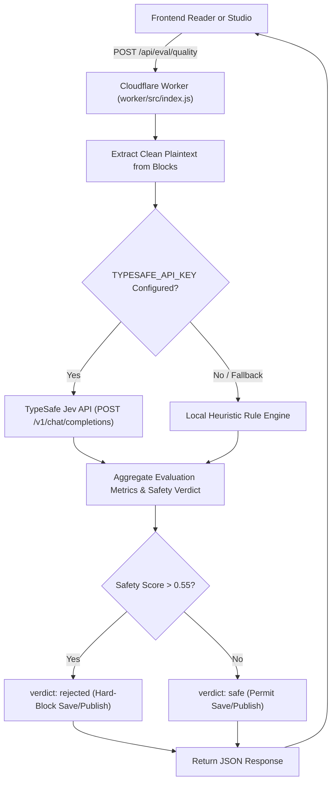

# Quality & Safety Evaluation

Kalidass Journal incorporates automated editorial evaluation and safety guardrails powered by [TypeSafe AI](https://typesafe.ai) and the **Jev** System One decision model. The evaluation pipeline runs at the edge inside the private Cloudflare Worker (`worker/src/index.js`) under `POST /api/eval/quality`.

## Architecture & Data Flow



---

## Evaluation Dimensions & Jev Primitives

The evaluation engine leverages three foundational Jev decision primitives:

| Dimension | Primitive | Range / Values | Purpose |
| :--- | :--- | :--- | :--- |
| **AI Writing Detection** | `noul` | Probability $0.0 - 1.0$ | Estimates likelihood of synthetic LLM generation vs. human composition |
| **Technical Accuracy** | `score` | $1.0 - 5.0$ (Level: beginner, intermediate, advanced) | Scores systems architecture depth, engineering precision, and factual rigor |
| **Reader Engagement** | `score` | $1.0 - 5.0$ (Level: low, moderate, high, viral) | Evaluates narrative flow, clarity, and pacing |
| **Editorial Readiness** | `choice` | `ready`, `needs_revision`, `draft_only` | Editorial triage classification |
| **Safety: Violence** | `noul` | Probability $0.0 - 1.0$ | Hard-blocks violent or harmful content when $> 0.55$ |
| **Safety: Sexual** | `noul` | Probability $0.0 - 1.0$ | Hard-blocks sexually explicit content when $> 0.55$ |
| **Safety: Antisocial** | `noul` | Probability $0.0 - 1.0$ | Hard-blocks harassment, hate speech, or unsocial content when $> 0.55$ |

---

## API Contract

### Endpoint
`POST /api/eval/quality`

### Request Payload
```json
{
  "title": "Zero-Trust Architecture on Cloudflare Workers",
  "subtitle": "Decoupling static frontends from edge storage",
  "excerpt": "A deep dive into serverless security patterns.",
  "blocks": [
    { "type": "paragraph", "text": "Systems engineering demands strict boundary isolation..." },
    { "type": "quote", "text": "Simplicity is prerequisite for reliability.", "cite": "Dijkstra" }
  ]
}
```

### Response Payload
```json
{
  "ok": true,
  "source": "typesafe-jev",
  "safety": {
    "verdict": "safe",
    "risks": {
      "violence": { "detected": false, "probability": 0.02 },
      "sexual": { "detected": false, "probability": 0.01 },
      "antisocial": { "detected": false, "probability": 0.03 }
    },
    "violations": []
  },
  "metrics": {
    "isAiWritten": {
      "probability": 0.18,
      "label": "Human-written"
    },
    "accuracy": {
      "score": 4.8,
      "level": "advanced",
      "confidence": 0.94
    },
    "engagement": {
      "score": 4.5,
      "level": "high",
      "confidence": 0.91
    },
    "editorialReadiness": {
      "choice": "ready",
      "confidence": 0.95
    }
  },
  "summary": "Article evaluated with high technical depth and zero safety violations."
}
```

---

## Safety Enforcement & Guardrails

1. **Pre-Submit Studio Gate**: In Studio Compose (`blog_frontend/src/pages/admin.tsx`), clicking **Save draft** or **Publish** triggers an automated quality & safety pre-check. If any safety risk exceeds $0.55$, saving is aborted and a high-visibility warning banner is rendered.
2. **Server-Side Worker Gate**: On `POST /api/articles` and `PUT /api/articles/:id`, the Worker runs safety verification. If prohibited content is detected, the API rejects the request with HTTP `422 Unprocessable Entity`.
3. **Reader Right Sidebar**: In `StoryPage.tsx`, readers and editors can trigger a live quality audit to inspect AI probability, technical rigor score, and safety verification badges in real time.
4. **Local Fallback Engine**: If `TYPESAFE_API_KEY` is not present in the Worker environment (e.g. offline dev or unit testing), the Worker falls back seamlessly to a local deterministic heuristic analyzer without throwing 500 errors.
