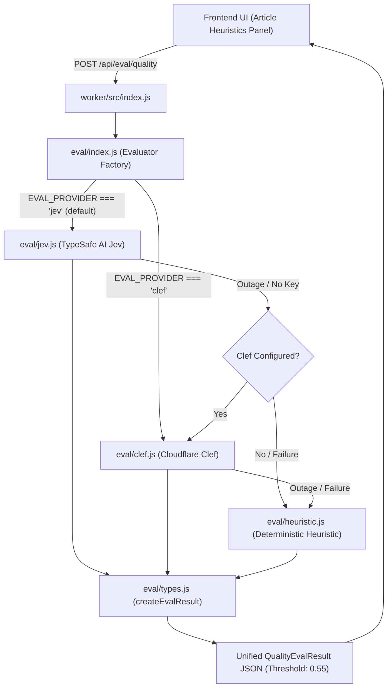

# Quality & Safety Evaluation

Kalidass Journal incorporates automated editorial evaluation and safety guardrails exposed in the UI as **Article Heuristics**. The evaluation pipeline runs at the edge inside the private Cloudflare Worker (`worker/src/index.js`) under `POST /api/eval/quality`.

## Architecture & Data Flow



---

## Modular Provider Architecture

The evaluator is structured into provider-specific modules behind a unified interface:

<Tree>
  <Tree.Folder name="worker" defaultOpen>
    <Tree.Folder name="src" defaultOpen>
      <Tree.Folder name="eval" defaultOpen>
        <Tree.File name="types.js" highlight />
        <Tree.File name="jev.js" highlight />
        <Tree.File name="clef.js" highlight />
        <Tree.File name="heuristic.js" highlight />
        <Tree.File name="index.js" highlight />
      </Tree.Folder>
      <Tree.File name="index.js" />
    </Tree.Folder>
  </Tree.Folder>
</Tree>

### Provider Selection & Cascading
The active evaluator is determined by `env.EVAL_PROVIDER` (or per-request override via `options.provider` / `x-eval-provider` header):
- **`jev` (default)**: Evaluates via TypeSafe AI Jev System One decision API.
- **`clef`**: Evaluates via the Cloudflare Clef decision model on Workers AI (`@cf/cloudflare/clef` / `clef-flash`), using Cloudflare API-key auth (REST `/ai/run`) or the `env.AI` binding.
- **`heuristic`**: Evaluates via deterministic offline rule engine.

If the primary provider encounters missing credentials or a network outage, the dispatcher automatically cascades to the next available provider, ensuring publishing workflows and reader audits are never blocked. The same provider selection and cascade also power the [Books Suggestions](/books-suggestions) scorer, which ranks Amazon candidates with the active model.

---

## Cloudflare Clef Provider

Clef is Cloudflare's open decision model on Workers AI (`@cf/cloudflare/clef`, `@cf/cloudflare/clef-flash`), following the same System One schema as Jev. `worker/src/eval/clef.js` submits the same seven typed questions (`noul`, `score`, `choice`) and normalizes the returned `answers` into a `cloudflare-clef` result.

Clef supports two access modes. The REST path takes precedence whenever an API key is present:

| Mode | Required configuration | Call |
| --- | --- | --- |
| **API key (REST)** | `CLEF_API_KEY` + `CLOUDFLARE_ACCOUNT_ID` | `POST https://api.cloudflare.com/client/v4/accounts/{id}/ai/run/@cf/cloudflare/{model}` with `Authorization: Bearer` |
| **Workers AI binding** | `[ai]` binding named `AI` in `wrangler.toml` | `env.AI.run("@cf/cloudflare/{model}", payload)` |

- **Model selector**: `CLEF_MODEL` = `clef-flash` (default — 9B, lowest latency) or `clef` (27B, highest precision).
- **Per-request overrides**: `x-clef-key` (API key), `x-eval-provider` (provider), and `x-cf-model` (model) headers, or the `clefApiKey` / `provider` / `clefModel` request-body fields.
- **Score normalization**: Clef returns a probability-weighted, 0-based `score`; the adapter maps it onto the canonical `1..N` scale before `createEvalResult` clamps it.
- **Fallback**: a missing key in REST mode, a missing `CLOUDFLARE_ACCOUNT_ID`, or any upstream error cascades to `local-heuristic`.

---

## Evaluation Dimensions & Decision Primitives

| Dimension | Primitive | Range / Values | Purpose |
| :--- | :--- | :--- | :--- |
| **AI Writing Detection** | `noul` | Probability $0.0 - 1.0$ | Estimates likelihood of synthetic LLM generation vs. human composition |
| **Technical Accuracy** | `score` | $1.0 - 5.0$ (Level: elementary, competent, rigorous, expert) | Scores systems architecture depth, engineering precision, and factual rigor |
| **Reader Engagement** | `score` | $1.0 - 5.0$ (Level: dry, clear, engaging, captivating) | Evaluates narrative flow, clarity, and pacing |
| **Editorial Readiness** | `choice` | `needs_major_revision`, `needs_minor_polish`, `ready_for_publication` | Editorial triage classification |
| **Safety: Violence** | `noul` | Probability $0.0 - 1.0$ | Hard-blocks violent or harmful content when $> 0.55$ |
| **Safety: Sexual** | `noul` | Probability $0.0 - 1.0$ | Hard-blocks sexually explicit content when $> 0.55$ |
| **Safety: Antisocial** | `noul` | Probability $0.0 - 1.0$ | Hard-blocks harassment, hate speech, or unsocial content when $> 0.55$ |

---

## API Contract

### Endpoint
`POST /api/eval/quality`

### Authentication
Requires a verified caller. Send a valid Auth0 `Authorization: Bearer <jwt>` token, or the admin token as `Authorization: Bearer <ADMIN_TOKEN>` / `X-Admin-Token`. Unauthenticated requests are rejected with HTTP `401 Unauthorized`.

### Request Payload
```json
{
  "title": "Zero-Trust Architecture on Cloudflare Workers",
  "subtitle": "Decoupling static frontends from edge storage",
  "excerpt": "A deep dive into serverless security patterns.",
  "blocks": [
    { "type": "paragraph", "text": "Systems engineering demands strict boundary isolation..." },
    { "type": "quote", "text": "Simplicity is prerequisite for reliability.", "cite": "Dijkstra" }
  ]
}
```

### Response Payload
```json
{
  "ok": true,
  "source": "typesafe-jev",
  "safety": {
    "verdict": "safe",
    "violence": 0.02,
    "sexual": 0.01,
    "antisocial": 0.03,
    "violations": []
  },
  "metrics": {
    "isAiWritten": {
      "probability": 0.18,
      "label": "Human-Authored"
    },
    "accuracy": {
      "score": 4.8,
      "level": "expert",
      "confidence": 0.94
    },
    "engagement": {
      "score": 4.5,
      "level": "engaging",
      "confidence": 0.91
    },
    "editorialReadiness": {
      "choice": "ready_for_publication",
      "confidence": 0.95
    }
  },
  "summary": "Article heuristics: expert accuracy, engaging prose, Human-authored. Safety: safe."
}
```

---

## Safety Enforcement & Guardrails

1. **Pre-Submit Studio Gate**: In Studio Compose (`blog_frontend/src/pages/admin.tsx`), clicking **Save draft** or **Publish** triggers an automated quality & safety pre-check. If any safety risk exceeds $0.55$, saving is aborted and a high-visibility warning banner is rendered.
2. **Server-Side Worker Gate**: On `POST /api/articles` and `PUT /api/articles/:id`, the Worker runs safety verification. If prohibited content is detected, the API rejects the request with HTTP `422 Unprocessable Entity`.
3. **Reader Right Sidebar**: In `StoryPage.tsx`, signed-in readers and editors can trigger a live quality audit (the endpoint requires authentication) to inspect AI probability, technical rigor score, and safety verification badges in real time in the **Article Heuristics** card. Stored evaluations remain visible to all readers.
4. **Resilient Cascading Engine**: If API keys are missing or a third-party service fails, the Worker cascades to the local heuristic engine without throwing 500 errors.

---

## Heuristic Safety Engine & Scunthorpe Defense

The fallback heuristic evaluator (`worker/src/eval/heuristic.js`) enforces strict regex word boundaries (`\b${escapedTerm}\b`) rather than naive substring matching:

- **Exact Word Boundaries**: Matches standalone words only (`/\bkill\b/i`, `/\bsex\b/i`). Prevents benign substrings inside technical vocabulary from triggering violations (e.g. `"analysis"`, `"analytics"`, and `"analyzer"` will never match `"anal"`; `"skills"` will never match `"kill"`).
- **Disambiguated Terms**: Uses explicit multi-word forms such as `"anal sex"` and distinct anatomical terms like `"anus"` rather than ambiguous short roots.
- **Word Inflections**: Expands stems into complete word forms (`"masturbate"`, `"masturbation"`, `"masturbating"`, `"mutilate"`, `"mutilation"`).
- **Technical Rigor Word Boundaries**: Technical metrics also apply word boundaries (`/\bgpu\b/i`, `/\bcuda\b/i`) to ensure accurate metric scoring.
