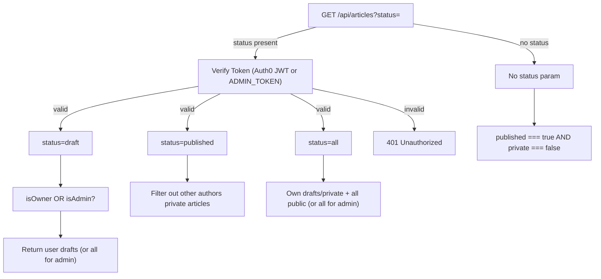

# Request Routing

The worker's `fetch` handler processes every incoming request by inspecting `url.pathname` and `request.method`. Routes are evaluated in declaration order. All responses include CORS headers derived from `CORS_ORIGIN`.

## CORS Handling

Every response carries access-control headers generated by `corsHeaders(origin)`:

```js
{
  "access-control-allow-origin": origin,
  "access-control-allow-methods": "GET,POST,PUT,DELETE,OPTIONS",
  "access-control-allow-headers": "content-type,authorization,x-admin-token",
  "access-control-max-age": "86400"
}
```

`OPTIONS` preflight requests receive an immediate `204` with CORS headers and no further processing.

## Route Table

| Method | Path | Auth Required | Handler | Description |
| --- | --- | --- | --- | --- |
| `OPTIONS` | `*` | No | `options(origin)` | CORS preflight — returns `204` immediately. |
| `GET` | `/api/blob/:path` | **Yes** | Memory object lookup | Serves in-memory blob bytes. Only active when no `UPSTASH_BLOB_TOKEN` is set. Requires authenticated author or admin. |
| `GET` | `/api/upload` | **Yes** | `uploadsFor(env).GET` | Returns Upstash Blob upload token for direct browser upload. Requires `UPSTASH_BLOB_TOKEN` and authenticated author or admin. |
| `POST` | `/api/upload` | **Yes** | `uploadsFor(env).POST` | Handles direct browser upload to Upstash Blob. Requires `UPSTASH_BLOB_TOKEN` and authenticated author or admin. |
| `GET` | `/api/health` | No | Inline | Health check — returns `{ ok: true }` with status `200`. |
| `GET` | `/api/auth/me` | **Yes** | `getAuthUser` | Returns authenticated user profile `{ user: { email, role, sub, isSuperuserEligible } }`. |
| `POST` | `/api/auth/elevate` | **Yes** | Inline verification | 2-Factor elevation. Requires whitelisted email (`ADMIN_EMAILS`) and valid `adminToken` body. Returns `{ ok: true, elevated: true }`. |
| `POST` | `/api/objects` | **Yes** | Inline multipart | Media upload via `FormData`. Accepts `file` field. Max `20mb`. Requires authenticated author or admin. |
| `POST` | `/api/eval/quality` | **Yes** | `runQualityEvaluation` | Evaluates AI detection, accuracy, engagement, and safety. Requires Bearer token. |
| `POST` | `/api/generate` | **Yes** | `generateArticle` | Autonomous Upstash Box article authoring & DALL-E cover synthesis. Requires Bearer token. |
| `POST` | `/api/admin/reset` | **Yes** | Inline reset | Flushes in-memory or blob index back to initial state. Requires Super-Admin Bearer token. |
| `GET` | `/api/articles` | Conditional | `ensureSeed` + filter | Public feed returns `published: true, private: false` articles. `?status=` queries require auth. |
| `GET` | `/api/articles?status=draft` | **Yes** | Filter | Returns drafts belonging to authenticated user (`authorEmail === user.email`), or all drafts for admin. |
| `GET` | `/api/articles?status=published` | **Yes** | Filter | Returns published articles (excluding other authors' private unlisted articles unless admin). |
| `GET` | `/api/articles?status=all` | **Yes** | Filter | Returns all accessible articles (scoped by author email for non-admins). |
| `POST` | `/api/articles` | **Yes** | `buildArticle` + `uniqueSlug` + `ensureSeed` | Creates article stamped with immutable `authorEmail`. Returns `201` with full `Article`. |
| `GET` | `/api/articles/:idOrSlug` | Conditional | `readJson` | Returns full article with `has_intelligence` flag. Draft **or private** articles require auth and ownership/admin access; returns `404` otherwise. |
| `GET` | `/api/articles/:idOrSlug?intelligence=true` | **Yes** | `getOrGenerateArticleIntelligence` | Compiles/refreshes live SerpApi search intelligence in Upstash Box. Requires author ownership or admin. |
| `GET` | `/api/articles/:idOrSlug/intel` | Conditional | `peekArticleIntelligence` | Public read-only intelligence sub-resource (Redis/Blob only, never spawns Box). Gated by article draft/private state. |
| `PUT` | `/api/articles/:idOrSlug` | **Yes** | `buildArticle` merge | Updates existing article. Returns `403 Forbidden` if requester is not author or admin. Preserves `authorEmail`. |
| `DELETE` | `/api/articles/:idOrSlug` | **Yes** | `bucket.del` | Deletes article and removes from index. Returns `403 Forbidden` if requester is not author or admin. |
| `*` | `*` | No | Inline | Catch-all — returns `404 { error: "Not found" }`. |

## Status Filter Logic



## Authentication & Authorization

Authentication is resolved by `getAuthUser(request, env)`:

1. **Auth0 JWT Verification**: If `AUTH0_DOMAIN` is configured, incoming `Authorization: Bearer <jwt>` tokens are verified against Auth0's remote JWKS (`https://<AUTH0_DOMAIN>/.well-known/jwks.json`) using `jose`. The verified payload resolves `user.email` (with Auth0 `/userinfo` endpoint fallback if claims are omitted from the access token) and evaluates `isSuperuserEligible` against `ADMIN_EMAILS`.
2. **2-Factor Superuser Elevation (`X-Admin-Token`)**:
   - For an authenticated author, `role: "admin"` is granted **only** when `isSuperuserEligible` is `true` **and** the `x-admin-token` header matches `ADMIN_TOKEN`.
   - Any attempt to elevate by non-whitelisted emails is rejected with `403 Forbidden` at `/api/auth/elevate` and ignored by `getAuthUser`.
3. **Admin Token Fallback**: If `ADMIN_TOKEN` matches the Bearer token directly, the request is granted full Super-Admin status (`role: "admin"`) for automated M2M publishing.
4. **Role & Ownership Gates**:
   - **Super-Admin (`role: "admin"`)**: Can view, edit, draft, and delete any article across all users.
   - **Author (`role: "author"`)**: Can create articles (stamped with their verified `authorEmail`), view/edit their own drafts and private articles, but receives `403 Forbidden` when attempting to mutate articles authored by other users.

## Error Handling

All unhandled exceptions in the fetch handler are caught by a top-level `try/catch` that returns a `500` JSON response:

```json
{ "error": "<error message>" }
```
