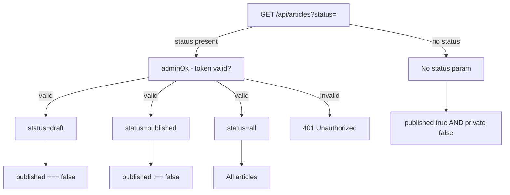

# Request Routing

The worker's `fetch` handler processes every incoming request by inspecting `url.pathname` and `request.method`. Routes are evaluated in declaration order. All responses include CORS headers derived from `CORS_ORIGIN`.

## CORS Handling

Every response carries access-control headers generated by `corsHeaders(origin)`:

```js
{
  "access-control-allow-origin": origin,
  "access-control-allow-methods": "GET,POST,PUT,DELETE,OPTIONS",
  "access-control-allow-headers": "content-type,authorization",
  "access-control-max-age": "86400"
}
```

`OPTIONS` preflight requests receive an immediate `204` with CORS headers and no further processing.

## Route Table

| Method | Path | Auth Required | Handler | Description |
| --- | --- | --- | --- | --- |
| `OPTIONS` | `*` | No | `options(origin)` | CORS preflight — returns `204` immediately. |
| `GET` | `/api/blob/:path` | No | Memory object lookup | Serves in-memory blob bytes. Only active when no `UPSTASH_BLOB_TOKEN` is set. |
| `GET` | `/api/upload` | No | `uploadsFor(env).GET` | Returns Upstash Blob upload token for direct browser upload. Requires `UPSTASH_BLOB_TOKEN`. |
| `POST` | `/api/upload` | No | `uploadsFor(env).POST` | Handles direct browser upload to Upstash Blob. Requires `UPSTASH_BLOB_TOKEN`. |
| `GET` | `/api/health` | No | Inline | Returns `{ ok, storage, runtime }`. Storage is `"upstash-blob"` or `"memory"`. |
| `POST` | `/api/objects` | **Yes** | Inline multipart | Fallback upload via `FormData`. Accepts `file` field. Max `20mb`, images and video only. |
| `GET` | `/api/articles` | Conditional | `ensureSeed` + filter | Public feed returns `published: true, private: false` articles. `?status=` queries require auth. |
| `GET` | `/api/articles?status=draft` | **Yes** | Filter | Returns articles where `published === false`. |
| `GET` | `/api/articles?status=published` | **Yes** | Filter | Returns all published articles including unlisted. |
| `GET` | `/api/articles?status=all` | **Yes** | Filter | Returns all articles regardless of state. |
| `POST` | `/api/articles` | **Yes** | `buildArticle` + `ensureSeed` | Creates article. Computes `slug`, `readTime`, `id`. Returns `201` with full `Article`. |
| `GET` | `/api/articles/:idOrSlug` | Conditional | `readJson` | Returns full article. Draft articles (`published: false`) require auth; returns `404` otherwise. |
| `PUT` | `/api/articles/:idOrSlug` | **Yes** | `buildArticle` merge | Merges body onto existing article. Recomputes `slug` (deduped) and `readTime`. Returns `200`. |
| `DELETE` | `/api/articles/:idOrSlug` | **Yes** | `bucket.del` | Deletes article object and removes from index. Returns `{ ok: true }`. |
| `*` | `*` | No | Inline | Catch-all — returns `404 { error: "Not found" }`. |

## Status Filter Logic



## Authentication

Authentication is enforced by `adminOk(request, env)`:

```js
function adminOk(request, env) {
  if (!env.ADMIN_TOKEN) return true;
  return (request.headers.get("authorization") || "") === `Bearer ${env.ADMIN_TOKEN}`;
}
```

- If `ADMIN_TOKEN` is not set, all requests pass authentication (open mode — suitable for local dev).
- If set, the `Authorization: Bearer <token>` header must match exactly.
- The client reads the token from `localStorage.getItem("kalidass-admin-token")`.

## Error Handling

All unhandled exceptions in the fetch handler are caught by a top-level `try/catch` that returns a `500` JSON response:

```json
{ "error": "<error message>" }
```
