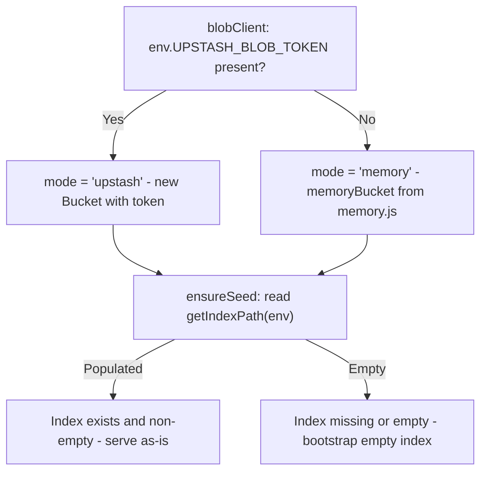

# Storage Abstraction

The worker supports two storage backends selected at startup by `blobClient(env)`. Both backends expose the same `get`, `put`, and `del` interface, making the rest of the worker storage-agnostic.

## Backend Selection



### Upstash Mode

Activated when `env.UPSTASH_BLOB_TOKEN` is set (production and configured local dev):

```js
new Bucket({ token: env.UPSTASH_BLOB_TOKEN, enableTelemetry: false })
```

All `get`, `put`, and `del` operations resolve against the Upstash Blob bucket. Article JSON and media objects are durable and survive worker restarts.

### Cloudflare Workers Fetch Guard

Cloudflare Workers use streaming fetch bodies by default (`ReadableStream`). To prevent S3/R2 AWS-v4 signature mismatches caused by missing `Content-Length` headers, the worker overrides `globalThis.fetch` to buffer streaming bodies into `Uint8Array` when executing `@upstash/blob` calls:

```js
const nativeFetch = globalThis.fetch;
globalThis.fetch = async function (input, init) {
  if (init?.body && typeof init.body.getReader === "function") {
    const bytes = new Uint8Array(await new Response(init.body).arrayBuffer());
    const { duplex, ...rest } = init;
    return nativeFetch(input, { ...rest, body: bytes });
  }
  return nativeFetch(input, init);
};
```

### Memory Mode

Activated when no token is present (local dev without `.dev.vars`):

```js
memoryBucket() // from src/memory.js
```

The memory store is a module-level `Map`. Data persists only for the lifetime of the `wrangler dev` process. Restarting wrangler resets all articles.

## Memory Bucket API (`memory.js`)

`memoryBucket()` returns an object implementing the same interface as `@upstash/blob`'s `Bucket`:

| Method | Behavior |
| --- | --- |
| `get(path)` | Returns `{ path, size, contentType, url, body }`. Throws `{ code: "not_found" }` if absent. |
| `put(path, body, options)` | Converts body to `Uint8Array`, stores with content type. URL is `/api/blob/<encoded-path>`. |
| `del(path)` | Removes entry from store. |

### Memory Blob Serving

The `/api/blob/:path` route serves in-memory objects directly:

```js
if (url.pathname.startsWith("/api/blob/")) {
  const path = decodeURIComponent(url.pathname.replace(/^\/api\/blob\//, ""));
  const item = getMemoryObject(path);
  if (!item) return json({ error: "Object not found" }, 404, origin);
  return new Response(item.bytes, {
    headers: corsHeaders(origin, { "content-type": item.contentType }),
  });
}
```

This route is only meaningful in memory mode — in Upstash mode, media objects have public Upstash CDN URLs.

## Blob Path Conventions

All object paths in Upstash Blob are namespaced under the configurable `ROOT_BUCKET` (default: `kalidass`):

| Content | Path Pattern | Format |
| --- | --- | --- |
| Article index | `<rootBucket>/index.json` (e.g. `kalidass/index.json`) | `ArticleSummary[]` JSON |
| Full article | `<rootBucket>/articles/<id>.json` | `Article` JSON |
| Article intelligence | `<rootBucket>/intelligence/<id>.json` | `AiIntelligence` JSON |
| Uploaded media | `<rootBucket>/media/<filename>-<unique-suffix>` | Image or video binary |

The `uniquePath` template tag from `@upstash/blob` generates collision-safe media paths inside `<rootBucket>/media/`.

## Multi-Tier Caching Layer (`worker/src/redis/`)

In addition to durable object storage in Upstash Blob, the worker incorporates a caching tier via `getRedisClient(env)`:

- **Upstash Redis Mode**: Active when `env.UPSTASH_REDIS_REST_URL` and `env.UPSTASH_REDIS_REST_TOKEN` are bound. Wraps `@upstash/redis` with support for `get`, `set` (with TTL expiry), `del`, and pattern-based key lookups.
- **In-Memory Cache Mode**: Activated when Redis credentials are not configured (local dev fallback). Implements the same async key-value interface with in-memory TTL expiration.
- **Intelligence Caching**: Article intelligence dossiers generated via SerpApi are stored in Redis under `kalidass:intel:<articleId>` with a 24-hour TTL, eliminating repetitive container runs. If the cache expires, reads automatically rehydrate from Upstash Blob.


## JSON Helpers

Two thin wrappers handle JSON serialization uniformly:

```js
// Read with fallback on any error (missing key, network, parse failure)
async function readJson(bucket, path, fallback = null) {
  try {
    const res = await bucket.get(path);
    return await new Response(res.body).json();
  } catch {
    return fallback;
  }
}

// Write with no-store cache hint and 2-space pretty print
function putJson(bucket, path, value) {
  return bucket.put(path, JSON.stringify(value, null, 2), {
    contentType: "application/json",
    cache: "no-store",
  });
}
```

## Cold-Start Seeding (`ensureSeed`)

On the first request to any articles endpoint, `ensureSeed(bucket, env)` is called:

1. Reads `<rootBucket>/index.json` (via `getIndexPath(env)`).
2. If the index is already a non-empty array, returns it immediately.
3. Otherwise, iterates `seedArticles` from `seed.js` and writes any entries as individual `<rootBucket>/articles/<id>.json` objects.
4. Builds and writes a fresh `<rootBucket>/index.json` from the summarized seed articles.
5. Returns the index array.

`seed.js` currently exports an empty placeholder list (`export const seedArticles = []`), so the first request against an empty store bootstraps an empty `index.json` and the public feed renders with no articles until content is created or published.
