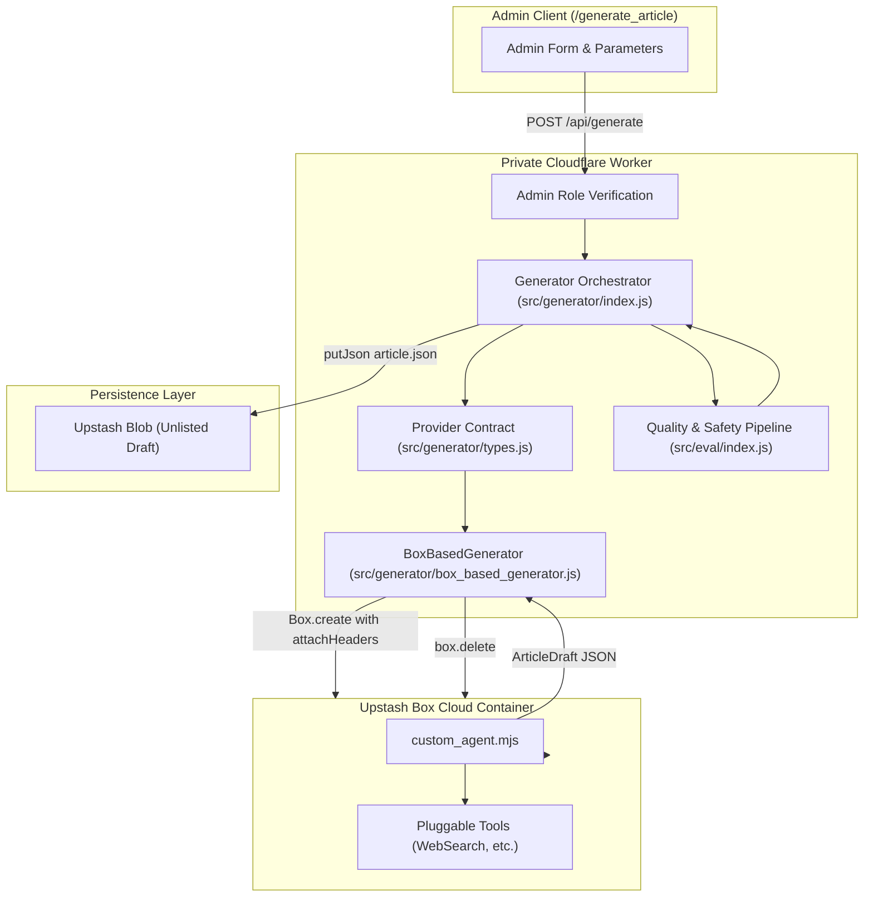

# Upstash Box AI Article Generator

The **Upstash Box Generator** is a containerized research authoring system within Kalidass Journal. It runs isolated cloud sandbox environments via `@upstash/box` to execute custom research agents, inject secure outbound authentication headers, and persist structured unlisted drafts into Upstash Blob storage.

---

## 1. System Architecture



---

## 2. Key Capabilities

### A. Custom Agent with Pluggable Tools
The generator deploys a dedicated custom research agent runner (`custom_agent.mjs`) inside the isolated container. The script includes a pluggable tool registry designed to accommodate web search engines (Brave, Serper, DuckDuckGo) or Model Context Protocol (MCP) servers.

### B. Outbound Security with `attachHeaders`
Using Upstash Box [`attachHeaders`](https://upstash.com/docs/box/overall/attach-headers), authentication secrets (such as `ANTHROPIC_API_KEY`, `OPENAI_API_KEY`, or `BRAVE_SEARCH_API_KEY`) are injected into outbound HTTP requests at the hypervisor level:
- Credentials never touch the container filesystem.
- Secrets are write-only and cannot be read or exfiltrated by scripts.

### C. Automatic Unlisted Draft Persistence
Articles are immediately evaluated by the quality/safety pipeline and saved directly to Upstash Blob as unlisted drafts:
- `published: false` (Draft)
- `private: true` (Unlisted)
- `aiGenerated: true` (AI Attribution Badge)
- `authorEmail`: Stamped with the administrator's identity.

### D. OpenAI gpt-image-1 Technical Infographics
Generates modern, typography-free 16:9 landscape infographics (`1536x1024`, WebP 80% compression, low quality) with a subtle `"Kalidass"` watermark:
- Strictly visual-only pictorial architecture diagrams, node topologies, and data conduits.
- Eliminates AI hallucinated text and typographical artifact clutter.
- Outputs compact WebP base64 data URIs or image URLs saved directly to `coverImage`.

---

## 3. Worker API Endpoint

### `POST /api/generate`
Generates a new systems research article draft. Requires super-admin privileges.

#### Request Headers
```http
Authorization: Bearer <ADMIN_TOKEN or AUTH0_JWT>
X-Admin-Token: <ELEVATION_TOKEN>
Content-Type: application/json
```

#### Request Body
```json
{
  "topic": "Emergent Memory Hierarchy in Hybrid State Space Topologies",
  "angle": "Empirical analysis of KV-cache compression vs. selective state retention.",
  "tone": "research",
  "blockCount": 8,
  "accent": "#6366f1",
  "provider": "upstash-box",
  "harness": "custom"
}
```

#### Response (201 Created)
```json
{
  "ok": true,
  "article": {
    "id": "c7a8b3e2-...",
    "slug": "emergent-memory-hierarchy-...",
    "title": "Emergent Memory Hierarchy in Hybrid State Space Topologies",
    "subtitle": "Empirical analysis of KV-cache compression vs. selective state retention.",
    "blocks": [],
    "published": false,
    "private": true,
    "aiGenerated": true,
    "authorEmail": "admin@amrit.fyi"
  },
  "evaluation": {
    "ok": true,
    "source": "local-heuristic",
    "safety": {
      "verdict": "safe",
      "violations": []
    },
    "metrics": {
      "isAiWritten": { "probability": 0.94, "label": "AI Generated" },
      "accuracy": { "score": 0.92, "level": "High" },
      "editorialReadiness": { "choice": "Ready with Review" }
    }
  }
}
```

---

## 4. Extensible Provider Contract

The generator module exposes an interface allowing additional sandbox runtimes to be plugged in:

```javascript
/**
 * @typedef {Object} ArticleGeneratorProvider
 * @property {string} name Unique provider identifier
 * @property {(request: GenerateArticleRequest, env: any) => Promise<ArticleDraft>} generate
 */
```

To register a new provider:
```javascript
import { registerGeneratorProvider } from "./generator/index.js";

registerGeneratorProvider({
  name: "custom-sandbox",
  async generate(request, env) {
    // Custom generation logic
    return draft;
  }
});
```
