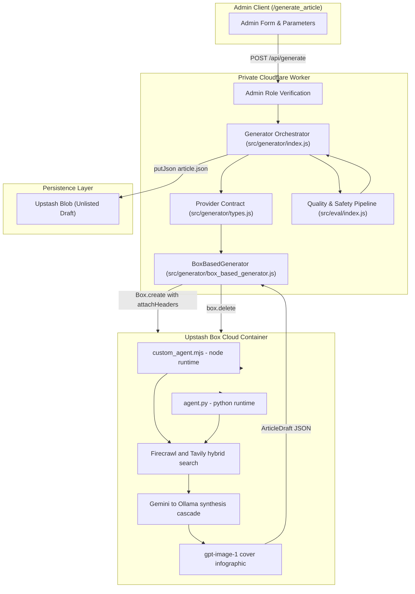

# Upstash Box AI Article Generator

The **Upstash Box Generator** is a containerized research authoring system within Kalidass Journal. It runs isolated cloud sandbox environments via `@upstash/box` to execute custom research agents, inject secure outbound authentication headers, and persist structured unlisted drafts into Upstash Blob storage.

---

## 1. System Architecture



---

## 2. Key Capabilities

### A. Dual-Runtime Research Agent (Node.js & Python)
The generator deploys one of two self-contained research agent scripts, selected by the request's `runtime` field (defaults to `"node"`):
- **Node.js runtime** — `custom_agent.mjs`, executed as `node /workspace/home/custom_agent.mjs`
- **Python runtime** — `agent.py`, executed as `python /workspace/home/agent.py`

Both agents implement the identical pipeline: Firecrawl/Tavily hybrid search, Gemini → Ollama synthesis cascade, gpt-image-1 cover art, polymorphic JSON normalization, deterministic local fallback, and a mandatory source-attribution block. The provider contract stays pluggable, so alternative harnesses (Claude Code, Codex, MCP servers) can be registered via `registerGeneratorProvider`.

### B. Outbound Security with `attachHeaders`
Using Upstash Box [`attachHeaders`](https://upstash.com/docs/box/overall/attach-headers), the Worker builds a hostname → header map in `buildAttachHeaders` that is injected into outbound HTTP requests at the hypervisor level:

| Hostname | Injected Header | Source Secret |
| --- | --- | --- |
| `api.firecrawl.dev` | `Authorization: Bearer …` | `FIRECRAWL_API_KEY` |
| `api.tavily.com` | `Authorization: Bearer …` | `TAVILY_API_KEY` |
| `generativelanguage.googleapis.com` | `x-goog-api-key: …` | `GEMINI_API_KEY` |
| `ollama.com` | `Authorization: Bearer …` | `OLLAMA_API_KEY` |
| `api.openai.com` | `Authorization: Bearer …` | `OPENAI_API_KEY` |

- Credentials never touch the container filesystem.
- Secrets are write-only and cannot be read or exfiltrated by scripts.
- Per-request `attachHeaders` entries are merged first and take precedence over the derived defaults.

### C. Automatic Unlisted Draft Persistence
Articles are immediately evaluated by the quality/safety pipeline and saved directly to Upstash Blob as unlisted drafts:
- `published: false` (Draft)
- `private: true` (Unlisted)
- `aiGenerated: true` (AI Attribution Badge)
- `authorEmail`: Stamped with the administrator's identity.

### D. OpenAI gpt-image-1 Technical Infographics (Milder, Vibrant Palette)
Generates modern, typography-free 16:9 landscape infographics (`1536x1024`, WebP 80% compression, low quality) with a subtle `"Kalidass"` watermark:
- **Milder, Vibrant Color Shades**: Combines milder, muted matte foundation shades (soft slate, gentle charcoal, titanium, subtle indigo) with vibrant, luminous accent color highlights (electric indigo, radiant cyan, warm amber, vibrant violet, emerald).
- Strictly visual-only pictorial architecture diagrams, node topologies, and data conduits with gentle contrast that is soothing and elegant.
- Eliminates AI hallucinated text and typographical artifact clutter.
- **Strict Single-Image Invariant**: Exactly ONE image is generated per article, saved directly to `coverImage`. No inline image blocks are emitted.

### E. Firecrawl & Tavily Hybrid Search (70/30 Ratio) & Non-Negotiable Thesis Angle Invariant
- **Firecrawl & Tavily Hybrid Search (70/30 Ratio)**: Research queries automatically append the dynamic operational year (e.g. `2026`) and thesis angle directives (`buildSearchQuery`). In-box agents split research load across **Firecrawl (70%)** and **Tavily (30%)** with bidirectional fallback — whichever engine is picked first falls back to the other when it returns no results. SerpApi is strictly excluded from generation containers, isolating its rate limits and quota exclusively for `/intel` Google SERP intelligence extraction.
- **Configurable Weight**: `FIRECRAWL_SEARCH_WEIGHT` accepts either `70` or `0.7` — values ≤ `1.0` are scaled ×100 into a percentage. Both runtimes read the same variable, so the split is identical for Node.js and Python agents.
- **Engine Parameters**: Firecrawl queries `api.firecrawl.dev/v1/search` with `limit: 5` and `scrapeOptions.formats: ["markdown"]` (descriptions fall back to the first 300 chars of scraped markdown). Tavily queries `api.tavily.com/search` with `search_depth: "advanced"`, `include_answer: true`, `time_range: "year"`, and `max_results: 5`.
- **Synthesis Cascade**: Search citations are appended to the user prompt under a mandatory reminder that the thesis angle is a non-negotiable invariant. Synthesis then cascades: **Google Gemini** (primary — model resolved from `request.model` → `GEMINI_MODEL` → `gemini-3.1-flash-lite`) → **Ollama Cloud** (fallback — `OLLAMA_MODEL` → `gemma4:31b-cloud` at `OLLAMA_API_BASE_URL` → `https://ollama.com`) → **deterministic local template** (marked `isFallback: true` with a `fallbackNotice`).
- **Mandatory Source Attribution**: Whenever live citations are gathered, the agent appends a trailing `References & Empirical Attributions` heading and a quote block listing every source, cited as `Autonomous Research Tooling (Firecrawl/Tavily)`.
- **Non-Negotiable Thesis Angle Priority**: The `angle` field is enforced as a top-priority non-negotiable invariant. Anti-recency prompting guarantees the model fulfills specific architectural requirements and constraints over generic search snippets.
- **IEEE & Elsevier Publishing Standard with Developer Pragmatism**: Synthesizes formal taxonomy, problem formulations, and citations benchmarked against IEEE/Elsevier journals, paired with actionable systems engineering intuition.
- **Beginner-Friendly Introduction & Elaborated Block Depth**: Accessible introductory analogies and motivations in the excerpt and first section, followed by deeply elaborated 3-5 sentence paragraphs for all technical blocks.

### F. In-Box Observability (`[Box Intel]` Logs)
Both agent runtimes emit structured progress logs prefixed `[Box Intel]` (Python `log()` helper; Node `console` markers) so container execution can be traced from Box stdout/stderr:
- `Tavily called...` / `firecrawl called...` — search engine selection per research query
- `ollama getting called` — synthesis cascade fell through to the Ollama fallback
- `Gemini parsing failed: …` / `Ollama parsing failed: …` — per-stage parse errors (mirrored to stderr)
- `PYTHON_GENERATION_COMPLETE` / `NODE_GENERATION_COMPLETE` — completion markers; the orchestrator also parses stdout JSON as a fallback when `article_output.json` cannot be read

### G. Resilient JSON Parsing & Array Normalization
To handle LLM output variations and markdown code block wrappers:
- **`parse_json_safely()`**: Strips markdown code fences (` ```json `), unwraps stringified JSON, and falls back to regex object/array boundary extraction.
- **Auto-Normalization**: Bare block arrays (`[ {"type": "heading", ...}, ... ]`) or single-element array wrappers are automatically normalized into standard `{ "title": ..., "blocks": [...] }` dictionaries.
- **Guarded Property Lookups**: Safely checks dict keys before generating the cover image, preventing runtime `AttributeError: 'list' object has no attribute 'get'`.

### H. Secret Management: Worker Environment vs. Upstash Board
API keys (`FIRECRAWL_API_KEY`, `TAVILY_API_KEY`, `GEMINI_API_KEY`, `OLLAMA_API_KEY`, `OPENAI_API_KEY`) are managed as Worker environment variables rather than static Upstash Board configurations:
- **Ephemeral Container Creation**: The Worker dynamically boots, runs, and terminates boxes on-demand via the `@upstash/box` SDK.
- **Zero Disk Exposure**: Secrets are passed strictly as `attachHeaders` parameters at runtime, which Upstash Box injects at the hypervisor network level. Secrets never touch disk or shell environment variables.

---

## 3. Worker API Endpoint

### `POST /api/generate`
Generates a new systems research article draft. Requires administrator privileges.

#### Request Headers
```http
Authorization: Bearer <ADMIN_TOKEN>
Content-Type: application/json
```
*(Authenticated via `kalidass-admin-token` in `localStorage`; no secondary elevation token required).*

#### Request Body
```json
{
  "topic": "Emergent Memory Hierarchy in Hybrid State Space Topologies",
  "angle": "Empirical analysis of KV-cache compression vs. selective state retention on Hopper H100 SRAM.",
  "tone": "research",
  "blockCount": 8,
  "accent": "#6366f1",
  "provider": "upstash-box",
  "harness": "custom"
}
```

*(Optional fields: `"runtime": "node" | "python"` selects the in-box agent runtime — Node.js by default; `"model"` overrides the Gemini synthesis model; `attachHeaders` adds custom outbound header maps.)*

#### Response (201 Created)
```json
{
  "ok": true,
  "article": {
    "id": "c7a8b3e2-...",
    "slug": "emergent-memory-hierarchy-...",
    "title": "Emergent Memory Hierarchy in Hybrid State Space Topologies",
    "subtitle": "Empirical analysis of KV-cache compression vs. selective state retention.",
    "blocks": [],
    "published": false,
    "private": true,
    "aiGenerated": true,
    "authorEmail": "admin@amrit.fyi"
  },
  "evaluation": {
    "ok": true,
    "source": "local-heuristic",
    "safety": {
      "violence": 0.02,
      "sexual": 0.01,
      "antisocial": 0.02,
      "verdict": "safe",
      "violations": []
    },
    "metrics": {
      "isAiWritten": { "probability": 0.94, "label": "AI-Synthesized" },
      "accuracy": { "score": 4.2, "level": "rigorous", "confidence": 0.9 },
      "engagement": { "score": 3.8, "level": "engaging", "confidence": 0.88 },
      "editorialReadiness": { "choice": "needs_minor_polish", "confidence": 0.88 }
    }
  }
}
```

---

## 4. Extensible Provider Contract

The generator module exposes an interface allowing additional sandbox runtimes to be plugged in:

```javascript
/**
 * @typedef {Object} ArticleGeneratorProvider
 * @property {string} name Unique provider identifier
 * @property {(request: GenerateArticleRequest, env: any) => Promise<ArticleDraft>} generate
 */
```

To register a new provider:
```javascript
import { registerGeneratorProvider } from "./generator/index.js";

registerGeneratorProvider({
  name: "custom-sandbox",
  async generate(request, env) {
    // Custom generation logic
    return draft;
  }
});
```
