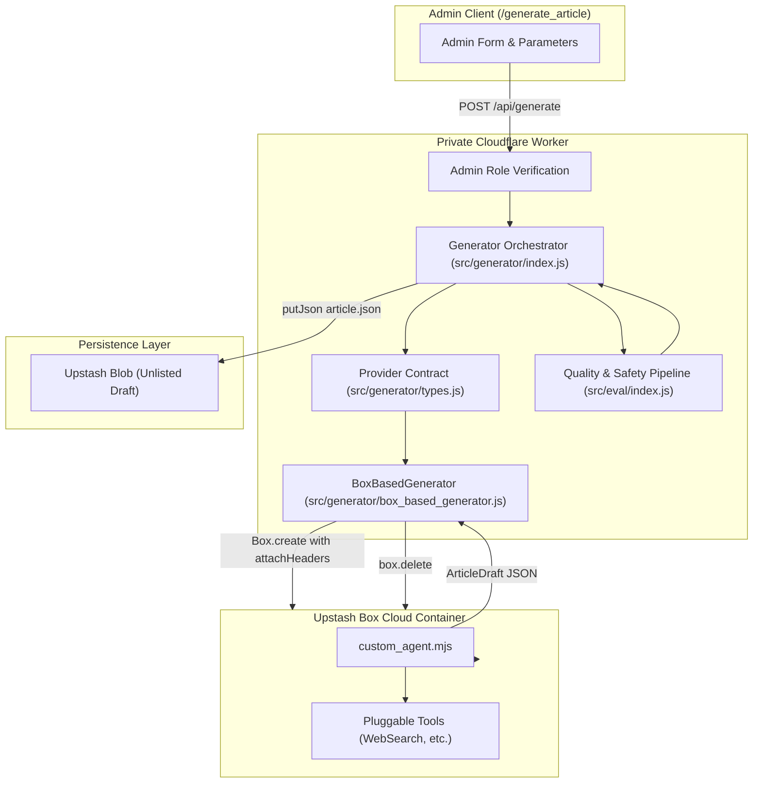

# Upstash Box AI Article Generator

The **Upstash Box Generator** is a containerized research authoring system within Kalidass Journal. It runs isolated cloud sandbox environments via `@upstash/box` to execute custom research agents, inject secure outbound authentication headers, and persist structured unlisted drafts into Upstash Blob storage.

---

## 1. System Architecture



---

## 2. Key Capabilities

### A. Custom Agent with Pluggable Tools
The generator deploys a dedicated custom research agent runner (`custom_agent.mjs`) inside the isolated container. The script includes a pluggable tool registry designed to accommodate web search engines (Brave, Serper, DuckDuckGo) or Model Context Protocol (MCP) servers.

### B. Outbound Security with `attachHeaders`
Using Upstash Box [`attachHeaders`](https://upstash.com/docs/box/overall/attach-headers), authentication secrets (such as `ANTHROPIC_API_KEY`, `OPENAI_API_KEY`, or `BRAVE_SEARCH_API_KEY`) are injected into outbound HTTP requests at the hypervisor level:
- Credentials never touch the container filesystem.
- Secrets are write-only and cannot be read or exfiltrated by scripts.

### C. Automatic Unlisted Draft Persistence
Articles are immediately evaluated by the quality/safety pipeline and saved directly to Upstash Blob as unlisted drafts:
- `published: false` (Draft)
- `private: true` (Unlisted)
- `aiGenerated: true` (AI Attribution Badge)
- `authorEmail`: Stamped with the administrator's identity.

### D. OpenAI gpt-image-1 Technical Infographics (Milder, Vibrant Palette)
Generates modern, typography-free 16:9 landscape infographics (`1536x1024`, WebP 80% compression, low quality) with a subtle `"Kalidass"` watermark:
- **Milder, Vibrant Color Shades**: Combines milder, muted matte foundation shades (soft slate, gentle charcoal, titanium, subtle indigo) with vibrant, luminous accent color highlights (electric indigo, radiant cyan, warm amber, vibrant violet, emerald).
- Strictly visual-only pictorial architecture diagrams, node topologies, and data conduits with gentle contrast that is soothing and elegant.
- Eliminates AI hallucinated text and typographical artifact clutter.
- **Strict Single-Image Invariant**: Exactly ONE image is generated per article, saved directly to `coverImage`. No inline image blocks are emitted.

### E. Date-Aware Search & Non-Negotiable Thesis Angle Invariant
- **Date-Aware Hybrid Search**: Research queries automatically append the dynamic operational year (e.g. `2026`) and thesis angle directives (`buildSearchQuery`) so Tavily and SerpApi fetch cutting-edge empirical sources.
- **Non-Negotiable Thesis Angle Priority**: The `angle` field is enforced as a top-priority non-negotiable invariant. Anti-recency prompting guarantees the model fulfills specific architectural requirements and constraints over generic search snippets.
- **IEEE & Elsevier Publishing Standard with Developer Pragmatism**: Synthesizes formal taxonomy, problem formulations, and citations benchmarked against IEEE/Elsevier journals, paired with actionable systems engineering intuition.
- **Beginner-Friendly Introduction & Elaborated Block Depth**: Accessible introductory analogies and motivations in the excerpt and first section, followed by deeply elaborated 3-5 sentence paragraphs for all technical blocks.

### F. Resilient JSON Parsing & Array Normalization
To handle LLM output variations and markdown code block wrappers:
- **`parse_json_safely()`**: Strips markdown code fences (` ```json `), unwraps stringified JSON, and falls back to regex object/array boundary extraction.
- **Auto-Normalization**: Bare block arrays (`[ {"type": "heading", ...}, ... ]`) or single-element array wrappers are automatically normalized into standard `{ "title": ..., "blocks": [...] }` dictionaries.
- **Guarded Property Lookups**: Safely checks dict keys before generating the cover image, preventing runtime `AttributeError: 'list' object has no attribute 'get'`.

### G. Secret Management: Worker Environment vs. Upstash Board
API keys (`OPENAI_API_KEY`, `ANTHROPIC_API_KEY`, `BRAVE_SEARCH_API_KEY`) are managed as Worker environment variables rather than static Upstash Board configurations:
- **Ephemeral Container Creation**: The Worker dynamically boots, runs, and terminates boxes on-demand via the `@upstash/box` SDK.
- **Zero Disk Exposure**: Secrets are passed strictly as `attachHeaders` parameters at runtime, which Upstash Box injects at the hypervisor network level. Secrets never touch disk or shell environment variables.

---

## 3. Worker API Endpoint

### `POST /api/generate`
Generates a new systems research article draft. Requires administrator privileges.

#### Request Headers
```http
Authorization: Bearer <ADMIN_TOKEN>
Content-Type: application/json
```
*(Authenticated via `kalidass-admin-token` in `localStorage`; no secondary elevation token required).*

#### Request Body
```json
{
  "topic": "Emergent Memory Hierarchy in Hybrid State Space Topologies",
  "angle": "Empirical analysis of KV-cache compression vs. selective state retention on Hopper H100 SRAM.",
  "tone": "research",
  "blockCount": 8,
  "accent": "#6366f1",
  "provider": "upstash-box",
  "harness": "custom"
}
```

#### Response (201 Created)
```json
{
  "ok": true,
  "article": {
    "id": "c7a8b3e2-...",
    "slug": "emergent-memory-hierarchy-...",
    "title": "Emergent Memory Hierarchy in Hybrid State Space Topologies",
    "subtitle": "Empirical analysis of KV-cache compression vs. selective state retention.",
    "blocks": [],
    "published": false,
    "private": true,
    "aiGenerated": true,
    "authorEmail": "admin@amrit.fyi"
  },
  "evaluation": {
    "ok": true,
    "source": "local-heuristic",
    "safety": {
      "violence": 0.02,
      "sexual": 0.01,
      "antisocial": 0.02,
      "verdict": "safe",
      "violations": []
    },
    "metrics": {
      "isAiWritten": { "probability": 0.94, "label": "AI-Synthesized" },
      "accuracy": { "score": 4.2, "level": "rigorous", "confidence": 0.9 },
      "engagement": { "score": 3.8, "level": "engaging", "confidence": 0.88 },
      "editorialReadiness": { "choice": "needs_minor_polish", "confidence": 0.88 }
    }
  }
}
```

---

## 4. Extensible Provider Contract

The generator module exposes an interface allowing additional sandbox runtimes to be plugged in:

```javascript
/**
 * @typedef {Object} ArticleGeneratorProvider
 * @property {string} name Unique provider identifier
 * @property {(request: GenerateArticleRequest, env: any) => Promise<ArticleDraft>} generate
 */
```

To register a new provider:
```javascript
import { registerGeneratorProvider } from "./generator/index.js";

registerGeneratorProvider({
  name: "custom-sandbox",
  async generate(request, env) {
    // Custom generation logic
    return draft;
  }
});
```
