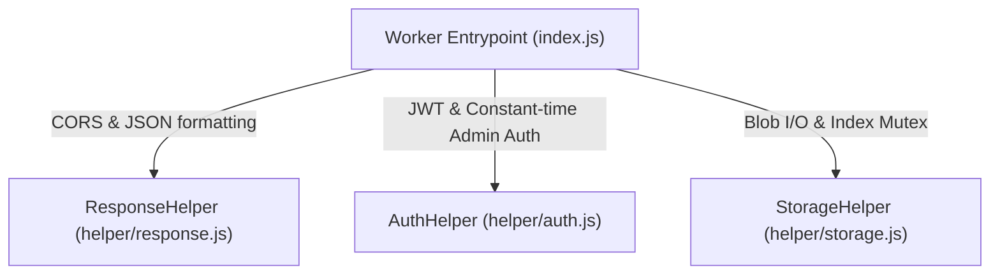

# Worker Helper Classes & Utilities

To maintain a clean separation of concerns and keep `index.js` focused strictly on routing and request dispatching, all supporting business logic is encapsulated in three dedicated helper classes in `worker/src/helper/`.



---

## 1. StorageHelper (`worker/src/helper/storage.js`)

`StorageHelper` manages article persistence, metadata projection, slug generation, read-time calculation, and per-isolate concurrency locking.

### `withIndexLock(task)`

Serializes asynchronous index read-modify-write cycles within each Cloudflare Worker isolate.

```js
static withIndexLock(task) {
  const result = _indexLock.then(() => task(), () => task());
  _indexLock = result.then(() => {}, () => {});
  return result;
}
```

- Guarantees that concurrent mutations within an isolate execute sequentially.
- Prevents lost updates and index corruption during rapid consecutive article operations.

### `slugify(value)`

Converts any string into a URL-safe, normalized slug (truncated to 72 characters, decomposed via `NFKD`).

### `uniqueSlug(index, slug, ignoreId?)`

Ensures the candidate slug is unique within the article index:
- On **create** (`POST`): `ignoreId` is omitted — any collision appends `-2`, `-3`, etc.
- On **update** (`PUT`): `ignoreId` is the existing article's `id` — self-matches are permitted.

### `estimateReadTime(blocks)`

Estimates reading time in minutes by concatenating text/captions across blocks, dividing by 180 wpm, with a minimum floor of 3 minutes.

### `buildArticle(body, existing?, user?)`

Merges an incoming payload with existing article state and caller identity:
- Server-stamps immutable `authorEmail` and `userId` from verified credentials.
- Defaults `published: true`, `private: true`, and `featured: false`.
- Records creation and update timestamps.

### `summarize(article)`

Projects a full article object into the lightweight `ArticleSummary` format stored in `index.json` and returned in feed lists.

### `ensureSeed(bucket, env)` & `reconstructIndex(bucket, env)`

Self-healing storage bootstrap:
- Checks canonical `kalidass/index.json`.
- Falls back to scanning individual article JSON files in the bucket (`bucket.list`) if the index is missing.
- Reconstructs and writes the index sorted chronologically.

---

## 2. AuthHelper (`worker/src/helper/auth.js`)

`AuthHelper` handles user authentication, Auth0 JWT validation, user profile resolution, and constant-time secret comparison.

### `matchesAdminToken(candidate, env)`

Performs a **timing-safe, constant-time comparison** of candidate admin tokens against `env.ADMIN_TOKEN`:

```js
static matchesAdminToken(candidate, env) {
  if (!candidate || !env?.ADMIN_TOKEN) return false;
  const target = String(env.ADMIN_TOKEN).trim().replace(/^["']|["']$/g, "").trim();
  const input = String(candidate).trim().replace(/^["']|["']$/g, "").trim();
  if (!target || !input) return false;

  const hashTarget = createHash("sha256").update(target).digest();
  const hashInput = createHash("sha256").update(input).digest();
  return timingSafeEqual(hashTarget, hashInput);
}
```

- Hashes both strings with SHA-256 before comparing with `node:crypto.timingSafeEqual`.
- Prevents byte-by-byte timing attacks and length leakage.

### `getAuthUser(request, env)`

Extracts and validates credentials from `Authorization: Bearer <token>` or `x-admin-token`:
1. **Super-Admin Token**: Direct match against `ADMIN_TOKEN` grants `role: "admin"` for automated M2M publishing.
2. **Auth0 JWT**: Validates against Auth0's remote JWKS (`getJWKS`) using `jose`. Resolves user email, nickname, and avatar (with `/userinfo` fallback).
3. **Step-Up Elevation**: Verifies `x-admin-token` for authors listed in `ADMIN_EMAILS` to elevate to `role: "admin"`.

---

## 3. ResponseHelper (`worker/src/helper/response.js`)

`ResponseHelper` centralizes HTTP response generation, CORS header synthesis, and origin resolution.

### `corsHeaders(origin, extra?)`

Constructs standard access-control headers including allowed methods, preflight max-age (86,400s), and custom headers (`x-admin-token`, `x-typesafe-key`, `x-eval-provider`).

### `json(data, status = 200, origin = "*", extraHeaders = {})`

Constructs a standard JSON `Response` with `content-type: application/json; charset=utf-8` and CORS headers attached.

### `options(origin)`

Returns an immediate `204 No Content` response for `OPTIONS` preflight requests.

### `withCors(response, origin)`

Wraps an existing `Response` (e.g. from `@upstash/blob` upload handler) with appropriate CORS headers.

### `resolveOrigin(request, env)`

Resolves the `Origin` header against permitted domains (`kalidass.amrit.fyi`, `kalidass.pages.dev`, `localhost:3000`) or falls back to `env.CORS_ORIGIN`.
