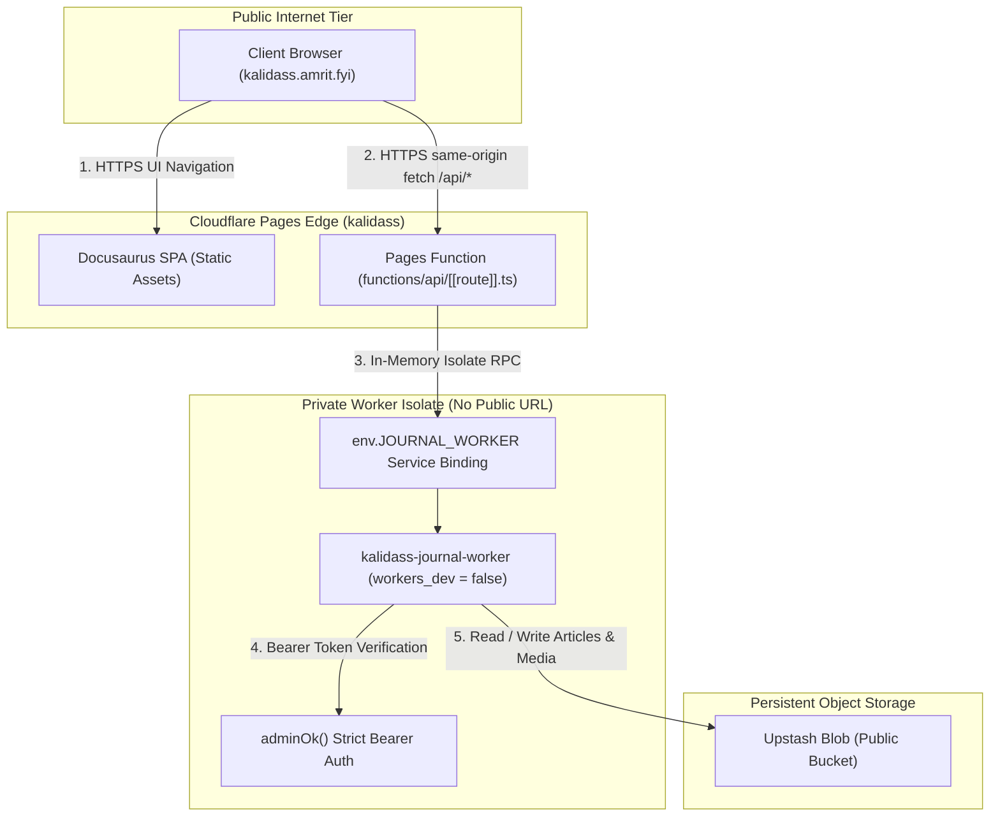

# Zero Trust Architecture

Kalidass Journal enforces a **Zero Trust Security Model** across its edge infrastructure. The backend Cloudflare Worker (`kalidass-journal-worker`) has **zero public internet exposure** and is accessible exclusively through Cloudflare's internal isolate network via a Cloudflare Pages Service Binding.

---

## 1. System Security Topology

The public internet only ever interacts with the Cloudflare Pages edge (`kalidass.amrit.fyi`). All API requests are intercepted at the edge and forwarded via direct memory Remote Procedure Calls (RPC) to the private worker.



---

## 2. The Four Pillars of Zero Trust Isolation

### Pillar 1: Zero Public Ingress (`workers_dev = false`)

The Cloudflare Worker configuration explicitly disables all public routing mechanisms:

```toml
name = "kalidass-journal-worker"
main = "src/index.js"
compatibility_date = "2026-09-01"
compatibility_flags = ["nodejs_compat"]

workers_dev = false

[vars]
CORS_ORIGIN = "https://kalidass.amrit.fyi"
ROOT_BUCKET = "kalidass"
```

- **No DNS Records**: No public A/AAAA or CNAME records exist for the worker (e.g., `api.kalidass.amrit.fyi` was dissolved).
- **No `*.workers.dev` Subdomain**: Public worker routing is disabled. Direct attempts to reach the worker over the internet return connection failure or 404.

---

### Pillar 2: Private Edge-to-Edge Service Binding

Communication between the Pages frontend and the Worker happens entirely within Cloudflare's internal edge isolate runtime via the `JOURNAL_WORKER` Service Binding.

#### Pages Function Handler (`functions/api/[[route]].ts`)

```typescript
interface Fetcher {
  fetch(input: RequestInfo | URL, init?: RequestInit): Promise<Response>;
}

interface Env {
  JOURNAL_WORKER: Fetcher;
}

interface PagesContext {
  request: Request;
  env: Env;
  params: Record<string, string | string[]>;
  data: Record<string, unknown>;
  next: (input?: Request | string, init?: RequestInit) => Promise<Response>;
  waitUntil: (promise: Promise<unknown>) => void;
}

export const onRequest = async (context: PagesContext): Promise<Response> => {
  const { request, env } = context;

  if (!env.JOURNAL_WORKER) {
    return new Response(
      JSON.stringify({
        ok: false,
        error: "JOURNAL_WORKER service binding is not configured in Cloudflare Pages settings.",
      }),
      { status: 500, headers: { "Content-Type": "application/json" } }
    );
  }

  return env.JOURNAL_WORKER.fetch(request);
};
```

- **Sub-Millisecond Latency**: Requests do not undergo external DNS resolution, TLS handshakes, or public network routing.
- **Header & Body Preservation**: The original `Request` (including HTTP method, query parameters, `Authorization` headers, and upload streams) is forwarded directly into the worker's isolate.

---

### Pillar 3: Strict Cryptographic Admin Guard

Even inside the private network boundary, the worker enforces strict Zero Trust authorization for all state-mutating operations:

```javascript
export function adminOk(request, env) {
  const expected = env.ADMIN_TOKEN;
  if (!expected) return false;
  const header = request.headers.get("Authorization") || "";
  const token = header.startsWith("Bearer ") ? header.slice(7).trim() : "";
  return token === expected;
}
```

- **Fail-Closed by Default**: If `ADMIN_TOKEN` is not configured in the worker environment, all admin queries and mutations are immediately rejected with `401 Unauthorized`.
- **Protected Operations**:
  - `POST /api/articles` (Publishing / Drafting)
  - `PUT /api/articles/:slug` (Updating articles)
  - `DELETE /api/articles/:slug` (Deleting articles)
  - `POST /api/upload` & `POST /api/objects` (Uploading media blobs)
  - `POST /api/articles/:slug/books` (Compiling book suggestions)
  - `GET /api/articles?status=draft` (Listing draft articles)

---

### Pillar 4: Cloudflare Access Edge Interception on Interactive Routes (`/generate_article`)

In addition to programmatic API token gates and private isolate service bindings, privileged interactive web surfaces—specifically the **Neural Gen** autonomous article generator (`/generate_article`)—are protected at the edge by **Cloudflare Access (Zero Trust)**.

#### SPA Routing vs. Edge Access Interception

In a Single Page Application (SPA), clicking client-side links (`history.push` or `@docusaurus/Link`) swaps DOM components in the browser runtime without sending an HTTP GET request to Cloudflare CDN. Consequently, client-side routing would bypass Cloudflare Access edge evaluation.

To enforce Zero Trust inspection:
1. The **Neural Gen** navigation link uses a dedicated component (`NeuralGenNavbarItem.tsx`) registered as `custom-neural-gen` in the Docusaurus navbar registry.
2. Standard clicks execute a hard browser navigation:
   ```javascript
   window.location.href = "/generate_article";
   ```
3. This forces the browser to initiate a genuine top-level HTTP GET request, allowing Cloudflare Access to intercept the request at the CDN edge, evaluate the identity and Zero Trust policies, and enforce authentication before private UI assets are served.

---

## 3. Architecture Comparison: Service Binding vs. Zero Trust Access Proxy

| Dimension | Service Binding Architecture (Implemented) | Traditional Zero Trust Access Proxy |
| :--- | :--- | :--- |
| **Worker Exposure** | **Zero (Completely Private)** | Exposed on public domain (`api.kalidass.fyi`) |
| **Authentication Flow** | In-memory isolate binding (`env.JOURNAL_WORKER`) | Service tokens (`CF-Access-Client-Id` / `Secret`) |
| **Public Surface Area** | 1 domain (`kalidass.amrit.fyi`) | 2 domains (`kalidass.amrit.fyi` + `api.kalidass.fyi`) |
| **Network Overhead** | 0 ms (Direct memory RPC) | ~20-50 ms (HTTPS network hop + Access evaluation) |
| **Secret Rotation** | None required for edge proxy | Periodic Service Token expiration and rotation |
| **CORS Complexities** | None (Browser calls same-origin `/api/*`) | Requires CORS proxy configuration |

---

## 4. Verification & Defense-in-Depth Checklist

1. **Internet Isolation Test**:
   - `curl -I https://kalidass-journal-worker.amrit08ju.workers.dev/api/health` → Disabled / Connection refused.
   - `curl -I https://api.kalidass.amrit.fyi/api/health` → DNS lookup fails (Domain removed).
2. **Pages Edge Gateway Test**:
   - `curl https://kalidass.amrit.fyi/api/health` → `{"ok":true}`.
3. **Admin Token Boundary Test**:
   - `curl -X POST https://kalidass.amrit.fyi/api/articles` → `401 Unauthorized` (`{"error":"Unauthorized"}`).
   - `curl -X POST https://kalidass.amrit.fyi/api/articles -H "Authorization: Bearer <VALID_TOKEN>"` → `200 OK` / Accepted.
